# 司机对账模块梳理

> 路径：`src/views/userBase/driverChecking/`
> 路由：`/userBase/driverChecking`

## 一、文件结构

```
driverChecking/
├── index.vue          # 列表页（搜索 + 表格 + 批量操作）
├── index.conf.js      # 列表页表单/弹窗配置（mixin）
├── index.format.js    # 列表页格式化工具：codeFormat / $action / $all 等（mixin）
├── add.vue            # 详情页（查看 / 核对 / 审核，复用同一组件）
├── add.conf.js        # 详情页表单/表格列/按钮配置（mixin）
├── add.format.js      # 详情页费用计算逻辑：$total / compuAdjustCost / fetchOilGasConfig（mixin）
└── tableHeader.js     # 列表页可拖拽表头静态定义（61 列）
```

---

## 二、路由与页面关系

```
/userBase/driverChecking              → index.vue   列表页
/userBase/driverChecking/read/:id     → add.vue     查看（只读）
/userBase/driverChecking/verify/:id   → add.vue     核对（可编辑确认金额）
/userBase/driverChecking/check/:id    → add.vue     审核（填写审核结果）
```

`add.vue` 通过 `this.$route.params.action` 区分三种模式，表单字段 `disabled`、按钮 `hide` 均依赖该值。

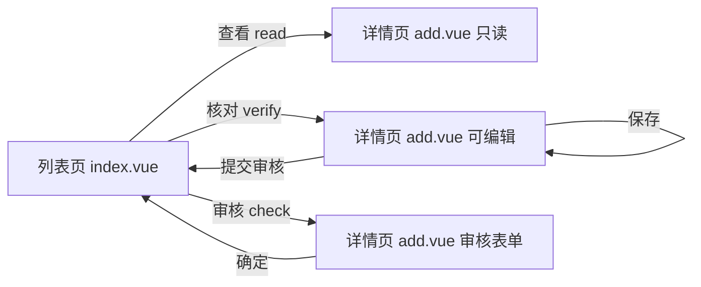

---

## 三、状态机（busStatus）

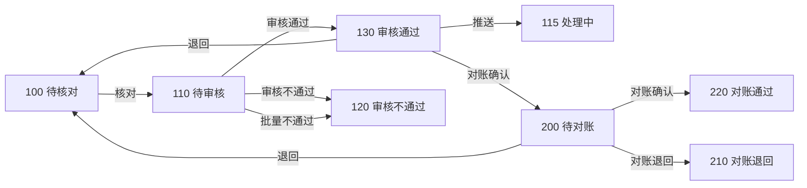

各状态下可用操作由 `index.format.js` 中的 `$action(row, action)` 控制：

| busStatus | 状态 | read | verify | check | giveBack(退回) | bill(推送) | affirm |
|-----------|------|:----:|:------:|:-----:|:--------:|:----------:|:------:|
| 100 | 待核对 | ✅ | ✅ | — | — | — | — |
| 110 | 待审核 | ✅ | — | ✅ | — | — | — |
| 115 | 处理中 | ✅ | — | — | — | — | — |
| 120 | 审核不通过 | ✅ | — | — | — | — | — |
| 130 | 审核通过 | ✅ | — | — | ✅ | ✅ | — |
| 200 | 待对账 | ✅ | — | — | ✅ | — | ✅ |
| 210 | 对账退回 | ✅ | — | — | — | — | — |
| 220 | 对账通过 | ✅ | — | — | — | — | — |

---

## 四、列表页 — 搜索区模块

### 4.1 搜索字段总览

搜索区支持展开/收起（`isExpand` 控制），通过 `getAllFieldRows()` 按每行 4 列分组，前 3 行默认展示。

字段配置采用 `searchFormColumns` 数组统一管理，支持字段拖拽排序和显示/隐藏，分为 `forever`（固定区）和 `temporary`（临时区）两种 section。

| 字段名 | 参数 | 类型 | section | 说明 |
|--------|------|------|---------|------|
| 派车日期 | `dispatchDate` | 日期范围 | forever | ±2 个月限制，不能选未来；watch 拼接时分秒 |
| 创建日期 | `unloadTime` | 日期范围 | forever | 同上 |
| 运单号 | `batchBusBillId` | 文本 | forever | 最多 200 个，空格隔开；**有值时派车/创建时间不生效** |
| 车牌号/船名航次/铁路运单号 | `busNumber` | 文本+下拉 | forever | 右侧 select 切换单个/批量（`multipleBusNumber`: 0/1）；单个模式自动 trim |
| 司机/承运商 | `dcCarrierCompanyName` | 文本 | forever | trim |
| 状态 | `busStatusList` | 多选下拉 | forever | 数据源：`driverCheckingEnumeration.statusMultiple` |
| 结算主体 | `payeeNames` | 文本 | forever | trim |
| 运输类型 | `transportType` | 单选下拉 | forever | 数据源：`driverCheckingEnumeration.driverChecking.transportType` |
| 货物名称 | `goodsName` | 文本 | forever | trim |
| 客户名称 | `consigneeName` | 文本 | forever | trim |
| 出发地简称 | `originAbbrLike` | 文本 | forever | trim |
| 目的地简称 | `destAbbrLike` | 文本 | forever | trim |
| 出发地省市区/目的地省市区 | `sendAddrShorthand` | 文本 | forever | labelWidth=120；trim |
| 订单号 | `orderId` | 文本 | temporary | trim |
| 货运类型 | `freightType` | 单选下拉 | temporary | 数据源：`driverCheckingEnumeration.typeOfFreight` |
| 网络货运主体 | `networkMainBodyName` | 自定义下拉 | temporary | 前端右模糊过滤 `networkMainBodyFilter()` 正则 startsWith |
| 货源别名 | `orderAlias` | 文本 | temporary | trim |
| 运单别名 | `waybillAlias` | 文本 | temporary | trim |
| 时效状态 | `expiryLimitStatusList` | 多选下拉 | temporary | 默认值 `['1','2','3']` |
| 来源 | `platformCode` | 下拉 | temporary | 微应用内 disabled 且默认值 `'40'` |
| 是否全流程 | `fullProcessFlag` | 单选下拉 | temporary | 数据源：`driverCheckingEnumeration.driverChecking.fullProcessFlag` |
| 上游客户名称 | `shipperCompanyNameLike` | 文本 | temporary | trim |
| 承运商名称 | `carrierCompanyNameLike` | 文本 | temporary | trim |
| 所属组织 | `carrierOrgIdList` | OrganizationTree | temporary | 多选；无权限时阻止列表请求，独立/微服务时接口区分 |
| 经办人 | `handlerId` | 下拉 | temporary | 数据源：`listAvailableEmployeeByCompanyId` |

### 4.2 搜索区流程

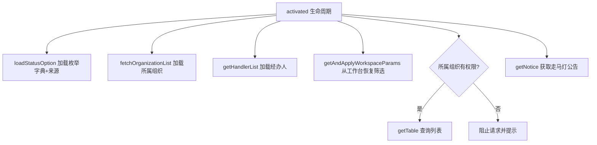

### 4.3 搜索/重置

| 操作 | 方法 | 说明 |
|------|------|------|
| 查询 | `getSearchTable()` | 所属组织无权限时直接报错拦截；否则 `currentPage=1` 后调 `getTable()` |
| 重置 | `handleReset()` | 清空 `carrierOrgIdList`、重置 `multipleBusNumber=0`、`resetFields()`、恢复默认派车日期 |
| 展开/收起 | `toggleExpand()` | 切换 `isExpand` 布尔值 |

### 4.4 所属组织无权限拦截机制

所属组织使用 `OrganizationTree` 组件，通过 `func-id` 关联权限。无权限时通过三道防线拦截接口请求：

**第一道：组件层（OrganizationTree）**

组件内部发起请求获取组织树数据，无权限时设置 `noPermission = true`，并通过 `@no-permission` 事件回调通知父组件。

**第二道：页面初始化层（activated）**

```javascript
async activated() {
  await this.fetchOrganizationList()
  // 等待 OrganizationTree 组件完成初始化请求
  const orgTree = Array.isArray(this.$refs.orgTree) ? this.$refs.orgTree[0] : this.$refs.orgTree
  if (orgTree?.fetchPromise) {
    try { await orgTree.fetchPromise } catch (e) { /* 网络异常时继续执行 */ }
    if (orgTree?.noPermission) {
      this.orgTreeNoPermission = true
      this.orgTreeNoPermissionMessage = orgTree.noPermissionMessage
    }
  }
  // 所属组织无权限时跳过列表请求
  if (!this.orgTreeNoPermission) {
    this.getTable()
  }
}
```

关键点：**等待 `orgTree.fetchPromise` 完成后才决定是否调 `getTable`**，避免无权限时白白请求列表数据。

**第三道：查询拦截层（getSearchTable）**

用户手动点"查询"时同样拦截：

```javascript
getSearchTable() {
  const orgTree = Array.isArray(this.$refs.orgTree) ? this.$refs.orgTree[0] : this.$refs.orgTree
  if (this.orgTreeNoPermission || orgTree?.noPermission) {
    return this.$message.error(this.orgTreeNoPermissionMessage || orgTree?.noPermissionMessage)
  }
  this.request.currentPage = 1
  this.getTable()
}
```

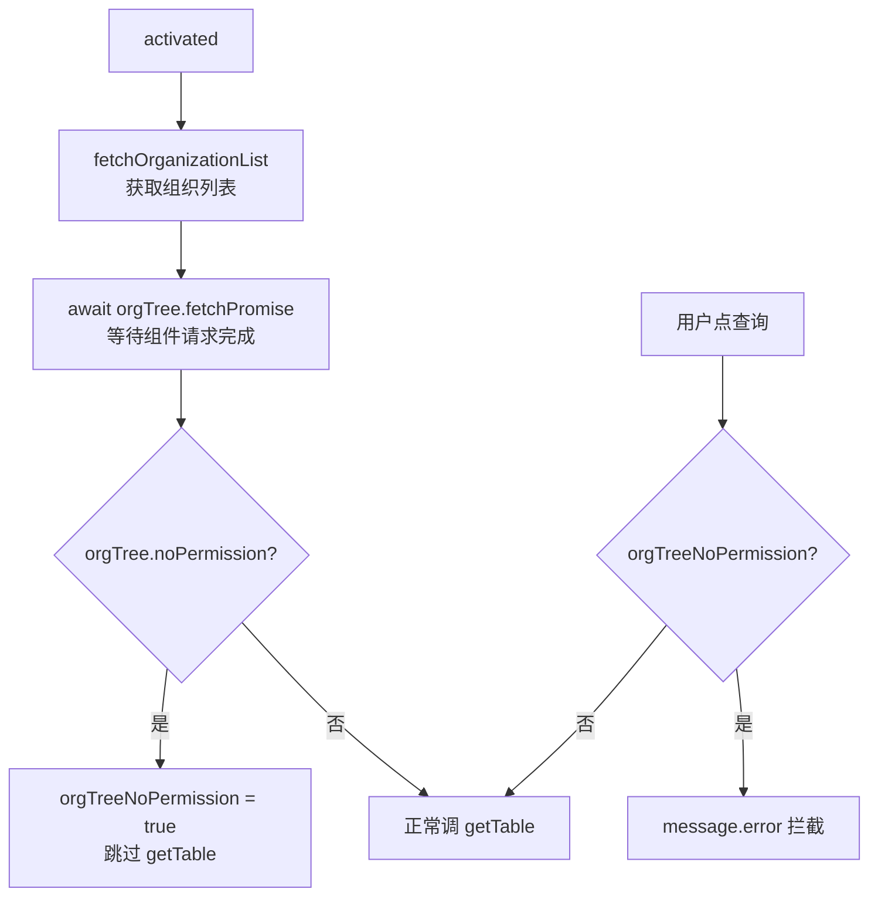

**兜底逻辑**：即使有权限，用户未手动选组织时，查询自动用 `copyCarrierOrgIdList`（全部组织ID）兜底：

```javascript
params.filterModel.carrierOrgIdList = 
  this.request.filterModel.carrierOrgIdList.length === 0 
    ? this.copyCarrierOrgIdList 
    : this.request.filterModel.carrierOrgIdList
```

### 4.5 运单号优先逻辑

`getTable` 内 `$nextTick` 执行：有运单号时清空 `sendCarDate`/`sendCarDateEnd`/`unloadTimeStartDate`/`unloadTimeEndDate`，使时间条件不参与过滤。

### 4.6 ES 开关逻辑

`getUseNew('query_waybill_account')` 判断是否走 ES 接口：

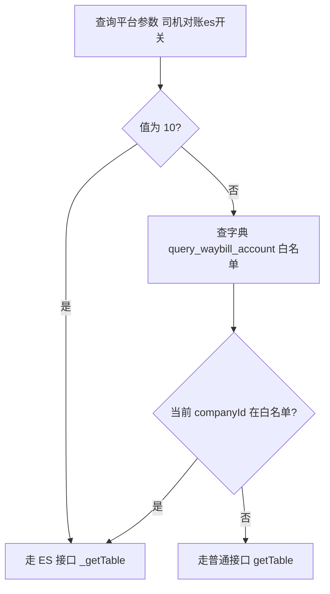

---

## 五、列表页 — 表格区模块

使用 `table-drag` 组件，`uuid='DRIVER_CHECKING'`，列显示状态持久化到 localStorage。共 **61 列**。

### 5.1 顶部操作栏

| 元素 | 条件 | 说明 |
|------|------|------|
| 走马灯公告 | `showCarouse=true` | 内容来自 `getParameterByParamName` 接口；文字长度决定容器宽度 |
| 费用说明按钮 | 始终显示 | 打开费用计算规则弹窗（`FEE_DETAIL` 静态数据） |
| 导出 | `$route.meta.export` | `ExportBtn` 组件 |
| 批量确认 | `$route.meta.batchAffirm` | `batchAffirm()` |
| 批量不通过 | `$route.meta.batchDisPass` | `handleBatchDisPass()` |

### 5.2 关键列说明

| prop | 说明 | 特殊处理 |
|------|------|---------|
| `checkbox` | 全选/单选 | 全流程互斥校验；`handleSelectable()` 控制禁用；`isFullProcessConflict()` 控制 tooltip |
| `waybillId` | 运单号 | 点击跳转运单详情（独立/微服务 跳转逻辑不通）；`expiryLimitStatus=2` 显示黄色图标，`=3` 显示红色图标 |
| `sendCarDate` | 派车日期 | `formatToDate().format('yyyy-MM-dd HH:mm')` |
| `receiptDate` | 回单日期 | `formatToDate().format('yyyy-MM-dd')` |
| `preExamTime` | 预审通过时间 | `formatToDate().format('yyyy-MM-dd HH:mm')` |
| `$startEnd` | 出发地-目的地 | `$startEnd(row)` 拼接 `sendAddrShorthand + '-' + receiveAddrShorthand` |
| `$all` | 应付金额 | `$all(row)` = `parsePrice(amountsPayable)` |
| `unitRice` | 单价 | `parsePrice(unitRice) + '(' + exGetUnitPerFixName(settlementType) + ')'` |
| `settlementQuantity` | 结算数量 | `exGetgoodsQuantity() + exGetUnitName()` |
| `gx` | 柜型柜数 | 仅 `transportType=1/2` 时显示；`containerNumber + '*' + codeFormat('gx', containerType)` |
| `waybillToConsignorPrice` | 托运人应付金额 | `companyType===1` 时显示 `--`，否则 `v-mask-star` 脱敏 |
| `serviceCharge` | 运费差价 | 同 `waybillToConsignorPrice` 脱敏规则 |
| `receivableTotalCost` | 应付总额 | `parsePrice` 格式化 |
| `transportCost` / `otherCost` 等 | 各类金额列 | `parsePrice` 格式化 |
| `oilAmount` | 使用油气额度（元） | `parsePrice` 格式化 |
| `oilDiscountAmount` | 油气优惠（元） | `parsePrice` 格式化 |
| `fpFreightDiffRateStr` | 全流程运费差价率 | `fullProcessFlag===10` 时显示，否则 `--` |
| `fpFreightDiffAmt` | 全流程运费差价 | `parsePrice` 格式化 |
| `fullProcessFlag` | 是否全流程 | `=10` 显示"是"，否则"否" |
| `isPremiumFlag` | 是否购买货物保障服务 | `insuranceFeeType==='22'`（司机自购）时显示"否"，否则按 `premiumBuyerType` 判断 |
| `listPremiumAmount` | 货物保障服务金额 | `insuranceFeeType==='22'` 时显示 `--`，否则 `parsePrice` |
| `premiumBuyer` | 货物保障服务购买方 | `insuranceFeeType==='22'` 时显示 `--` |
| `shipperCompanyName` | 上游客户名称 | `companyType===2` 时显示，否则 `--` |
| `b1PayableFreight` | 客户应付运费 | `companyType===2` 时显示 `payableFpFreight`，否则 `--` |
| `payableB2Freight` | 应付承运商运费 | `companyType===1` 时显示 `payableFpFreight`，否则 `--` |
| `splitCollectionInfo` | 委托转账主体 | tooltip 显示名称/账号（可脱敏切换）/支付渠道 |
| `splitType` | 委托转账规则 | `splitFlag='10'` 时显示；`renewTimes>0` 标红，`splitType='10'` 黑色，否则橙色 |
| `platformCode` | 来源 | `sourceObj[platformCode] \|\| platformCodeName \|\| '--'` |
| `carrierOrgName` | 所属组织 | 无值显示 `-` |
| `handlerName` | 经办人 | 无值显示 `-` |
| `taxRate` | 运费差价率 | `isNumber(taxRate)` 时显示 `taxRate%`，否则 `--` |
| `expenseDetailNote` / `goodsRemark` | 备注类字段 | 超 20 字截断显示 `...`；tooltip 每 50 字换行展示完整内容 |
| `expiryLimitStatus` | 时效状态 | `expiryLimitStatusObj` 映射 |
| `goodsName` | 质物名称 | 直接显示 |
| `handle` | 操作列 | 查看/核对/审核/退回/推送/对账确认 |

### 5.3 金额列脱敏规则

- `serviceCharge` / `waybillToConsignorPrice`：`companyType===1` 时显示 `--`，否则 `v-mask-star` 脱敏
- `controlBtn.showStar` 控制是否脱敏

---

## 六、列表页 — 选中与汇总模块

### 6.1 选中机制

使用 `el-checkbox-group` + `v-model="selectedIds"`（waybillId 数组）：

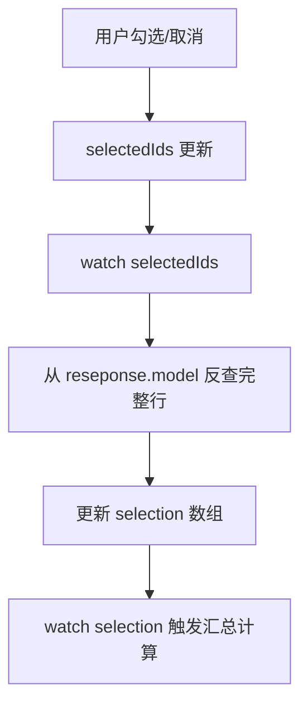

### 6.2 全流程互斥校验

- **单选禁用**（`handleSelectable`）：已选中运单的 `fullProcessFlag` 与当前行不一致时禁用
- **全选校验**（`handleCheckAllChange`）：全选前检查所有行的 `fullProcessFlag` 是否一致
- **冲突提示**（`isFullProcessConflict`）：未选行与已选行 `fullProcessFlag` 不一致时显示 tooltip

### 6.3 底部选中统计

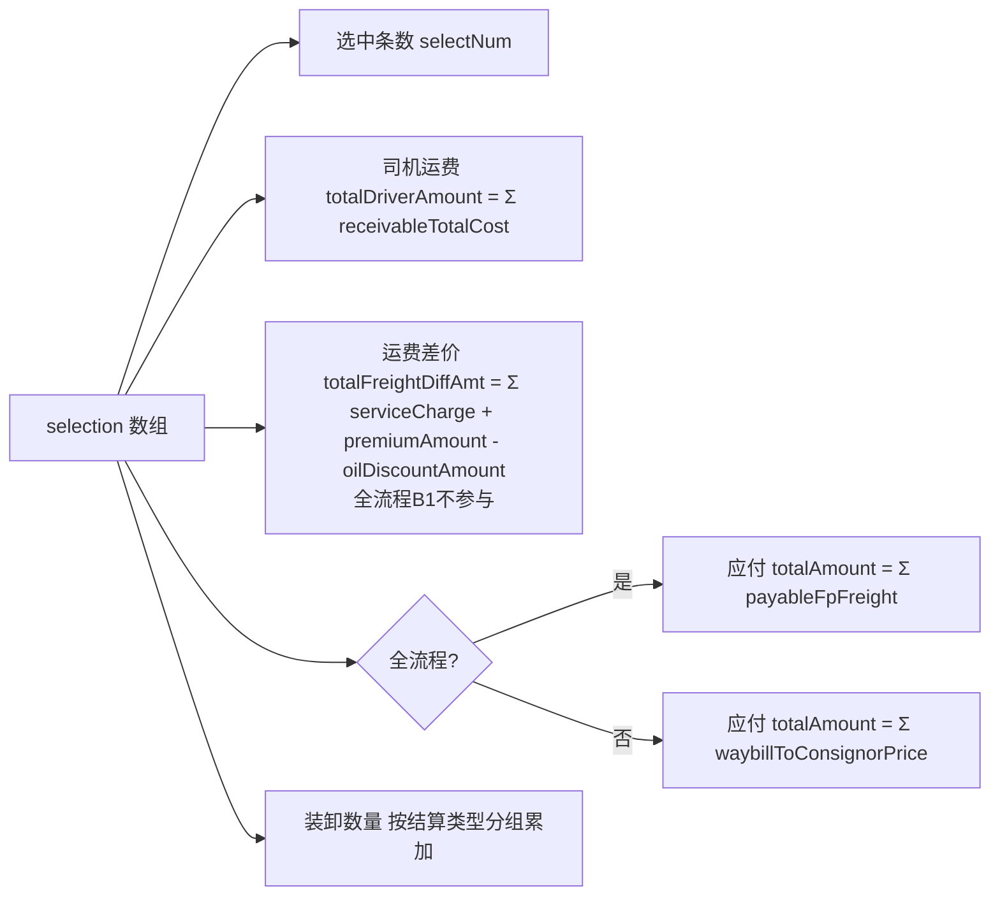

---

## 七、列表页 — 批量操作模块

### 7.1 批量确认（batchAffirm）

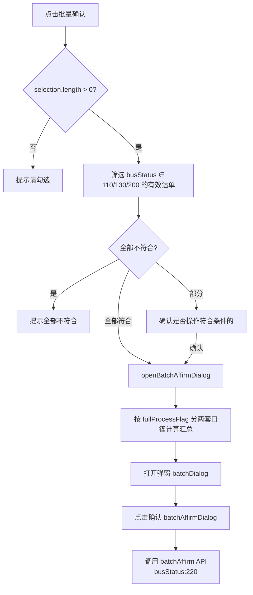

汇总金额计算：

| 口径 | 司机运费 | 运费差价 | 保费 | 油气优惠 | 应付总额 |
|------|---------|---------|------|---------|---------|
| 全流程 | Σ receivableTotalCost | Σ fpFreightDiffAmt | 0 | 0 | Σ payableFpFreight |
| 非全流程 | Σ receivableTotalCost | Σ serviceCharge | Σ premiumAmount | Σ oilDiscountAmount | Σ waybillToConsignorPrice |

### 7.2 批量不通过（handleBatchDisPass）

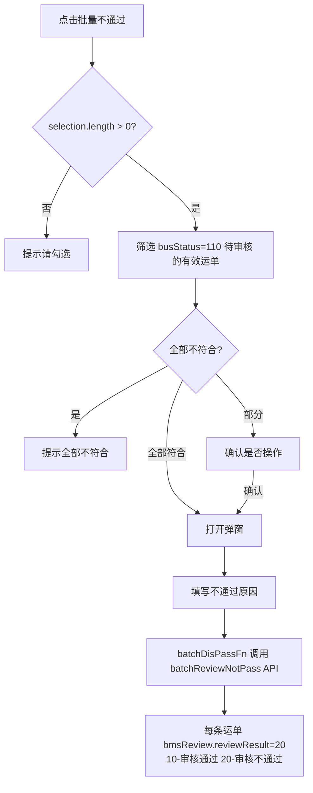

---

## 八、列表页 — 单笔操作模块

### 8.1 退回（giveBack）

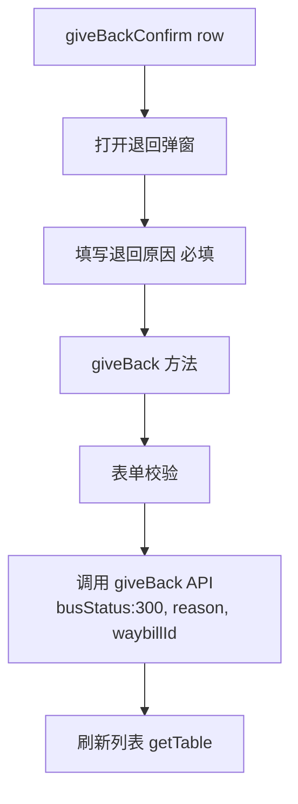

### 8.2 推送（push / pushOnline）

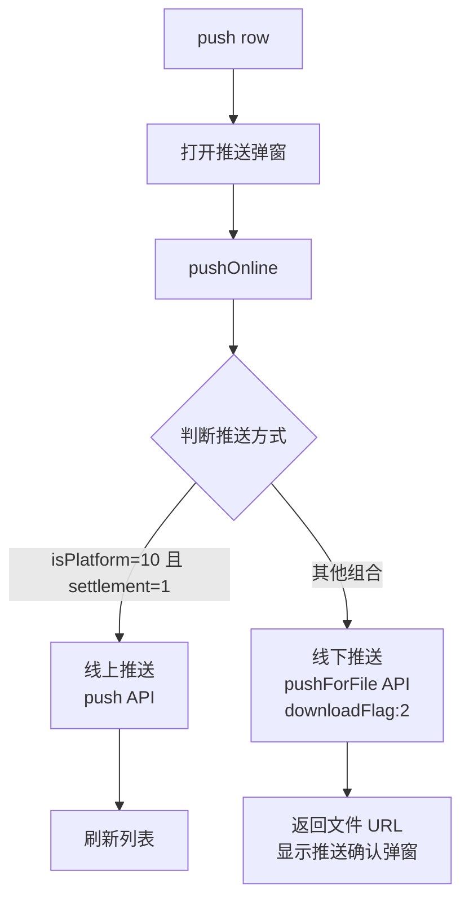

### 8.3 对账确认（affirmConfirm / affirm）

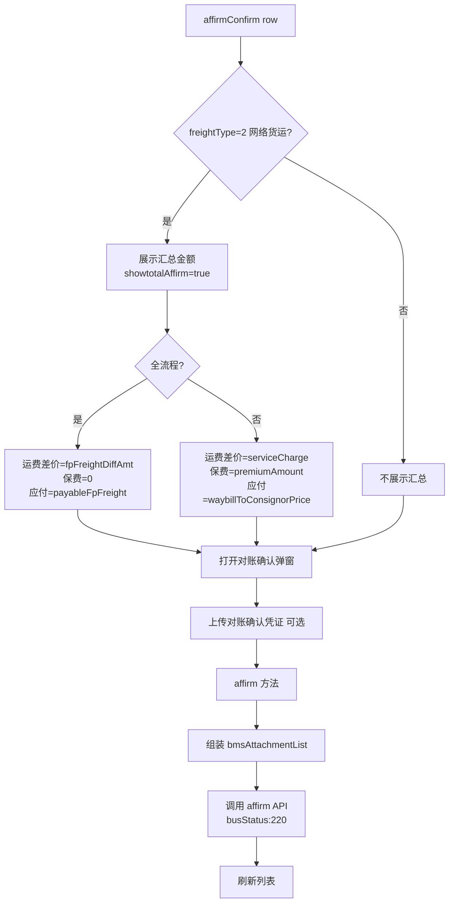

---

## 九、列表页 — 导出模块

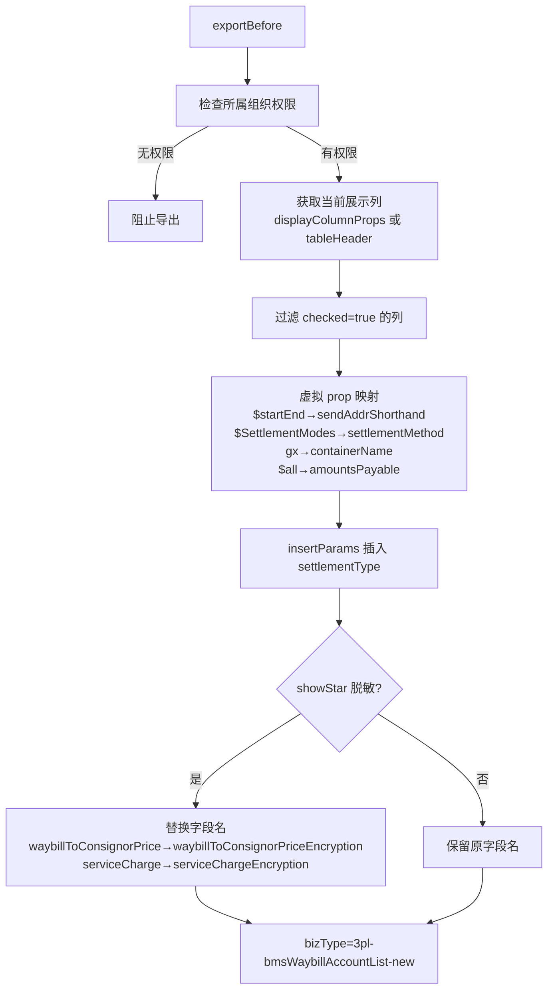

---

## 十、详情页 — 页面初始化模块

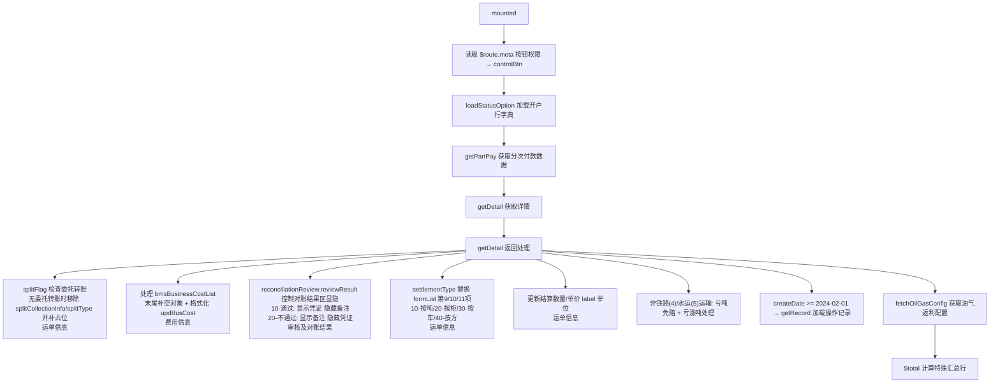

---

## 十一、详情页 — 运单信息区模块

布局固定 4 列一行，默认 6 行（24 个字段）；无委托转账时（`splitFlag !== '10'`）删除 2 项并补 1 个空占位，改为 5 行（`newLayout=true`）。

### 11.1 动态字段替换

根据 `transportType` + `settlementType` 动态替换 `formList[9~11]`：

| settlementType | 字段 1 | 字段 2 | 字段 3 |
|----------------|--------|--------|--------|
| 10（按吨） | 结算重量（吨） | 结算数量（吨） | 单价（元/吨） |
| 20（按柜） | 结算数量（柜） | 单价（元/柜） | 柜型/数量 |
| 30（按车） | 结算数量（车） | 单价（元/车） | 柜型/数量 |
| 40（按方） | 结算重量（吨） | 结算数量（方） | 单价（元/方） |

### 11.2 关键 slot 字段处理

| prop | 展示逻辑 |
|------|---------|
| `waybillId` | 蓝色可点击，跳转运单详情 |
| `payeeNames` | 蓝色可点击，调 `getSettlementDetail()` 展示收款信息弹窗 |
| `sendCarDate` / `zcsj` / `receiptDate` | `formatToDate().format('yyyy-MM-dd HH:mm')` |
| `$startEnd` | 拼接 `sendAddrShorthand + '-' + receiveAddrShorthand` |
| `busNumber` | 铁路/水运直接展示；公路显示蓝色跳转车辆监控（微应用内不跳转） |
| `goodsName` | `renderRowInfo(model)` 拼接货物明细 |
| `settlementQuantity` / `settlementWeight` | `exValidatorWeight()` 格式化 |
| `unitRice` | `parsePrice()` |
| `loadWeight` / `unloadWeight` | 蓝色可点击，调 `handleLookImg()` 查看附件照片 |
| `$otherKuiTonsRatio` | 亏涨吨情况（四种表现，见下方） |
| `splitCollectionInfo` | 委托转账主体：名称/账号（可脱敏切换）/支付渠道 |
| `splitType` | 委托转账规则：全额运费 或 自定义金额+单位；颜色区分 |

### 11.3 亏涨吨情况（`$otherKuiTonsRatio`）

| 表现 | 出现条件 |
|------|---------|
| 未设置亏吨免赔 | `otherKuiTonsRatioShow=true` 但 `lsdsGoodsDeductible.enable !== 1` |
| 空白 | 免赔已开启，但 `loadWeight`/`unloadWeight` 缺值、`transportType=1/2` 或 `kuiTonsSituationVO.lossType` 无值 |
| 亏吨/涨吨 XX 千克 | 免赔已开启，`kuiTonsSituationVO` 有有效的 `lossType`/`lossNumber` |
| 正常 | 同上，`lossType` 为"正常" |

---

## 十二、详情页 — 费用信息区模块

使用 `primitive-table` 组件，列配置来自 `add.conf.js`。

### 12.1 费用表格列（10 列）

| 列 | prop | verify 模式 | read/check 模式 |
|----|------|-----------|----------------|
| 序号 | `aa` | 从 1 开始（特殊行合并显示文字） | 同左 |
| 费用项目 | `costName` | 只读，tooltip 展示别名 | 同左 |
| 费用类型 | `costType` | `codeFormat` 映射 | 同左 |
| 原金额 | `busCost` | `parsePrice(parsePriceReduction())` | 同左 |
| 调整金额 | `$adjustCost` | `compuAdjustCost()` 计算 | 同左 |
| 确认金额 | `updBusCost` | **`el-input` 可编辑**，`@input` 触发 `updBusCostInput` | 只读文本 |
| 费用备注 | `confirmRemark` | **`el-input` 可编辑** | 只读 |
| 附件 | `$files` | 查看附件 | 同左 |
| 操作人 | `updateName` | 只读 | 同左 |
| 操作时间 | `updateDate` | `formatToDate` | 同左 |

### 12.2 费用表格渲染流程

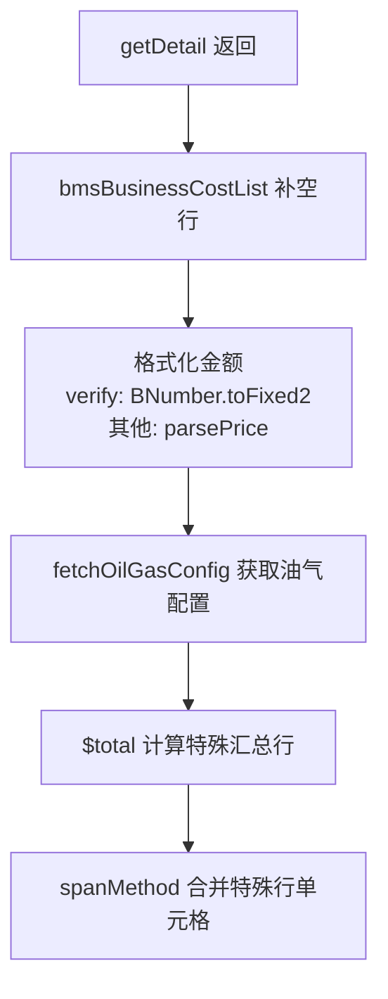

### 12.3 确认金额编辑逻辑（verify 模式）

- `updBusCostInput(index)`：输入时过滤非数字字符，保留一位小数点，整数部分限 15 位；调用 `$total()` 重新计算汇总
- `updBusCostBlur(index)`：失焦时 `BNumber.toFixed(2)` 格式化

---

## 十三、详情页 — 特殊汇总行模块

`add.format.js` 的 `$total()` 在 `bmsBusinessCostList` 末尾追加特殊行，通过 `specialRowType` 字段标识。仅在 `action !== 'verify' && freightType === '2'`（网络货运 + 查看/审核模式）时追加。

### 13.1 特殊行一览

| specialRowType | 显示文字 | 确认金额取值 | 显示条件 | 备注列额外内容 |
|----------------|---------|------------|---------|---------------|
| `subtotal` | 小计 | 前端累加计算（应付加 / 应收减） | 始终 | ① `premiumBuyerType==='20'` 且 `insuranceFeeType!=='22'`：显示"含司机购买货物保障服务金额 X 元" ② 小计行（verify）：tooltip 展示付款方式说明 |
| `freightDiff` | 运费差价 | `serviceCharge`（脱敏） | `companyType !== 1` | "差价率: X%" |
| `insurance` | 货物保障服务金额 | 全流程为 0；否则 `premiumAmount` | `premiumBuyerType === '10'` | — |
| `oilDiscount` | 油气优惠 | 全流程为 0；否则 `-oilDiscountAmount`（-1 时 `--`） | 有效油气数据 或 全流程 | "油气实际使用 X 元" |
| `total` | 合计 | 小计 + 差价 + 保费 - 油气 | `companyType !== 1` | tooltip："合计结果以现金账户支付测算得出" |
| `fpDiff` | 全流程运费差价 | `fpFreightDiffAmt` | `fullProcessFlag === 10` | "差价率：X%" |
| `shipperPay` | 客户应付运费 | `payableFpFreight` | 全流程 + `companyType === 2` | "上游客户名称：XXX" |
| `carrierPay` | 应付承运商运费 | `payableFpFreight`（加粗） | 全流程 + `companyType === 1` | "承运商名称：XXX" |

### 13.2 特殊行追加流程

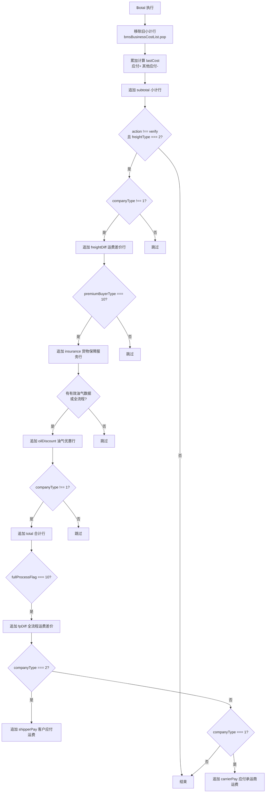

### 13.3 油气优惠判断逻辑

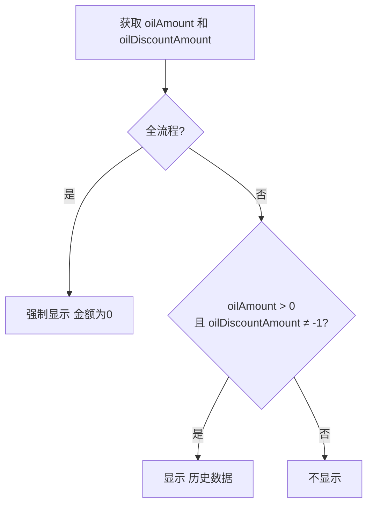

---

## 十四、详情页 — 付款方式与操作记录

### 14.1 分次付款展示

`getPartPay()` 接口获取运单的分次付款配置，存入 `partPayData` 和 `partPayObj`：

| type | 含义 | partPayObj 字段 |
|------|------|----------------|
| 10 | 预付 | `prePaymen='1'` + `prePaymenValue` |
| 20 | 回单付 | `receiptPayment='1'` + `receiptPaymentValue` |
| 30 | 到付 | `deliveryPayment='1'` + `deliveryPaymentValue` |

在小计行（subtotal）的备注列展示付款方式说明（仅 verify 模式 + 第一行时）。

### 14.2 操作记录

`getRecord()` 调用 `constManagement.recordNew` 接口：
- 仅展示 `createDate >= 2024-02-01` 之后创建的运单
- `requestRecord` 的 `busTypeList: ['30', '160']`
- 分页展示

### 14.3 审核及对账结果区

仅在 `isRead`（查看模式）时展示，包含：
- 审核结果（通过/不通过）
- 审核备注
- 对账结果（通过/不通过）
- 对账确认凭证（附件查看）

---

## 十五、详情页 — 核对流程模块

仅 `action === 'verify'` 模式可用。

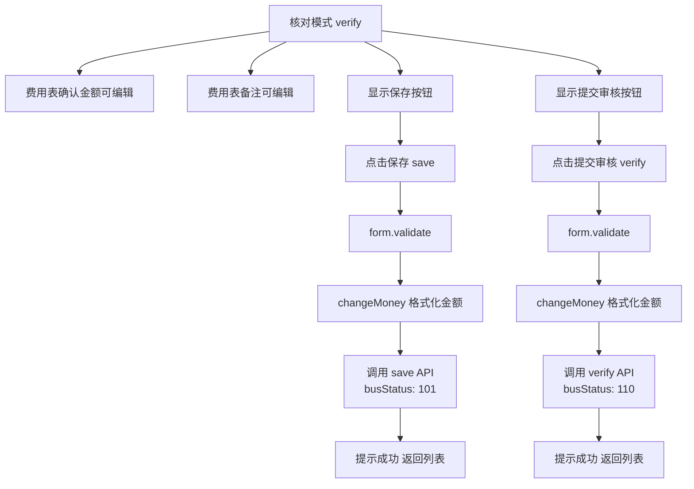

### 15.1 保存（save）

```javascript
// requestSave = { ...model, busStatus: '101', bmsBusinessCostList: model.list.slice(0, -1) }
constManagement.driverChecking.save({ ...requestSave, waybillId })
```

### 15.2 提交审核（verify）

```javascript
// requestVerify = { ...model, busStatus: '110', bmsBusinessCostList: model.list.slice(0, -1) }
constManagement.driverChecking.verify({ ...request, waybillId })
```

---

## 十六、详情页 — 审核流程模块

仅 `action === 'check'` 模式可用。

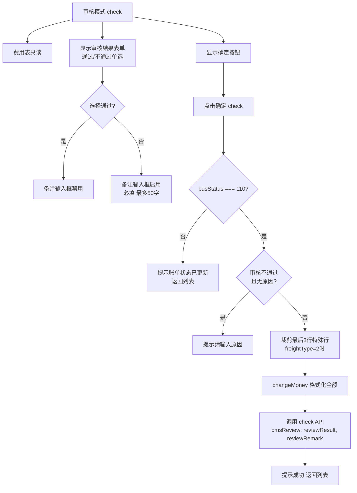

### 16.1 审核（check）

```javascript
// requestBmsReview = { ...model, bmsReview: { reviewResult, reviewRemark }, bmsBusinessCostList: model.list.slice(0, -3) }
// 注意：freightType=2 时裁剪最后3行（小计+合计+空行）
constManagement.driverChecking.check({ ...requestBmsReview, bmsBusinessCostList: newlist })
```

---

## 十七、整体业务流程

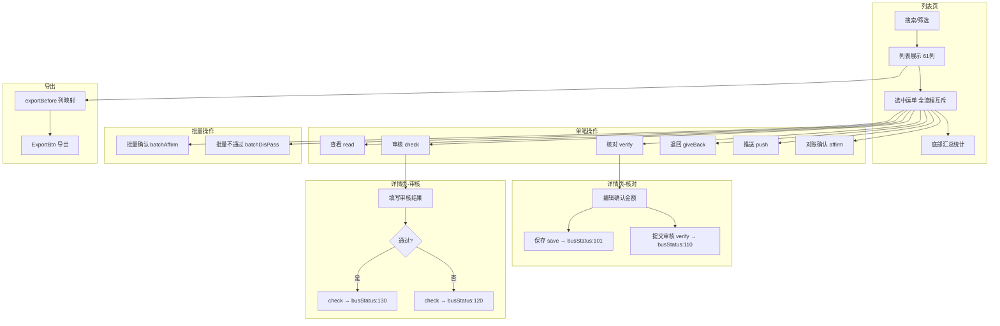

---

## 十八、接口汇总

### 列表页接口

| 接口函数 | 模块 | 说明 |
|---------|------|------|
| `getTable` | `constManagement.driverChecking` | 列表查询（普通） |
| `_getTable` | `constManagement.driverChecking` | 列表查询（ES） |
| `affirm` | `constManagement.driverChecking` | 单笔对账确认 |
| `batchAffirm` | `constManagement.driverChecking` | 批量对账确认 |
| `giveBack` | `constManagement.driverChecking` | 退回 |
| `push` | `constManagement.driverChecking` | 推送（线上） |
| `pushForFile` | `constManagement.driverChecking` | 推送（线下生成文件） |
| `batchReviewNotPass` | `constManagement.driverChecking` | 批量不通过 |
| `getParameterByParamName` | `Payment` | 走马灯公告 |
| `getNewCompanyInfos` | `userBase/mainstay` | 网络货运主体列表 |
| `fetchOrganizationList` | `fetchOrgList` | 所属组织列表 |
| `listAvailableEmployeeByCompanyId` | `userBase.supplymanagement` | 经办人列表 |
| `queryValidValueList` | `public` | 字典开关（ES 白名单） |
| `platformCmPlatformParameterPaging` | `bmsInvoiceRecords` | ES 开关平台参数 |

### 详情页接口

| 接口函数 | 模块 | 说明 |
|---------|------|------|
| `getDetail` | `constManagement.driverChecking` | 获取详情（运单信息 + 费用列表） |
| `save` | `constManagement.driverChecking` | 保存（核对暂存） |
| `verify` | `constManagement.driverChecking` | 提交审核 |
| `check` | `constManagement.driverChecking` | 审核确定 |
| `recordNew` | `constManagement` | 操作记录 |
| `getAttachmentsByWaybillId` | `userBase.transport` | 装/卸货附件图片 |
| `getPartPay` | `userBase.driverSupplymanagement` | 分次付款方式 |
| `queryDispatchRatio` | `oilGasManage` | 油气返利配置 |

---

## 十九、关键业务规则与坑点

### 19.1 ES 开关

通过 `getUseNew()` 同时检查「司机对账es开关」平台参数（值为 `'10'` 全量开启）以及 `query_waybill_account` 字典白名单（按公司ID灰度），决定调用 `getTable` 还是 `_getTable`。

### 19.2 全流程运单互斥选中

`fullProcessFlag===10` 与非全流程运单不能混选：
- `handleSelectable` 禁用冲突行
- `handleCheckAllChange` 全选前校验一致性
- `isFullProcessConflict` 显示冲突 tooltip

### 19.3 时间范围限制

派车日期/创建日期 picker 限制在 ±2 个月内，且不能选未来日期。

### 19.4 运单号优先

有运单号时，派车时间和创建时间字段置空，不作为过滤条件。

### 19.5 导出列映射

- 虚拟 prop 映射：`$startEnd → sendAddrShorthand`、`$SettlementModes → settlementMethod`、`gx → containerName`、`$all → amountsPayable`
- `showStar` 控制时将 `waybillToConsignorPrice`/`serviceCharge` 替换为加密版字段名
- `displayColumnProps` 优先（来自 TableDrag 当前展示列），为空时回退到 `tableHeader` 全量

### 19.6 货物保障服务购买方

- `premiumBuyerType === '10'`：货主购买 → 显示保险行
- `premiumBuyerType === '20'`：司机购买 → 不显示保险行，但在小计行备注追加"含司机购买货物保障服务金额 X 元"
- `insuranceFeeType === '22'`：司机自购 → 列表页保险相关列显示"否/--"

### 19.7 油气优惠行

- 全流程运单强制显示且金额为 0
- 非全流程仅当后端返回有效油气数据（`oilAmount > 0` 且 `oilDiscountAmount ≠ -1`）时才追加
- 判断逻辑只看历史数据，不受当前返利配置状态影响

### 19.8 金额计算

- 使用 `BigNumber` 避免浮点精度
- `parsePriceReduction` 处理原金额
- `compuAdjustCost` 计算调整金额 = `updBusCost - busCost`
- 合计 = 小计 + 运费差价 + 保费 - 油气优惠

### 19.9 搜索字段拖拽排序

`searchFormColumns` 数组支持字段拖拽排序和显示/隐藏，分为 `forever`（固定区）和 `temporary`（临时区）两种 section。`getAllFieldRows()` 按 `checked=true` 的字段每行 4 列分组渲染。

### 19.10 工作台参数恢复

`getAndApplyWorkspaceParams()` 从工作台缓存恢复筛选条件，日期字段交给 watch 处理（不直接赋值）。

---

**文档版本**: v2.0
**最后更新**: 2026年08月
**整理人**: 王新骏
