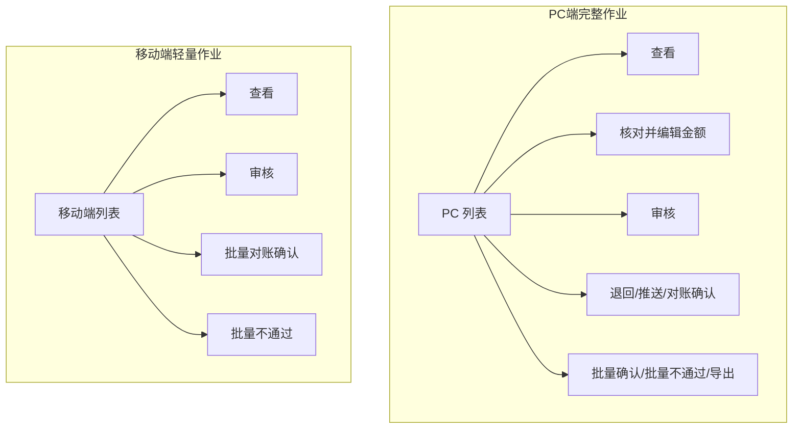
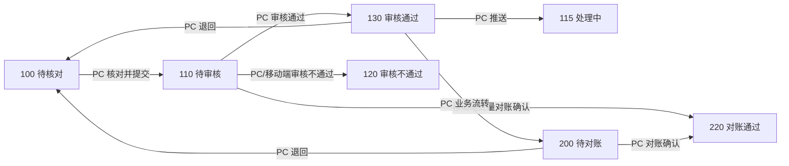
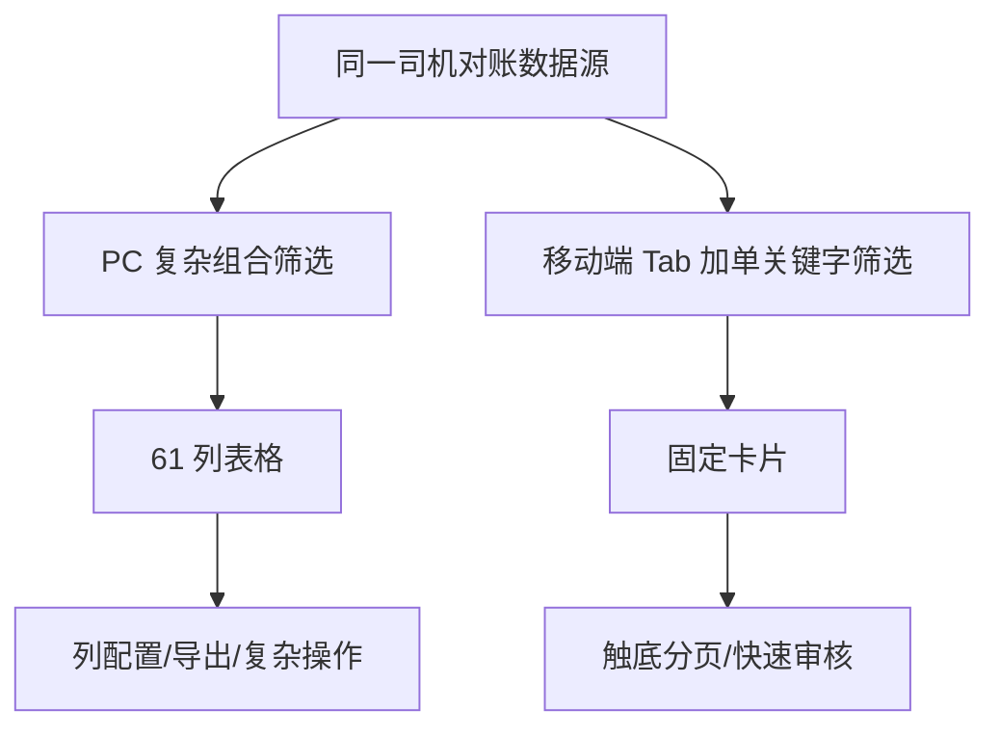
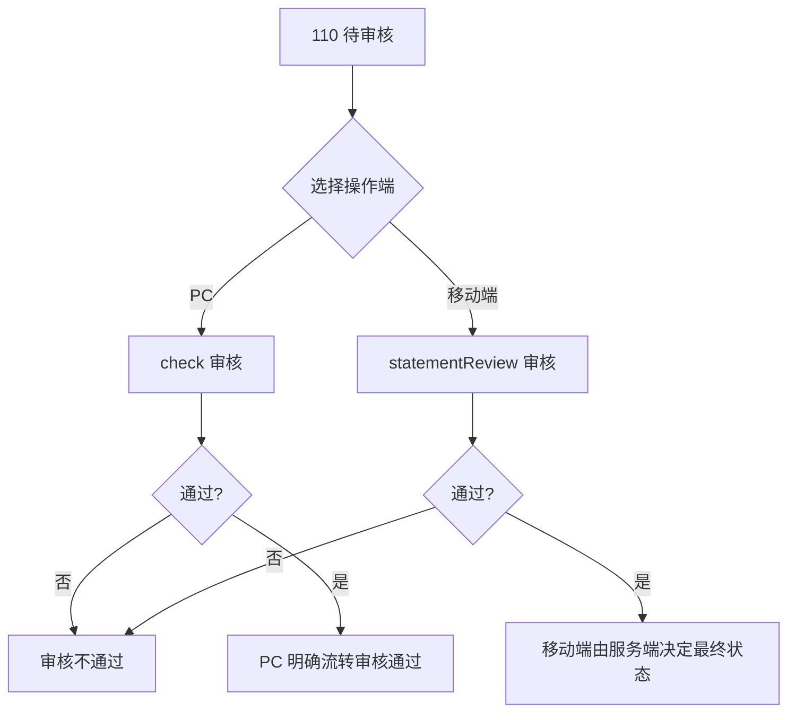
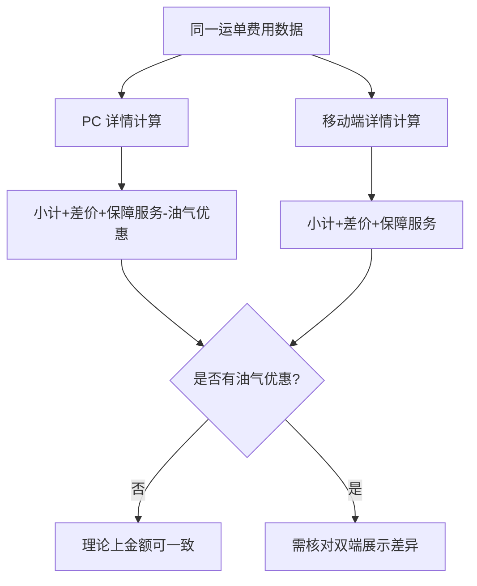
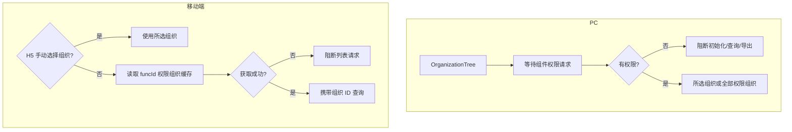
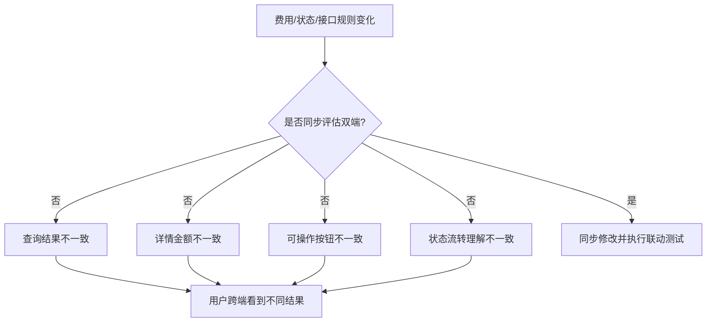

# 司机对账双端横向对比

> PC 端模块：`logisticsweb/src/views/userBase/driverChecking/`  
> 移动端模块：`wlyd-app-consigner/minePages/mine/driverCheckPages/`  
> 对比范围：页面、状态、查询、权限、金额、接口、操作流程与测试联动

## 一、对比结论

PC 端是司机对账的完整作业端，覆盖核对、审核、退回、推送、对账确认和导出；移动端是轻量审核与确认端，重点覆盖状态查询、只读详情、审核、批量不通过和批量对账确认。

双端共用司机对账业务状态和主要金额字段，但不是同一套前端实现。两端在全流程运单、油气优惠、金额计算、状态操作和接口入参方面存在明显差异，不能把 PC 端逻辑直接等同于移动端逻辑。

## 二、双端定位与页面结构

| 维度 | PC 端 | 移动端 |
|---|---|---|
| 项目 | `logisticsweb` | `wlyd-app-consigner` |
| 技术栈 | Vue 2 + Element UI | uni-app + uView |
| 入口 | `/userBase/driverChecking` | `/minePages/mine/driverCheckPages/index` |
| 列表形式 | 表格，61 列，可拖拽配置 | 固定卡片，滚动分页 |
| 详情复用 | `add.vue` 复用查看/核对/审核 | `detail.vue` 复用查看/审核 |
| 费用说明 | 列表弹窗 | 独立页面 `feeDetail.vue` |
| 主要用户场景 | 桌面端完整作业 | 移动端快速审核和确认 |



## 三、功能能力矩阵

| 业务能力 | PC 端 | 移动端 | 对比结论 |
|---|:---:|:---:|---|
| 查看列表和详情 | ✓ | ✓ | 双端具备，展示结构不同 |
| 待核对金额编辑 | ✓ | — | 仅 PC 端处理 |
| 核对暂存 | ✓ | — | PC 保存为 `busStatus=101` |
| 提交审核 | ✓ | — | PC 核对后提交为 `110` |
| 单笔审核通过/不通过 | ✓ | ✓ | 双端接口和提交结构不同 |
| 批量审核不通过 | ✓ | ✓ | 移动端最多 20 笔 |
| 单笔对账确认 | ✓ | 通过审核流程间接完成 | 移动端没有独立列表“对账确认”按钮 |
| 批量对账确认 | ✓ | ✓ | 双端均传目标状态 `220` |
| 退回 | ✓ | — | 移动端只读相关状态 |
| 账单推送 | ✓ | — | PC 支持线上和线下推送 |
| 导出 | ✓ | — | PC 根据当前展示列导出 |
| 全流程运单 | ✓ | — | 移动端固定过滤 `fullProcessFlag=20` |
| 油气优惠 | ✓ | — | 移动端详情金额未体现 |
| 催运费时效 | — | ✓ | 移动端列表特有展示 |
| 操作记录 | ✓ | ✓ | 双端均查询业务操作记录 |
| 所属组织过滤 | ✓ | ✓ | 交互和权限拦截方式不同 |
| 经办人过滤 | ✓ | H5 支持 | App/小程序不展示选择器 |

## 四、状态与业务流程对比

### 4.1 共同状态

| `busStatus` | 状态 | PC 端 | 移动端 |
|---:|---|:---:|:---:|
| 100 | 待核对 | 查看、核对 | 查看 |
| 110 | 待审核 | 查看、审核、批量不通过 | 查看、审核、批量操作 |
| 120 | 审核不通过 | 查看 | 查看 |
| 130 | 审核通过 | 查看、退回、推送 | 查看 |
| 200 | 待对账 | 查看、退回、对账确认 | 查看 |
| 210 | 对账退回 | 查看 | 查看 |
| 220 | 对账通过 | 查看 | 查看 |

PC 端额外明确处理 `115 处理中`；移动端状态字典还包含 `99、300、310、320`，但未包含 `115`。

### 4.2 双端流程



> 移动端单笔审核接口未显式传目标 `busStatus`，最终状态由服务端决定；图中只对批量确认明确标记 `220`。

## 五、查询与列表能力对比

### 5.1 查询能力

| 查询维度 | PC 端 | 移动端 |
|---|---|---|
| 时间范围 | 派车日期、创建日期 | 不支持 |
| 运单号 | 支持最多 200 个批量输入 | 单个关键字搜索 |
| 车辆/司机 | 支持单个或批量车牌、司机/承运商 | 车牌号或司机姓名二选一搜索 |
| 状态 | 多选状态 | 四个固定 Tab |
| 业务信息 | 结算主体、运输类型、客户、货物、起止地等 | 货源名称、货源别名、运单别名 |
| 高级条件 | 货运类型、来源、时效、全流程、上下游主体等 | 不支持 |
| 所属组织 | 多选树 | H5 单选；其他端自动带权限组织 |
| 经办人 | 支持 | 仅 H5 展示 |
| 工作台参数恢复 | 支持 | 不支持 |
| 字段拖拽排序 | 支持 | 不支持 |

PC 端有运单号时会清空派车日期和创建日期，使运单号优先；移动端一次只能选一个搜索范围，输入关键字但未选范围时会阻止查询。

### 5.2 列表展示

| 维度 | PC 端 | 移动端 |
|---|---|---|
| 布局 | 高密度表格 | 移动卡片 |
| 字段数量 | 61 列 | 固定核心字段 |
| 列配置 | 显示/隐藏、拖拽、持久化 | 不支持 |
| 分页 | 表格页码 | 每页 50 条，触底加载 |
| 金额脱敏 | 按公司类型和权限控制 | 委托转账账号固定中间脱敏 |
| 时效提示 | 运单图标、时效状态列 | 催运费等级和持续时间 |
| 导出 | 按展示列导出 | 不支持 |



## 六、详情与费用展示对比

| 维度 | PC 端 | 移动端 |
|---|---|---|
| 详情模式 | 查看、核对、审核 | 查看、审核 |
| 运单信息 | 4 列表单布局，字段较完整 | 卡片化核心字段 |
| 动态结算字段 | 按吨、柜、车、方动态替换 | 统一展示结算数量和单位 |
| 费用列 | 10 列 | 4 列 |
| 原金额 | 展示 | 不展示独立列 |
| 调整金额 | 展示并计算 | 不展示 |
| 确认金额 | 核对模式可编辑 | 只读 |
| 费用附件 | 支持查看 | 费用表未展示附件 |
| 费用操作人/时间 | 展示 | 不展示 |
| 装卸货附件 | 支持 | 支持第一张图片预览 |
| 操作记录 | 支持 | 支持 |
| 审核及对账结果 | 查看模式展示 | 根据详情和审核区展示 |

PC 端详情适合作业和追溯，移动端详情主要用于快速确认关键信息。

## 七、核对与审核流程对比

### 7.1 核对

核对仅 PC 端提供：


移动端对待核对数据只提供查看，因此确认金额的产生和修改依赖 PC 端或其他上游流程。

### 7.2 审核

| 维度 | PC 端 | 移动端 |
|---|---|---|
| 入口 | `action=check` | `type=apply` |
| 费用编辑 | 不可编辑 | 不可编辑 |
| 审核结果 | 通过/不通过 | 通过/不通过 |
| 不通过原因 | 必填，最多 50 字 | 必填，最多 50 字 |
| 提交接口 | `check` | `statementReview` |
| 状态前置校验 | 前端校验当前为 `110` | 未见同等前端状态校验 |
| 成功处理 | 返回列表 | 返回列表，`onShow` 刷新 |



## 八、批量操作对比

| 维度 | PC 批量确认 | 移动端批量对账确认 |
|---|---|---|
| 可选状态 | 从选中项筛选 `110/130/200` | 批量模式只在待审核 Tab 出现 |
| 选择限制 | 未见固定 50 笔前端上限 | 最多 50 笔 |
| 全流程混选 | 明确禁止 | 不涉及，全流程已过滤 |
| 汇总口径 | 区分全流程和非全流程 | 仅非全流程口径 |
| 请求标识 | `busStatus=220` | `busStatus=220` |
| 确认结果 | 对账通过 | 对账通过并提示生成付款单 |

| 维度 | PC 批量不通过 | 移动端批量不通过 |
|---|---|---|
| 有效状态 | `110` | 待审核 Tab |
| 数量限制 | 未见固定 20 笔前端上限 | 最多 20 笔 |
| 原因 | 必填 | 必填，最多 50 字 |
| 请求结构 | 每笔设置 `bmsReview` | 每笔附带 `versionCode`、账户 ID 和运单 ID |
| 接口 | `batchReviewNotPass` | `bathReviewNotPass` |

### 双端并发关注

PC 和移动端可以同时处理同一笔待审核运单。移动端批量不通过携带 `versionCode`，PC 端单笔审核还会检查状态；测试时需重点验证重复提交、状态已变化和版本冲突的服务端提示。

## 九、金额计算口径对比

### 9.1 共同核心字段

| 业务含义 | 主要字段 |
|---|---|
| 司机运费/应付总额 | `receivableTotalCost` |
| 运费差价 | `serviceCharge` |
| 货物保障服务金额 | `premiumAmount`、`listPremiumAmount` |
| 托运人应付金额 | `waybillToConsignorPrice` |
| 全流程应付运费 | `payableFpFreight` |
| 全流程运费差价 | `fpFreightDiffAmt` |
| 油气使用和优惠 | `oilAmount`、`oilDiscountAmount` |
| 费用原金额/确认金额 | `busCost`、`updBusCost` |

### 9.2 详情汇总

| 口径 | PC 端 | 移动端 |
|---|---|---|
| 费用小计 | 应付类加、应收类减 | `costType=200/600` 加，其余减 |
| 运费差价 | 计入合计 | 计入合计 |
| 货物保障服务 | 按购买方和保险类型展示/计算 | 直接使用详情字段展示/计算 |
| 油气优惠 | 合计中扣减 | 未纳入当前详情公式 |
| 全流程运费差价 | 单独计算和展示 | 不支持 |
| 最终金额 | 特殊汇总行分场景计算 | 页面重算 `waybillToConsignorPrice` |
| 精度工具 | `BigNumber` | 详情用 `BigNumber`，批量汇总用原生 `Number` |

非全流程的概念口径如下：

```text
PC 合计 = 费用小计 + 运费差价 + 货物保障服务金额 - 油气优惠
移动端当前合计 = 费用小计 + 运费差价 + 货物保障服务金额
```

因此，当运单存在有效油气优惠时，双端详情展示存在不一致风险。

### 9.3 批量确认汇总

| 项目 | PC 非全流程 | 移动端 |
|---|---|---|
| 司机运费 | `Σ receivableTotalCost` | `Σ receivableTotalCost` |
| 运费差价 | `Σ serviceCharge` | `Σ serviceCharge` |
| 货物保障服务金额 | `Σ premiumAmount` | `Σ premiumAmount` |
| 司机购买保障服务 | 在业务备注/口径中体现 | 单独汇总 `premiumBuyerType=20` 的 `listPremiumAmount` |
| 油气优惠 | `Σ oilDiscountAmount` | 未展示 |
| 应付 | `Σ waybillToConsignorPrice` | `Σ waybillToConsignorPrice` |



## 十、全流程及特殊业务对比

| 特殊业务 | PC 端 | 移动端 |
|---|---|---|
| 全流程查询 | 可筛选 | 固定排除 |
| 全流程混选 | 禁止与非全流程混选 | 不涉及 |
| 全流程运费差价 | 展示 `fpFreightDiffAmt` | 不展示 |
| 客户应付/承运商应付 | 按 `companyType` 展示 | 不展示 |
| 全流程保费/油气 | 汇总时按 0 处理 | 不涉及 |
| 油气返利配置 | 查询配置并结合历史数据 | 未查询 |
| 委托转账 | 列表和详情均展示 | 列表和详情均展示 |
| 货物保障服务购买方 | 区分货主、司机和司机自购 | 展示字段较简化 |
| 分次付款 | 详情小计备注展示 | 当前司机对账详情未展示 |
| 时效/催促 | PC 展示时效状态 | 移动端展示催运费等级和时长 |

移动端若未来开放全流程，必须同时补齐列表选择互斥、详情特殊行、批量金额口径、客户/承运商字段和测试用例，不能只去掉 `fullProcessFlag=20`。

## 十一、权限与组织过滤对比

### 11.1 权限模型

| 维度 | PC 端 | 移动端 |
|---|---|---|
| 权限来源 | 路由 `meta` 和功能权限 | `common/getAuthList` 功能编号 |
| 查看 | 路由/按钮控制 | `1595573577890` |
| 审核 | 路由/按钮控制 | `1585726621799` |
| 批量模式 | 路由权限 | `1585726501509` |
| 批量不通过 | 路由权限 | `1732094414293` |
| 导出 | `$route.meta.export` | 不支持 |

移动端没有批量不通过权限时，`batchBtnStr` 返回字符串，公共批量组件会进入通用付款按钮分支，可能误显示“批量到付/批量回单付”，属于移动端权限分支风险。

### 11.2 组织过滤



两端都遵循“无组织权限不查询”的原则，但 PC 端是组件显式状态加三道拦截，移动端主要依赖 `fetchCachedConditionOrgIds` 返回结果。

## 十二、接口与字段映射

### 12.1 列表接口

| 场景 | PC 端 | 移动端 |
|---|---|---|
| 旧列表 | `driverChecking.getTable` | `/bms/BmsWaybillAccounts/bmsWaybillAccountsPaging` |
| 新列表 | `driverChecking._getTable` | `/lgi-orch-bmsquery/waybill/bmsWaybillAccountsPaging` |
| 开关参数 | “司机对账es开关” | “app司机对账列表查询开关” |
| 字典白名单 | `query_waybill_account` | `query_waybill_account` |
| 全流程参数 | 用户筛选 | 固定 `fullProcessFlag=20` |

双端共享字典白名单，但平台参数名称不同，因此可能出现 PC 已切新接口、移动端仍走旧接口，或反向不一致。

### 12.2 业务接口

| 业务 | PC 端 | 移动端 | 说明 |
|---|---|---|---|
| 详情 | `driverChecking.getDetail` | `/bms/BmsWaybillAccounts/viewDetail` | 返回模型需保持字段兼容 |
| 核对暂存 | `driverChecking.save` | — | 仅 PC |
| 提交审核 | `driverChecking.verify` | — | PC 核对流程 |
| 单笔审核 | `driverChecking.check` | `/bms/BmsWaybillAccounts/statementReview` | 接口不同 |
| 批量不通过 | `batchReviewNotPass` | `/bms/BmsWaybillAccounts/bathReviewNotPass` | 移动端路径使用 `bath` |
| 单笔对账确认 | `driverChecking.affirm` | — | 移动端无独立入口 |
| 批量确认 | `driverChecking.batchAffirm` | `/bms/BmsWaybillAccounts/batchReconciliationConfirm` | 均目标 `220` |
| 退回 | `driverChecking.giveBack` | — | 仅 PC |
| 推送 | `push`、`pushForFile` | — | 仅 PC |
| 操作记录 | `recordNew` | `operateView` 内查询 | 业务类型均含 `30/160` |
| 催运费 | — | `query_freight_reminder`、`get_freight_reminder_time` | 移动端特有 |

### 12.3 关键字段对应

| 业务含义 | PC 端 | 移动端 | 一致性关注 |
|---|---|---|---|
| 运单 ID | `waybillId` | `waybillId` | 一致 |
| 对账账户 ID | 列表/接口内部账户标识 | `waybillAccountsId`，路由名 `waybillPoolId` | 移动端命名易混淆 |
| 状态 | `busStatus` | `busStatus`、查询用 `appStatus` | 状态与 Tab 需区分 |
| 确认金额 | `updBusCost` | `updBusCost` | 移动端只读 |
| 费用类型 | `costType` | `costType` | 加减规则需保持一致 |
| 委托转账 | `splitFlag/splitType/...` | 同名字段 | 展示规则基本一致 |
| 全流程 | `fullProcessFlag` | 固定筛选为 `20` | 移动端无全流程数据 |
| 乐观锁 | 业务请求模型 | 批量不通过显式传 `versionCode` | 并发处理需验证 |

## 十三、双端一致性风险

### 13.1 高优先级

1. **油气优惠导致详情合计不一致**  
   PC 合计扣减 `oilDiscountAmount`，移动端当前详情公式未扣减。存在油气优惠的同一运单可能展示不同的托运人应付总额。

2. **移动端批量按钮权限分支异常**  
   无批量不通过权限时，公共组件可能展示通用付款按钮，而非司机对账按钮。

3. **移动端失败分支引用未定义变量**  
   批量确认和批量不通过失败时使用未定义的 `errMsg`，可能覆盖服务端真实错误提示。

4. **状态映射不完整**  
   PC 明确存在 `115 处理中`，移动端状态字典没有该值，接口返回时可能渲染异常。

### 13.2 中优先级

5. **批量金额精度不同**  
   PC 使用 `BigNumber`；移动端批量弹窗使用原生 `Number` 累加，金额较多或带小数时可能产生尾差。

6. **前端重算覆盖服务端金额**  
   移动端详情重新计算并覆盖 `waybillToConsignorPrice`，计算规则变化时容易与 PC 或服务端不一致。

7. **新旧接口开关不同步**  
   双端平台参数名不同，灰度期间可能查询不同服务，需验证数据总数、状态和字段一致。

8. **单笔审核状态语义不同**  
   PC 对审核后的状态流转描述明确；移动端 `statementReview` 未显式传目标状态，不能仅根据前端推断结果。

### 13.3 低优先级与体验差异

9. 移动端费用说明入口受批量权限和待审核 Tab 限制。
10. 移动端只能查看第一张装卸货图片，PC 附件查看能力更完整。
11. PC 支持复杂筛选和导出，移动端无法复现同一筛选结果集。
12. 移动端 `waybillPoolId` 实际承载 `waybillAccountsId`，命名不一致增加维护成本。

### 13.4 风险影响链路



## 十四、联动测试清单

### 14.1 同一运单跨端一致性

- 在 PC 核对并提交后，移动端待审核 Tab 能查询到该运单。
- PC 修改后的 `updBusCost`、费用备注在移动端详情正确展示。
- 移动端审核后，PC 列表状态、审核结果和操作记录同步更新。
- PC 退回、推送或对账确认后，移动端对应 Tab 正确迁移。
- 同一运单的司机、车辆、结算主体、委托转账和保障服务字段一致。

### 14.2 金额一致性

- 无保费、无油气优惠的普通运单。
- 货主购买保障服务、司机购买保障服务、司机自购三类运单。
- 有效油气优惠、优惠值为 `-1`、油气使用为 0 的运单。
- 应付、其他应付、应收等不同费用类型组合。
- 多笔带小数金额的批量确认，检查双端汇总尾差。
- 对比 `receivableTotalCost`、`serviceCharge`、`premiumAmount`、`waybillToConsignorPrice`。

### 14.3 状态和并发

- PC 与移动端同时打开同一笔 `110` 运单，先后提交审核。
- PC 审核通过后，移动端旧页面再提交不通过。
- 移动端批量确认后，PC 旧列表继续执行审核或退回。
- 批量操作中混入已被其他端处理的运单。
- 验证 `versionCode` 冲突、状态已更新和重复提交提示。
- 验证 `100、110、115、120、130、200、210、220` 的跨端展示。

### 14.4 权限和组织

- 同一用户在双端的查看、审核、批量权限保持一致。
- 无组织权限时双端均不发送有效列表查询。
- 选择部分组织时，双端查询结果范围一致。
- H5 经办人和所属组织筛选与 PC 同条件结果对比。
- 移动端无批量不通过权限时不应出现通用付款按钮。

### 14.5 接口灰度

- 双端同时走旧接口。
- 双端同时走新接口。
- PC 新/移动端旧和 PC 旧/移动端新的交叉组合。
- 对比总数、分页、状态、金额、组织、经办人和全流程过滤结果。

## 十五、维护建议

1. 司机对账涉及状态、金额或接口字段调整时，必须同时评估 PC 和移动端，不能只搜索单一项目。
2. 金额公式应优先由服务端返回最终展示值；如前端必须重算，应抽取统一规则并使用 `BigNumber`。
3. 移动端应补齐 `115` 及未知状态兜底，避免新增状态造成卡片渲染失败。
4. 双端新旧列表接口开关建议统一配置口径，减少灰度结果不一致。
5. 移动端开放全流程前，应以 PC 全流程规则为基准建立专项改动和测试清单。
6. 状态操作接口应明确返回目标状态和版本冲突信息，前端不自行推断。
7. 双端文档更新时同步维护本对比文档，重点检查能力矩阵、状态图、金额公式和接口映射。

---

**文档版本**: v1.0  
**最后更新**: 2026年08月  
**整理人**: 王新骏

