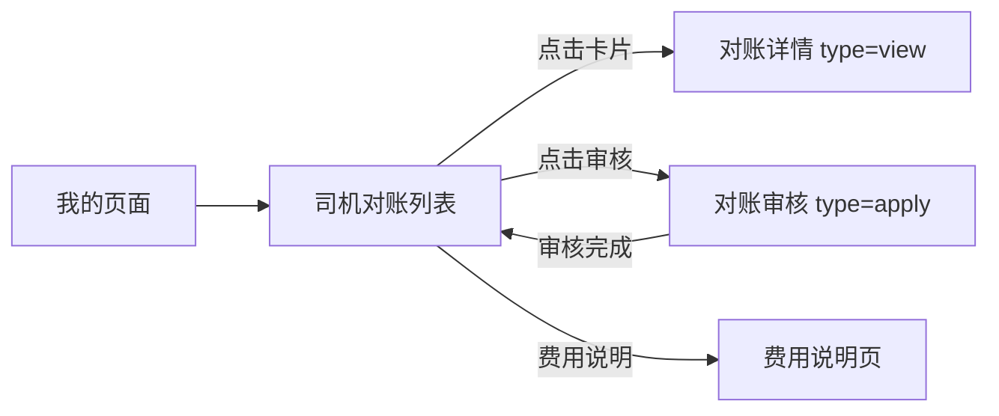
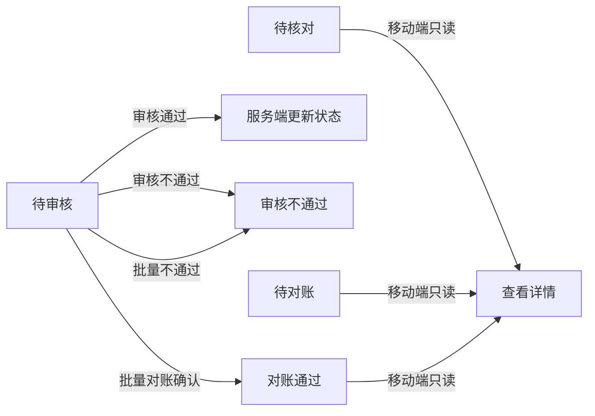
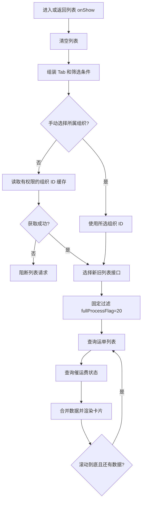
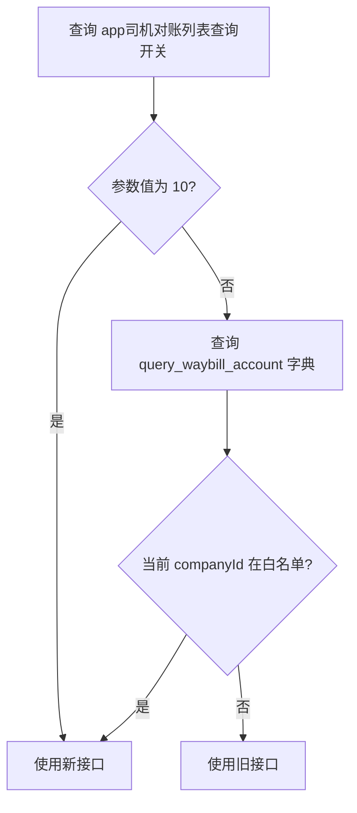
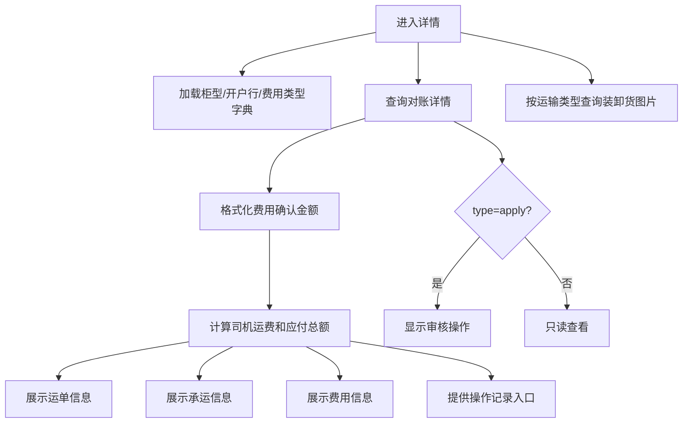
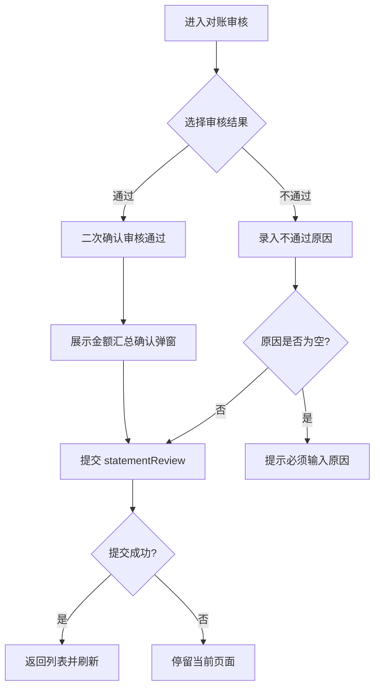
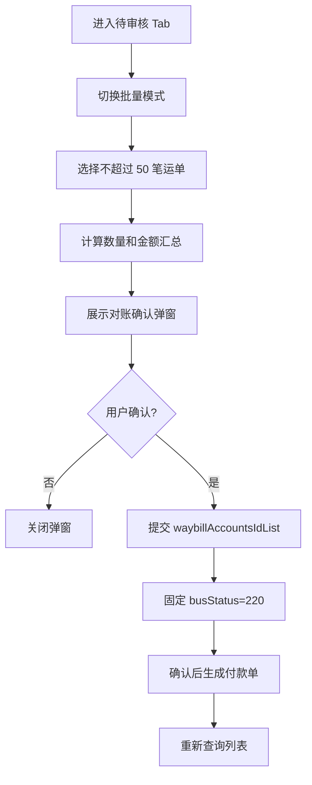
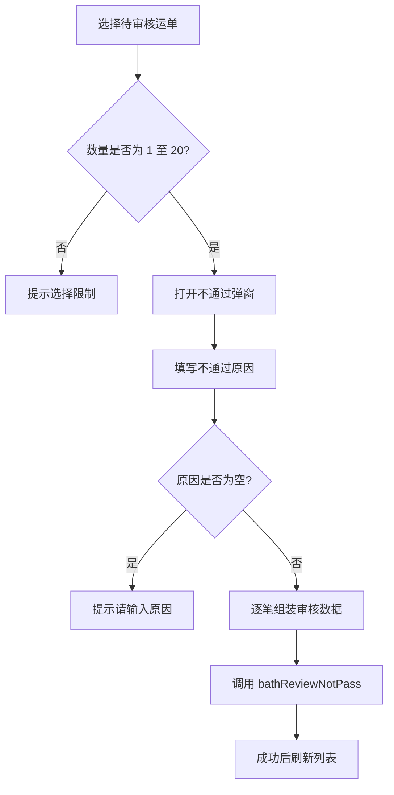

# 移动端司机对账模块梳理

> 项目：`wlyd-app-consigner`  
> 模块路径：`minePages/mine/driverCheckPages/`  
> 入口路由：`/minePages/mine/driverCheckPages/index`

## 一、模块定位

移动端司机对账主要供货主查询司机对账运单，并完成查看、审核、批量不通过和批量对账确认。它不是 PC 端司机对账的完整复刻，移动端更偏向审核和确认操作。

移动端当前支持：

- 按待审核、待核对、待对账、已对账查看运单。
- 查看运单、承运、费用和操作记录。
- 单笔审核通过或不通过。
- 批量审核不通过、批量对账确认。
- 查看费用说明和催运费时效。

移动端当前不支持：

- 核对阶段编辑确认金额、暂存和提交审核。
- 退回、账单推送和列表导出。
- 自定义列表列和 PC 端的完整组合筛选。
- 全流程运单。列表接口固定附加 `fullProcessFlag=20`。

## 二、文件结构

```text
driverCheckPages/
├── index.vue                  # 列表、分页和批量操作
├── detail.vue                 # 详情和单笔审核
├── feeDetail.vue              # 费用说明
├── constants.js               # 所属组织权限编号
├── rules.js                   # 费用说明配置
└── components/
    ├── SearchHeader.vue       # 状态 Tab、单笔/批量切换
    ├── searchPopup.vue        # 条件筛选
    ├── waybillList.vue        # 运单卡片和详情跳转
    ├── WaybillInfo.vue        # 运单信息
    ├── CarrierInfo.vue        # 承运信息
    ├── CostContent.vue        # 费用信息
    ├── ReviewAction.vue       # 审核操作栏
    ├── contentNode.js         # 确认金额汇总
    ├── urge.vue               # 催运费展示
    └── urgeTool.js            # 催运费数据合并
```

关联公共文件：

| 文件 | 作用 |
|---|---|
| `api/mine.js` | 列表、详情、审核和批量操作接口 |
| `minePages/api/bmsNetworkFreightPayment.js` | 选择新旧列表接口 |
| `minePages/components/batchBtnGroup.vue` | 公共批量操作栏 |
| `common/orgFilter.js` | 司机对账所属组织权限编号 |
| `utils/cached-condition-org-ids.js` | 缓存有权限的组织 ID |

## 三、路由与页面关系

| 路由 | 页面 | 说明 |
|---|---|---|
| `/minePages/mine/driverCheckPages/index` | `index.vue` | 司机对账列表 |
| `/minePages/mine/driverCheckPages/detail?type=view...` | `detail.vue` | 对账详情，只读 |
| `/minePages/mine/driverCheckPages/detail?type=apply...` | `detail.vue` | 对账审核 |
| `/minePages/mine/driverCheckPages/feeDetail` | `feeDetail.vue` | 费用说明 |



详情页接收 `waybillPoolId`、`waybillId` 和 `transportType`，其中 `waybillPoolId` 的实际值来自列表字段 `waybillAccountsId`。

## 四、状态与功能范围

### 4.1 列表 Tab

| Tab | `appStatus` | 可用操作 |
|---|---:|---|
| 待审核 | 2 | 查看、审核、批量不通过、批量对账确认 |
| 待核对 | 1 | 查看 |
| 待对账 | 3 | 查看 |
| 已对账 | 4 | 查看 |

### 4.2 卡片状态

| `busStatus` | 状态 | `busStatus` | 状态 |
|---:|---|---:|---|
| 99 | 未回单 | 100 | 待核对 |
| 110 | 待审核 | 120 | 审核不通过 |
| 130 | 审核通过 | 200 | 待对账 |
| 210 | 对账退回 | 220 | 对账通过 |
| 300 | 待处理 | 310 | 已保存 |
| 320 | 转结算 | — | — |

移动端没有独立的核对编辑页，状态查询与操作关系如下：



> 单笔审核提交未显式传递目标 `busStatus`，最终状态以服务端返回为准；批量对账确认明确传递 `busStatus=220`。

## 五、列表查询流程

列表每页加载 50 条，`onShow` 时清空并重新查询，滚动到底部后继续分页。



### 5.1 新旧接口开关



- 新接口：`/lgi-orch-bmsquery/waybill/bmsWaybillAccountsPaging`
- 旧接口：`/bms/BmsWaybillAccounts/bmsWaybillAccountsPaging`
- H5 货主模式额外附加 `platformCode=40`。
- 移动端固定附加 `fullProcessFlag=20`，不展示全流程运单。

## 六、筛选与权限

### 6.1 筛选条件

移动端一次只能选择一个文本搜索范围：

| 搜索项 | 参数 |
|---|---|
| 运单编号 | `waybillId` |
| 货源名称 | `goodsName` |
| 车牌号 | `busNumber` |
| 司机姓名 | `dcCarrierCompanyName` |
| 货源别名 | `orderAlias` |
| 运单别名 | `waybillAlias` |

H5 额外支持所属组织 `carrierOrgIdList` 和经办人 `handlerId`。输入关键字但未选择搜索范围时，页面提示“请选择搜索范围”。

### 6.2 所属组织

司机对账组织查询 `funcId` 为 `1606892266175130`：

- H5 可以手动选择所属组织。
- 未选择时自动查询当前用户有权限的全部组织 ID。
- App/小程序不展示组织选择器，但列表请求仍自动携带权限组织。
- 组织权限查询失败时直接阻断列表请求。

### 6.3 按钮权限

| 权限编号 | 能力 |
|---|---|
| `1595573577890` | 查看详情 |
| `1585726621799` | 单笔审核 |
| `1585726501509` | 待审核 Tab 的单笔/批量切换 |
| `1732094414293` | 批量不通过 |

没有详情权限时点击卡片提示“暂无详情权限”。批量不通过按钮受 `1732094414293` 控制；未拥有该权限时，页面向公共批量组件传入字符串而非按钮数组，公共组件会进入通用付款按钮分支，存在显示非司机对账按钮的风险，详见风险点。

## 七、列表卡片与批量选择

### 7.1 卡片内容

卡片展示运单号、状态、起止地、结算主体、司机、车牌号、托运人应付总额、司机运费、货物、结算数量、单价、客户和网络货运主体等信息。

委托转账运单额外展示：

- 委托转账主体、脱敏账号和支付渠道。
- 全额运费、固定金额或单位扣减规则。
- 规则续签过时 `renewTimes>0` 使用红色提示。

所属组织仅在 H5 展示。

### 7.2 批量选择

- 批量模式仅在“待审核”Tab 出现。
- 单次最多选择 50 笔。
- “全选”选择当前已加载列表的前 50 笔。
- 批量不通过最多 20 笔。
- 切换单笔/批量模式会清空已选状态。
- 底部按结算类型汇总装货数量、卸货数量和结算数量。

## 八、详情页



### 8.1 运单信息

- 出发地、目的地、运单编号。
- 货物名称、运输数量、重量、柜型柜数。
- 货源别名和运单别名。

### 8.2 承运信息

- 结算主体、开户行、收款账号。
- 委托转账信息和规则。
- 司机、车辆、装货净重、卸货净重及图片。

### 8.3 费用信息

费用表展示费用项目、费用类型、确认金额和备注；汇总区展示司机运费合计、货物保障服务、运费差价、托运人应付总额、单价、结算数量和亏涨吨信息。

### 8.4 操作记录

复用 `operateView` 组件，查询参数为：

- `source=driverCheck`
- `busId=waybillPoolId`
- `busTypeList=['30','160']`

## 九、审核流程

详情页通过 `type=apply` 进入审核模式，费用明细只读，不支持修改确认金额。



提交内容包括完整详情数据，并附加：

- 审核通过：`bmsReview.reviewResult=10`。
- 审核不通过：`bmsReview.reviewResult=20`，同时传递 `reviewRemark`。
- `unitRice` 转回未格式化金额。
- 费用列表的 `busCost`、`updBusCost` 转为两位小数。

不通过原因必填，最多 50 字。

## 十、批量操作

### 10.1 批量对账确认



确认弹窗汇总：

| 项目 | 计算字段 |
|---|---|
| 司机运费 | `Σ receivableTotalCost` |
| 含司机支付货物保障服务金额 | `premiumBuyerType='20'` 时 `Σ listPremiumAmount` |
| 运费差价 | `Σ serviceCharge` |
| 货物保障服务金额 | `Σ premiumAmount` |
| 应付 | `Σ waybillToConsignorPrice` |

确认文案提示：通过后立即生成付款单，运费不可修改。

### 10.2 批量审核不通过



每笔请求数据包含：

- `reviewResult=20`
- `reviewRemark`
- `versionCode`
- `waybillAccountsId`
- `waybillId`

## 十一、金额计算口径

### 11.1 详情费用初始化

确认金额按以下优先级初始化：

1. `updBusCost` 不为空时使用确认金额。
2. 否则 `busCost` 不为空时使用原金额。
3. 两者均为空时使用 `0.00`。

### 11.2 详情汇总

费用类型为 `200`、`600` 时累加，其余费用类型扣减：

```text
司机运费合计 = Σ 应付/其他应付确认金额 - Σ 其他类型确认金额
托运人应付总额 = 司机运费合计 + 运费差价 + 货物保障服务金额
```

移动端详情当前没有计算油气优惠、全流程运费差价及全流程客户/承运商应付金额。全流程相关逻辑暂不涉及，是因为列表已固定过滤 `fullProcessFlag=20`。

## 十二、附件与催运费

### 12.1 装卸货图片

详情页根据运输类型选择装卸货节点：

| 运输类型 | 装货状态 | 卸货状态 |
|---|---:|---:|
| 3、6 | 410 | 420 |
| 1、2 | 410 | 430 |
| 其他 | 400 | 420 |

存在附件时显示第一张图片，点击后使用 `uni.previewImage` 预览；不存在时不显示图片入口。

### 12.2 催运费

列表查询成功后按运单号批量加载催运费状态：

| 等级 | 文案 |
|---:|---|
| 10 | 初级 |
| 20 | 中级 |
| 30 | 高级 |

点击“催”可查看已催次数、催促持续时间和对账持续时间。`reminderStatus` 为 `100` 或 `40` 时不显示催运费标识。

## 十三、费用说明

费用说明页展示费用名称、计算规则和备注，共包含：

1. 托运人应付金额
2. 应付总额
3. 运费差价
4. 货物保障服务金额
5. 运费
6. 杂费
7. 其他费用
8. 预付费用
9. 应付金额
10. 垫付金额

当前费用说明入口位于待审核 Tab 的批量功能区域，因此只有具备批量权限且处于待审核状态时才显示。

## 十四、接口汇总

| 接口 | 说明 |
|---|---|
| `/bms/BmsWaybillAccounts/bmsWaybillAccountsPaging` | 旧版列表查询 |
| `/lgi-orch-bmsquery/waybill/bmsWaybillAccountsPaging` | 新版列表查询 |
| `/bms/BmsWaybillAccounts/viewDetail` | 对账详情 |
| `/bms/BmsWaybillAccounts/statementReview` | 单笔审核 |
| `/bms/BmsWaybillAccounts/batchReconciliationConfirm` | 批量对账确认 |
| `/bms/BmsWaybillAccounts/bathReviewNotPass` | 批量审核不通过 |
| `/lgi-shipper/freight_reminder/query_freight_reminder` | 查询催运费状态 |
| `/lgi-shipper/freight_reminder/get_freight_reminder_time` | 查询催运费时效 |
| `/platform/PlatformCmSystemparameter/getParameterByParamName` | 查询列表公告 |
| `/platform/PlatformCmPlatformParameter/platformCmPlatformParameterPaging` | 查询列表接口开关 |
| `/lmt-pub/dict/query-valid-value-list` | 查询列表接口灰度白名单 |

## 十五、与 PC 端的主要差异

| 能力 | PC 端 | 移动端 |
|---|---|---|
| 状态查询 | 多条件状态筛选 | 四个固定 Tab |
| 核对确认金额 | 可编辑、保存、提交审核 | 不支持编辑 |
| 审核 | 支持 | 支持 |
| 批量不通过 | 支持 | 支持，最多 20 笔 |
| 对账确认 | 单笔和批量 | 审核通过、批量确认 |
| 退回 | 支持 | 不支持 |
| 推送 | 支持线上/线下推送 | 不支持 |
| 导出 | 支持 | 不支持 |
| 全流程运单 | 支持 | 固定过滤 |
| 油气优惠 | 参与金额展示和计算 | 当前详情未体现 |
| 搜索能力 | 完整组合查询 | 单搜索范围加关键字 |
| 列表展示 | 61 列，可拖拽配置 | 固定卡片 |

## 十六、关键规则与风险点

### 16.1 业务规则

1. 移动端暂不展示全流程运单，列表固定传递 `fullProcessFlag=20`。
2. 批量确认最多选择 50 笔，批量不通过最多 20 笔。
3. 审核不通过必须填写原因，最多 50 字。
4. 批量确认请求固定传递 `busStatus=220`。
5. 所属组织无权限或查询失败时阻断列表请求。
6. 审核通过后会生成付款单，运费不可继续修改。

### 16.2 源码风险

1. **失败提示变量未定义**：`index.vue` 的批量确认和批量不通过失败分支使用未定义的 `errMsg`，可能产生运行时异常。
2. **状态映射缺少兜底**：卡片直接读取 `EXECUTING_STATUS[item.busStatus]`，若接口返回 `115` 或新增状态，可能导致渲染异常。
3. **批量按钮权限分支异常**：没有批量不通过权限时 `batchBtnStr` 返回字符串，公共 `BatchBtnGroup` 会进入通用付款按钮分支，可能显示“批量到付/批量回单付”，而不是仅显示“批量对账确认”。
4. **批量金额精度风险**：`contentNode.js` 使用原生 `Number` 累加金额，与 PC 端 `BigNumber` 口径不一致。
5. **详情金额覆盖接口字段**：页面重新计算并覆盖 `waybillToConsignorPrice`，需要保证前端公式与服务端一致。
6. **费用说明入口受批量权限影响**：无批量权限或不在待审核 Tab 时无法进入费用说明，需要确认是否符合产品预期。
7. **全流程扩展成本**：后续开放全流程时，需同步调整列表过滤、详情汇总、批量确认和金额展示，不能只移除过滤条件。
8. **批量限制不同**：批量确认和批量不通过的数量限制不同，交互提示和测试需分别覆盖。

## 十七、验证建议

### 17.1 列表与筛选

- 验证四个 Tab 请求的 `appStatus` 正确。
- 验证 H5、App、小程序的组织权限参数和展示差异。
- 验证新旧接口开关、公司白名单及默认旧接口。
- 验证关键字搜索、重置、分页和无权限阻断。
- 验证列表始终排除全流程运单。

### 17.2 权限与详情

- 验证无详情权限、无审核权限、无批量权限和无批量不通过权限。
- 验证 `view` 与 `apply` 两种详情模式。
- 验证不同运输类型对应的装卸货图片节点。
- 验证委托转账信息脱敏、规则颜色和操作记录。

### 17.3 审核与批量

- 验证审核通过、审核不通过、原因为空及接口失败场景。
- 验证选择 0、1、20、21、50 和超过 50 笔时的处理。
- 验证批量金额、数量汇总及付款单生成提示。
- 验证操作成功后列表刷新，失败后页面状态不丢失。

---

**文档版本**: v1.0  
**最后更新**: 2026年08月  
**整理人**: 王新骏

