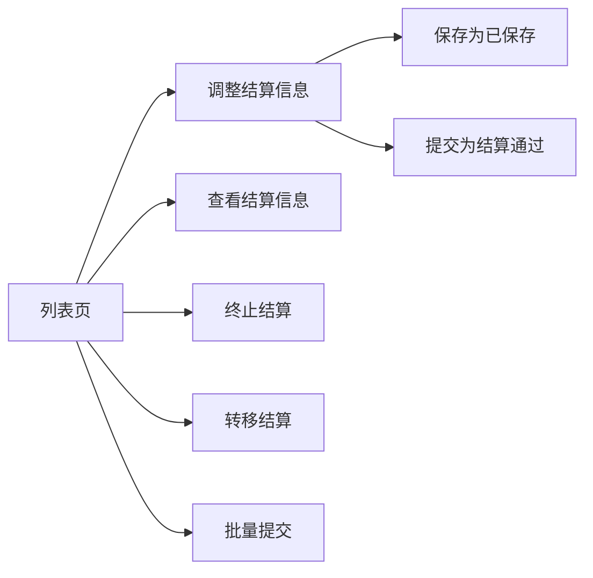

# 运单结算处理模块梳理（PC端）

> 路径：`src/views/userBase/waybillSettlement/`
> 路由：`/userBase/waybillSettlement`
> 范围：PC 端运单结算列表、调整结算信息页、查看结算信息页及相关弹窗/组件。

## 目录

- [一、模块定位](#一模块定位)
- [二、文件结构](#二文件结构)
- [三、路由与页面关系](#三路由与页面关系)
- [四、列表页（index.vue）](#四列表页indexvue)
- [五、列表表格](#五列表表格)
- [六、业务逻辑](#六业务逻辑)
- [七、接口汇总（列表页）](#七接口汇总列表页)
- [八、调整结算信息页（edit.vue）](#八调整结算信息页editvue)
- [九、查看结算信息页（read.vue）](#九查看结算信息页readvue)
- [十、详情页接口汇总（edit / read 共用）](#十详情页接口汇总edit--read-共用)
- [十一、Mixin 依赖](#十一mixin-依赖)
- [十二、关键业务规则与风险点](#十二关键业务规则与风险点)
- [十三、验证建议](#十三验证建议)

---

## 一、模块定位

运单结算处理是 PC 端从运单池进入结算审核链路前的处理模块，核心职责是查询待处理运单、调整结算信息、提交结算、查看结算结果，并处理风控预警、运单状态异常、亏吨货损、修改装卸重量、终止/转移结算等异常场景。

| 能力 | 说明 |
|------|------|
| 查询运单结算池 | 按时间、运单号、状态、主体、风险、是否结算、所属组织等条件筛选运单 |
| 调整结算信息 | 修改单价、结算数量、付款方式、费用明细、别名、备注等结算数据 |
| 批量提交结算 | 对勾选运单做状态校验、风控测算、提交并汇总成功/失败原因 |
| 查看结算信息 | 查看已提交、待预审、已终止或已转移的结算详情 |
| 异常处理 | 覆盖风控弹窗、状态异常弹窗、亏吨货损确认、修改装卸重量、抹零处理 |
| 数据保护 | 金额脱敏、委托转账账号脱敏、按钮权限、组织权限、全流程互斥选择 |

与司机对账的阶段差异：

| 模块 | 主要阶段 | 核心动作 |
|------|----------|----------|
| 运单结算处理 | 运单进入结算/预审前 | 调整、保存、提交、终止、转移 |
| 司机对账 | 结算数据进入司机对账后 | 核对、审核、推送、对账确认 |

---

## 二、文件结构

```
waybillSettlement/
├── index.vue                       列表页
├── edit.vue                        调整结算信息页
├── read.vue                        查看结算信息页
├── tableHeader.js                  列表表头配置（约 80 列）
└── components/
    ├── SettlementInfo.vue          结算信息区块（含 PaymentMethodPanel）
    ├── CostMessageDetails.vue      费用明细展示/编辑
    ├── EditMessageDetails.vue      操作记录列表
    ├── loseDialog.vue              亏吨货损确认弹窗
    ├── examResult.vue              预审结果展示
    ├── warnTable.vue               运单状态异常警告弹窗
    ├── editLoadWeight.vue          修改装卸重量弹窗
    ├── AnchorNav.vue               顶部锚点导航
    ├── WeighBillCarousel.vue       磅单轮播
    ├── rushIcon.vue                催付图标
    └── add.conf.js                 （add 相关配置）
```

---

## 三、路由与页面关系

```
/userBase/waybillSettlement
  → index.vue   运单结算处理列表

/userBase/waybillSettlement/edit?waybillPoolId=xxx&waybillId=xxx&type=edit&riskLevel=xxx
  → edit.vue    调整结算信息

/userBase/waybillSettlement/read?waybillPoolId=xxx&waybillId=xxx&type=read&riskLevel=xxx
  → read.vue    查看结算信息
```



> 这张图只表达主入口。状态校验、风控测算、货损确认、抹零处理等细节在后续章节单独说明。

| 入口 | 目标/动作 | 进入条件 |
|------|-----------|----------|
| 调整结算信息 | `edit.vue` | `busStatus ∈ ['120','300','310','210','340']`，`settlementFlag='0'`，网络货运且有风控结果 |
| 查看结算信息 | `read.vue` | `busStatus ∈ ['320','330']`，或 `settlementFlag !== '0'` |
| 终止结算 | `waybillStopSettlement` | 可处理状态，且 `settlementFlag='0'` |
| 转移结算 | `waybillStopSettlement` | 可处理状态，且 `settlementFlag='0'`，需选择目标网络货运主体 |
| 批量提交 | `postChangeStatus` | 勾选项满足网络货运、有风控结果、未货损待确认、全流程一致等条件 |

---

## 四、列表页（index.vue）

### 4.1 搜索区字段

搜索区支持展开/收起，默认展示前 3 行。`getAllFieldRows()` 统一按 4 列分组渲染。

| 字段名 | 参数 | 类型 | 说明 |
|--------|------|------|------|
| 装货时间 | `loadingStartDate` / `loadingEndDate` | 日期范围 | picker-options 限制 ±3 个月，不能超过当前日期 |
| 运单号 | `batchBusBillId` | 文本 | 最多 200 个，空格隔开；格式校验：字母/数字/空格；**有值时时间条件不生效** |
| 车牌号 | `busNumber` | 文本 | trim |
| 司机 | `dcCarrierCompanyName` | 文本 | trim |
| 货物名称 | `goodsName` | 文本 | trim |
| 客户名称 | `consigneeName` | 文本 | trim |
| 别名 | `orderAlias` | 文本 | trim |
| 结算主体 | `payeeNames` | 文本 | trim |
| 目的地省市区 | `receiveAddrShorthand` | 文本 | trim |
| 出发地省市区 | `sendAddrShorthand` | 文本 | trim |
| 目的地简称 | `destAbbrLike` | 文本 | 展开后显示 |
| 出发地简称 | `originAbbrLike` | 文本 | 展开后显示 |
| 单据状态 | `busStatusList` | 多选下拉 | 数据源：字典 `djzt`，排除 `enable='2'` 的选项 |
| 是否全流程 | `fullProcessFlag` | 单选下拉 | 数据源：`fullProcessFlagOption` 枚举 |
| 经办人 | `handlerId` | 下拉 | 支持 filterable；数据源：`listAvailableEmployeeByCompanyId` |
| 订单号 | `orderId` | 文本 | 展开后显示 |
| 运单结算时效 | `expiryLimitStatusList` | 多选下拉 | 展开后显示 |
| 预警情况 | `riskLevel` | 单选下拉 | 展开后显示；选项：400 高风险 / 300 中风险 / 200 低风险 |
| 是否结算 | `settlementFlag` | 单选下拉 | 展开后显示；正常结算/转移结算/不结算，默认 `'0'` |
| 运输类型 | `transportType` | 单选下拉 | 展开后显示 |
| 是否购买货物保障服务 | `isPremium` | 单选下拉 | 展开后显示；全部/未购买/已购买 |
| 货运类型 | `freightType` | 单选下拉 | 展开后显示；网络货运/传统货运 |
| 网络货运主体 | `networkMainBodyName` | 自定义下拉 | 展开后显示；前端过滤 |
| 卸货时间 | `unloadTimeStartDate` / `unloadTimeEndDate` | 日期范围 | 展开后显示 |
| 来源 | `platformCode` | 下拉 | 展开后显示；微应用内 disabled |
| 上游客户名称 | `shipperCompanyNameLike` | 文本 | 展开后显示 |
| 承运商名称 | `carrierCompanyNameLike` | 文本 | 展开后显示 |
| 所属组织 | `carrierOrgIdList` | OrganizationTree | 展开后显示；多选 |

### 4.2 搜索/重置

| 操作 | 方法 | 说明 |
|------|------|------|
| 查询 | `handleSearch()` | `currentPage=1` → `getList('click')` |
| 重置 | `handleReset()` | 清空筛选条件、恢复默认装货时间、重新获取网络货运主体 |

---

## 五、列表表格

使用 `table-drag` 组件，`uuid='0effb9e4-...'`，约 **80 列**，以下列出关键列。

### 5.1 关键列说明

| prop | 说明 | 特殊处理 |
|------|------|---------|
| `checkbox` | 全选/单选 | `handleSelectable()` 多条件禁用；全流程互斥校验 |
| `waybillId` | 运单号 | 点击跳转运单详情；`rushIcon` 显示催付次数；时效图标（黄/红） |
| `busStatus` | 单据状态 | 字典 `djzt` 映射 |
| `riskLevel` | 预警情况 | 可点击查看风控详情；`warning-red/orange/blue` 样式 |
| `orderId` | 订单号 | 非微应用可点击查看订单详情 |
| `expiryLimitStatus` | 运单结算时效 | 临近超期/已超期时显示 popover 提示 |
| `receivableTotalCost` | 运费（元） | `parsePrice()` |
| `shipperYfAmount` | 托运人应付运费 | `companyType !== 1` 且 `v-mask-star` 脱敏；否则 `--` |
| `serviceCharge` | 运费差价 | 同上脱敏规则 |
| `unitRice` | 单价 | `parsePrice() + '(' + exGetUnitPerFixName(settlementType) + ')'` |
| `settlementQuantity` | 结算数量 | `exValidatorWeight()` + `exGetUnitName()` |
| `b1PayableFreight` | 客户应付运费 | `companyType===2` 时显示 `payableFpFreight`，否则 `--` |
| `payableB2Freight` | 应付承运商运费 | `companyType===1` 时显示 `payableFpFreight`，否则 `--` |
| `fpFreightDiffRateStr` | 全流程运费差价率 | `fullProcessFlag===10` 时显示，否则 `--` |
| `fpFreightDiffAmt` | 全流程运费差价 | 同上 |
| `shipperCompanyName` | 上游客户名称 | `companyType===2` 时显示，否则 `--` |
| `splitCollectionInfo` | 委托转账主体 | tooltip：名称/账号（脱敏可切换）/支付渠道 |
| `splitType` | 委托转账规则 | `splitFlag='10'` 时显示；颜色规则同司机对账 |
| `isPlatform` | 是否线上 | `='10'` 显示"是"，否则"否" |
| `settlementWay` | 结算方式 | 固定显示"现付" |
| `expenseDetailNote` / `remark` / `orderAlias` | 备注类 | 超 20 字截断 `...`；tooltip 完整展示 |
| `handle` | 操作列 | 见下方说明 |

### 5.2 操作列按钮

| 按钮 | 权限字段 | 状态条件 | 方法 |
|------|---------|---------|------|
| 调整结算信息 | `btnAdjustSettlement` | `busStatus ∈ ['120','300','310','210','340']` 且 `settlementFlag='0'` 且有风控结果 且网络货运 | `handleMessage(row, 'edit')` |
| 查看结算信息 | `btnLookSettlementDetail` | `busStatus ∈ ['320','330']` 或 `settlementFlag ≠ '0'` | `handleMessage(row, 'read')` |
| 终止结算 | `btnCease` | `busStatus ∈ ['120','300','310','210','340']` 且 `settlementFlag='0'` | `account(row, '2')` |
| 转移结算 | `btnShift` | 同终止结算条件 | `account(row, '1')` |

### 5.3 顶部操作栏

| 元素 | 条件 | 说明 |
|------|------|------|
| 走马灯公告 | `showCarouse=true` | 内容来自系统参数接口 |
| 导出 | `btnWaybillExport` | `exportBefore()` 处理列映射和脱敏 |
| 提交 | `btnTransferSettlement` | `handleChangeOrderStatus()` 进入批量提交流程 |

### 5.4 复选框禁用规则（handleSelectable）

以下条件需**同时满足**才可选中：

1. `busStatus` 不在 `['320','330']`
2. `settlementFlag === '0'`
3. `cargoCompensationConfirmFlag !== '1'`
4. 网络货运（`freightType === 2`）且有风控结果（`riskLevel` 存在且 `≠ 100`）

全流程互斥：已选中运单的 `fullProcessFlag` 与当前行不一致时禁用。

### 5.5 底部选中统计

```
选中 N 单   应付 X 元   含运费 Y 元
  全流程运单：应付 = 累加 payableFpFreight（payableFpFreight 已含油气优惠扣除）
  非全流程：  应付 = 累加 shipperYfAmount
  运费：      累加 receivableTotalCost
```

---

## 六、业务逻辑

### 6.1 单据状态（busStatus）

| 状态值 | 名称 | 可用操作 |
|--------|------|---------|
| 120 | 审核不通过 | 调整结算信息 / 终止 / 转移 |
| 210 | 对账退回 | 同上 |
| 300 | 待处理 | 同上 |
| 310 | 已保存 | 同上 |
| 340 | 预审不通过 | 同上 |
| 320 | 结算通过 | 查看结算信息 |
| 330 | 待预审 | 查看结算信息 |

### 6.2 页面初始化（activated）

```
1. 从 $route.meta 读取按钮权限 → controlBtn
2. getNotice()                  走马灯公告
3. fetchOrganizationList()      所属组织
4. loadStatusOption()           枚举字典
5. getAndApplyWorkspaceParams() 工作台参数回填
6. getList()                    查询列表
7. getHandlerList()             经办人列表
8. fetchOilGasConfig()          油气配置

created:
  URL 带 waybillId 时填充到 batchBusBillId
  getDefaultMainId()            默认网络货运主体
  getTime()                     设置默认装货时间（近 3 个月）
```

### 6.3 列表查询（getList）

```
前置校验：装货时间或卸货时间必填（来自工作台时跳过）
searchForm.validate()
  → 运单号有值时清空时间参数
  → 组织未选时使用 copyCarrierOrgIdList
  → getUseNew() 决定接口版本（query_waybill_pool 字典白名单）
  → listWaybillPoolAndTmsWaybill(params)
  → 数据回填 + 异步补充 rushCount（催付次数）
  → handleCanCheck() 更新可选数据列表
```

### 6.4 批量提交流程（handleChangeOrderStatus）

```
选中运单 → 弹出确认框
  → 委托转账超限校验（splitUpLimitFlag='10' 时报错拦截）
  → checkOrder()
      调 checkOrderStatus({ waybillIds })
      有问题运单 → 打开 warnTable 弹窗
      无问题     → riskManagement()
  → riskManagement()
      调 queryWaybillRiskInfoList 批量风控测算
      低风险（highRiskCount=0 且 midRiskCount=0）→ riskPassWaybillList → settleWaybillList()
      中高风险                                    → riskNotPassWaybillList → RiskWarningDialog 弹窗
  → settleWaybillList()
      调 postChangeStatus({ waybillPoolId: ids.join(',') })
      返回 overloadWaybillIds / expiryWaybillIds / busStatusWaybillIds
  → summaryFinalSettleResult()
      统计 successCount / failCount 及失败原因分类
      $msgBox 展示汇总结果，刷新列表
```

### 6.5 终止/转移结算

```
终止（settlementFlag='2'）：
  $confirm 二次确认
  → waybillStopSettlement({ waybillId, settlementFlag:'2' })

转移（settlementFlag='1'）：
  弹窗选择目标网络货运主体
  → $confirm 二次确认
  → waybillStopSettlement({ waybillId, settlementFlag:'1', networkMainBodyId, networkMainBodyName, taxRate })
```

### 6.6 导出（exportBefore）

```
读取 localStorage 列配置 → filter checked
去掉序号列和操作列
扩展列规则：
  包含 payeeNames     → 追加 payeeTelephone / bankOfDepositInfo
  包含运费相关列      → 追加 unitRice / taxRate / serviceCost / premiumAmount
插入 pricePricingType 字段
showStar=true 时替换脱敏字段名：
  shipperYfAmount  → shipperYfAmountEncryption
  serviceCost      → serviceCostEncryption
  taxRate          → taxRateEncryption
```

### 6.7 新旧接口开关（getUseNew）

运单结算列表通过平台参数（`query_waybill_pool`）+ 字典白名单双重判断，决定调 `listWaybillPoolAndTmsWaybill` 还是新版接口。

---

## 七、接口汇总（列表页）

| 接口函数 | 模块 | 说明 |
|---------|------|------|
| `listWaybillPoolAndTmsWaybill` | `userBase.waybillSettlement` | 结算列表查询 |
| `postChangeStatus` | `userBase.waybillSettlement` | 批量提交运单 |
| `exportWaybillPoolAndTmsWaybillData` | `userBase.waybillSettlement` | 导出列表 |
| `waybillStopSettlement` | `userBase.waybillSettlement` | 终止/转移结算 |
| `checkOrderStatus` | `userBase.logisticsPlan` | 运单状态校验 |
| `queryWaybillRiskInfoList` | `@/components/Risk/riskTools` | 风控测算 |
| `rushCountRequest` | 催付服务 | 异步补充催付次数 |
| `fetchOrganizationList` | `fetchOrgList` | 所属组织列表 |
| `listAvailableEmployeeByCompanyId` | `userBase.supplymanagement` | 经办人列表 |
| `getParameterByParamName` | `Payment` | 走马灯公告 |
| `queryDispatchRatio` | `oilGasManage` | 油气配置 |
| `getNewCompanyInfos` | `userBase/mainstay` | 网络货运主体 |

---

## 八、调整结算信息页（edit.vue）

路由：`/userBase/waybillSettlement/edit?waybillPoolId=xxx&waybillId=xxx&type=edit&riskLevel=xxx`

### 8.1 页面初始化（mounted）

```
getCompanyRoundMode()    获取金额取整方式（影响运费计算精度）
loadStatusOption()       枚举字典（运单状态、结算类型、开户行等）
getDetails()             运单详情 + 费用明细 + 结算信息
getZeroByBusId()         获取当前运单抹零方式
getPartPay()             分次支付数据（预付/回单付/到付初始值）
```

### 8.2 页面锚点结构

```
anchorWaybillInfo     → 运单信息（运单表格）
anchorSettlementInfo  → 结算信息（SettlementInfo 组件）
anchorCostDetail      → 费用明细（CostMessageDetails 组件）
anchorRiskWarning     → 风控预警（有中高风险时插入）
anchorExamResult      → 预审结果
anchorOperationRecord → 操作记录
```

### 8.3 运单信息区

表格展示 `bmsWaybillPoolList`，关键列：

| 列 | 说明 |
|----|------|
| 运单号 | 可点击，跳转运单详情（`handleLook`） |
| 车牌号/船名航次/铁路运单号 | 铁路/水运仅展示文本；公路可点击跳转车辆监控（`handleViewCarInfo`） |
| 装车净重 / 卸车净重 | 可点击查看附件图片（`handleLookImg`） |
| 运单签收信息 | 可点击查看签收附件 |
| 柜型柜数 / 柜号 / 封条号 | 仅 `settlementType='20'`（按柜）时显示 |

### 8.4 结算信息区（SettlementInfo 组件）

edit.vue 使用 `readonly=false` + `show-edit-actions=true` 模式。

**Props 传入**：`formModel`、`detail`、`dictionary`、`bindCardInfo`、`newCompanyOffLineDatas`、`splitMainInfo`、`splitInfo`、`btnLoading`、`waybillId`、`showDownBtn`

**事件监听**：

| 事件 | 父组件处理 |
|------|-----------|
| `@input-change` | `updBusCostInput(tip)` — 重算运费 |
| `@open-edit-load-weight` | `handleOpenEditLoadWeight()` — 打开修改重量弹窗 |
| `@open-confirm-loss` | `handleTodialog()` — 打开亏吨确认弹窗 |
| `@load-more` | `loadMore()` — 结算主体下拉加载更多 |

**关键字段**：

| 字段 | 是否可编辑 | 说明 |
|------|-----------|------|
| `unitRice` | ✅ | 单价，变化触发运费重算 |
| `settlementQuantity` | ✅（非柜/车类型） | 结算数量，变化触发运费重算 |
| `settlementWeight` | ✅ | 结算重量（吨） |
| `transportCost` | ❌ | 自动计算（单价 × 数量，`roundingMode` 取整） |
| `accountName` | ❌ | 结算主体，disabled 下拉 |
| `receiptPayment` | ✅ | 回单付，PaymentMethodPanel 内编辑 |
| `cashOnDelivery` | ❌ | 到付，联动计算 |
| `advancePayment` | ❌ | 预付款，来自 getDetails |
| `loadWeight` / `unloadWeight` | ❌ 直接编辑 | 通过 editLoadWeight 弹窗修改 |
| `waybillAlias` | ✅ | 运单别名，最多 100 字 |
| `remark` | ✅ | 备注，最多 200 字 |

**运费联动（`once` 标志位控制）**：

```
watch: unitRice / settlementQuantity
  → once=false 时才触发重算
  → transportCost = unitRice × settlementQuantity（roundingMode 取整）
  → newTransportCost → CostMessageDetails（驱动运费费项联动）

updBusCostInput(tip) 调用后将 once 置为 false
POW 开头且 supplyType='300' 的运单 once 始终为 true，不自动重算
```

### 8.5 费用明细区（CostMessageDetails）

- `ref.commit()` 暴露校验方法供父页面调用
- `newTransportCost` prop 传入新运费，驱动运费费项确认金额联动
- 支持增删改费项；合计由组件内部维护

### 8.6 保存/提交主流程

```
handleSave / handleSubmit
  → changeWaybillStatus(status, type)
      CostMessageDetails.commit()          费用明细校验
      validateOilGasCost()                 油气费校验（司机运费 ≥ 实付油气费）
      抹零处理（zeroByBusIdMode）
        diffAmount = 应付合计 - 运费合计
        diffAmount < 0 → 追加应付抹零费项（orderNumber=101）+ 弹窗确认
        diffAmount > 0 → 追加应收抹零费项（orderNumber=102）+ 弹窗确认
        diffAmount = 0 → 直接进入 beforeChangeWaybill
      beforeChangeWaybill()
        formRef.validate()
          → checkOrder()
              → riskManagement()
```

> 付款等式校验（小计 = 预付 + 回单付 + 到付）和回单付比例校验已迁移至 `SettlementInfo.vue` 内部。

### 8.7 风控处理流程

```
riskManagement()
  → postData(busStatus)           先保存数据
  → getWaybillRiskInfoList()      风控测算（传 settlementWeight / receivableTotalCost）
  → 有中高风险 && 不允许通过
      → 打开 RiskWarningDialog 弹窗
  → 无风险 / 允许通过
      → postSubmitAfterRiskPass()
          save   → postData('310') → 成功跳回列表
          submit → postData('320') → 成功跳回列表

风控弹窗回调（通过 provide 注入）：
  handleCloseRiskDialog    关闭弹窗，不操作
  handleSubmitRiskDialog   允许则调 postSubmitAfterRiskPass
  updateRiskWarning        更新页面风控展示
```

### 8.8 亏吨货损处理

| `cargoCompensationConfirmFlag` | 表现 |
|-------------------------------|------|
| `'0'` | 不处理 |
| `'1'` | 进页面自动弹 loseDialog 确认 |
| `'2'` | 已确认，可手动再次查看 |
| `'3'` | 未超吨 |

- `findOneByWaybillId` 获取货损确认详情
- `updateBmsWaybillPoolKuitonsAndWaybillCost` 提交货损确认
- 运单不存在亏吨时弹提示"亏吨货损变为 0"

### 8.9 修改装卸重量（editLoadWeight）

- 已上报（`regulatoryReportingStatus='4'`）或结算通过（`busStatus='320'`）时隐藏修改按钮
- `handleConfirmEditLoadWeight()`：调 `updateWeight` 接口，传 `waybillId + versionCode`（乐观锁）
- 若已确认货损且重量有变化，弹提示

### 8.10 provide 注入（供子组件使用）

| key | 说明 |
|-----|------|
| `bmsWaybillDetail` | 当前运单详情（响应式函数） |
| `updateRiskWarning` | 更新风控信息回调 |
| `handleCloseRiskDialog` | 风控弹窗关闭回调 |
| `handleSubmitRiskDialog` | 风控弹窗确认回调 |
| `handleGetTrack` | 获取跟踪信息回调 |

---

## 九、查看结算信息页（read.vue）

路由：`/userBase/waybillSettlement/read?waybillPoolId=xxx&waybillId=xxx&type=read&riskLevel=xxx`

### 9.1 与 edit.vue 的差异

| 维度 | edit.vue | read.vue |
|------|----------|----------|
| SettlementInfo 模式 | `readonly=false` `show-edit-actions=true` | `readonly=true` `show-edit-actions=false` |
| 结算主体赋值 | 含绑卡状态/手机号拼接逻辑 | 直接用 `detail.accountName` |
| 绑卡状态检查 | 调 `checkMemberStatus` + `checkBindingCardInfo` | 不调用 |
| 亏吨货损弹窗 | `flag='1'` 自动弹，支持手动再次打开 | 不弹 |
| 抹零处理 | 有（`getZeroByBusId`） | 无 |
| 风控展示 | 页面内 RiskWarning + RiskWarningDialog 弹窗 | 仅页面内 RiskWarning |
| 修改装卸重量 | EditLoadWeight 弹窗（满足条件时显示） | 不显示修改按钮 |
| 底部按钮 | 取消 / 保存 / 提交 | 仅返回 |
| `getPartPay` 作用 | 联动付款方式计算 | 仅用于展示 |
| 费用 `busCost` 格式化 | `toFixed(2)` 编辑态 | `parsePrice()` 展示态 |
| `once` 标志位 | `updBusCostInput` 调用后置 false | 永远不会被置 false，watch 不触发 |

### 9.2 页面初始化（mounted）

```
getCompanyRoundMode()    金额取整方式（传给 CostMessageDetails 用于展示格式化）
loadStatusOption()       枚举字典
getDetails()             运单详情 + 费用明细（busCost 用 parsePrice 格式化）
getPartPay()             分次支付数据（仅展示）
```

> read.vue 不调用 `getZeroByBusId`、`checkMemberStatus`、`checkBindingCardInfo`、`findOneByWaybillId`。

### 9.3 图片预览

装车净重、卸车净重、运单签收信息均可点击：

```
handleLookImg(scope, btnType)
  → getAttachmentsByWaybillId({ waybillId, wabillStatus, operAttachmentType, transportType })
  → 组装 imgList + imgListUrl
  → $refs.previewRef.clickHandler()
图片切换时 prevLoadImg / nextLoadImg 更新顶部标题（urlTxt）
```

---

## 十、详情页接口汇总（edit / read 共用）

| 接口函数 | 模块 | edit | read | 说明 |
|---------|------|:----:|:----:|------|
| `postWaybillDetails` | `userBase.waybillSettlement` | ✅ | ✅ | 获取运单结算详情 |
| `postSaveWaybill` | `userBase.waybillSettlement` | ✅ | ❌ | 保存/提交（310/320） |
| `findZeroByBusId` | `userBase.waybillSettlement` | ✅ | ❌ | 抹零方式 |
| `updateWeight` | `userBase.waybillSettlement` | ✅ | ❌ | 修改装卸重量 |
| `updateBmsWaybillPoolKuitonsAndWaybillCost` | `userBase.waybillSettlement` | ✅ | ❌ | 确认亏吨货损 |
| `findOneByWaybillId` | `userBase.waybillSettlement` | ✅ | ❌ | 查询货损确认详情 |
| `checkBindingCard` | `userBase.waybillSettlement` | ✅ | ❌ | 检查绑卡状态 |
| `dcsOperationRecordPagingexport` | `userBase.waybillSettlement` | ✅ | ✅ | 操作记录分页 |
| `getShipperName` | `userBase.supplymanagement` | ✅ | ❌ | 结算主体下拉 |
| `getAttachmentsByWaybillId` | `userBase.transport` | ✅ | ✅ | 装卸/签收附件 |
| `checkOrderStatus` | `userBase.logisticsPlan` | ✅ | ❌ | 运单状态校验 |
| `checkMemberStatus` | `mainstay/api/bankcard` | ✅ | ❌ | 检查开户状态 |
| `getPartPay` | `userBase.driverSupplymanagement` | ✅ | ✅ | 分次支付数据 |
| `receiptPayCheck` | `userBase.driverSupplymanagement` | ✅ | ❌ | 回单付比例校验 |
| `getWaybillRiskInfoList` | `@/components/Risk/riskTools` | ✅ | ❌ | 风控测算（提交时） |
| `queryWaybillRiskInfoList` | `@/components/Risk/riskTools` | ✅ | ✅ | 查询风控结果（进页面时） |
| `queryDispatchRatio` | `oilGasManage` | ✅ | ✅ | 油气配置查询 |

---

## 十一、Mixin 依赖

| Mixin | 提供能力 | 使用方 |
|-------|---------|--------|
| `endOfCalculation` | `roundingMode`、`fomatFloatRoundMode`、`BNumber`、`getCompanyRoundMode` | edit / read |
| `unitTool` | `exGetUnitName`、`exValidatorWeight`、`exGetgoodsQuantity`、`exGetUnitPerFixName` | index / edit / read |
| `getTrackTimes` | `handleGetTrack`（provide 注入供子组件调用） | edit |
| `sourceDictionary` | `loadSourceOption`、`sourceOption`、`sourceObj` | index |

---

## 十二、关键业务规则与风险点

### 12.1 运单号优先于时间

`batchBusBillId` 有值时，查询会清空装货/卸货时间参数。该规则用于精确查询，但也意味着输入运单号后，时间筛选不再参与过滤。

### 12.2 时间条件前置校验

列表查询默认要求装货时间或卸货时间至少存在一个；从工作台参数回填进入的场景可跳过该校验。排查“列表不请求”问题时，需要先确认是否命中了时间必填拦截。

### 12.3 所属组织兜底

用户未手动选择所属组织时，查询参数会使用 `copyCarrierOrgIdList` 兜底，避免无组织参数导致查询范围异常。

### 12.4 全流程与非全流程不能混选

批量提交时，全流程和非全流程的应付金额口径不同：

| 类型 | 应付金额口径 |
|------|--------------|
| 全流程 | 累加 `payableFpFreight`，该字段已含油气优惠扣除 |
| 非全流程 | 累加 `shipperYfAmount` |

因此列表通过可选规则和全流程互斥逻辑限制混选。

### 12.5 风控结果是提交前置条件

列表勾选要求存在有效 `riskLevel`，且不能是无效风险值。无风控结果的运单不能参与批量提交；编辑页保存/提交也会重新触发风控测算。

### 12.6 待确认亏吨货损阻断提交

`cargoCompensationConfirmFlag='1'` 的运单在列表不可勾选提交，进入编辑页后自动弹出亏吨货损确认弹窗。必须先完成确认，再继续结算提交。

### 12.7 委托转账超限强拦截

批量提交前会检查 `splitUpLimitFlag`。当 `splitUpLimitFlag='10'` 时，前端直接报错并阻断提交，不进入后续状态校验和风控流程。

### 12.8 保存不是简单暂存

编辑页保存同样会经过费用明细校验、油气校验、抹零处理、运单状态校验和风控测算。保存成功后状态为 `310`，提交成功后状态为 `320`。

### 12.9 查看页不能触发编辑态副作用

`read.vue` 只用于展示，不调用抹零、绑卡检查、货损自动确认、修改装卸重量、保存提交等编辑态能力，避免查看动作产生业务副作用。

### 12.10 金额计算必须使用精度工具

单价、结算数量、运费、回单付、到付、油气优惠、抹零等金额联动应使用 `BNumber` 和公司取整配置 `roundingMode`，避免原生浮点计算导致等式校验误判。

### 12.11 导出字段受展示列和脱敏权限影响

导出不是直接提交当前表头字段，会读取本地列配置并做字段扩展。`controlBtn.showStar=true` 时，导出字段会替换为脱敏字段，例如 `shipperYfAmountEncryption`、`serviceCostEncryption`、`taxRateEncryption`。

### 12.12 新旧查询口径存在开关

列表查询通过 `getUseNew()` 判断接口版本，依赖平台参数和 `query_waybill_pool` 字典白名单。排查列表数据差异时，需要确认当前公司是否命中新口径。

---

## 十三、验证建议

| 场景 | 验证点 |
|------|--------|
| 列表查询 | 默认装货时间、卸货时间兜底、运单号优先、所属组织兜底、工作台参数回填 |
| 搜索重置 | 重置后默认时间、网络货运主体、展开字段是否恢复正确 |
| 表格展示 | 金额格式化、脱敏、时效图标、催付次数、备注 tooltip、委托转账主体 tooltip |
| 勾选 | 结算通过/待预审不可选、待货损确认不可选、无风控结果不可选、全流程互斥 |
| 批量提交 | 状态校验、风控弹窗、委托转账超限、提交结果成功/失败分类 |
| 终止结算 | 二次确认、`settlementFlag='2'`、列表刷新 |
| 转移结算 | 主体选择、税率传参、`settlementFlag='1'`、列表刷新 |
| 编辑页保存 | 费用明细校验、油气校验、抹零处理、状态校验、保存为 `310` |
| 编辑页提交 | 风控测算、风险弹窗、提交为 `320`、返回列表 |
| 查看页 | 只读展示、图片预览、无编辑态副作用 |
| 修改重量 | 已上报/结算通过隐藏按钮，乐观锁失败提示，货损联动提示 |
| 导出 | 展示列过滤、扩展字段、脱敏字段替换 |

---

**文档版本**: v1.0
**最后更新**: 2026年08月
**整理人**: 王新骏

