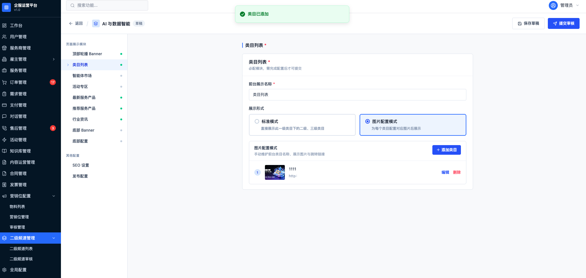

# PRD\-二级频道页

# 二级频道页 PRD


## 1\. 文档信息


- 产品名称：二级频道页

- 文档版本：V1\.0

- 产品类型：类目运营频道页

- 适用端：雇主端、运营后台

- 终端范围：PC 端


原型链接：https://www\.figma\.com/make/pYm7cke5XsBLI52PRf2J9F/7\.23%E8%80%81%E7%89%88%E5%B9%BF%E5%91%8A%E4%BD%8D%E9%85%8D%E7%BD%AE%E6%A8%A1%E5%9D%97%E8%AE%BE%E8%AE%A1\-\-Copy\-?fullscreen=1\&t=9nwy2agBpUrcBIys\-1\&code\-node\-id=0\-9


---


# 2\. 项目背景


平台目前主要通过一级类目列表页承接用户访问，类目下的服务产品、活动、智能体和行业资讯较为分散，无法集中承载某一垂直行业的运营内容。


因此建设通用二级频道页：


- 每个一级类目最多配置一个二级频道页；

- 运营人员通过后台配置页面模块和展示内容；

- 新建或编辑内容必须经过初审、复审后才可正式发布；

- 支持独立链接用于线下推广、站外传播和 SEO 收录；

- 支持定时发布和定时下线。

    

---


# 3\. 产品目标


## 3\.1 业务目标


1. 为一级类目提供独立的行业运营页面。

2. 集中展示类目下的服务产品、活动、智能体和行业资讯。

3. 支持通过独立链接进行线下推广和外部传播。

4. 通过审核流程保证频道内容质量。

5. 支持 PC、移动端分别配置图片。

6. 支持定时发布，满足活动排期和运营计划。

7. 提升频道内服务产品、智能体、活动和资讯的曝光及转化。

    

## 3\.2 用户目标


雇主用户进入频道页后可以：


- 了解当前行业类目；

- 浏览二级、三级类目；

- 查看最新和推荐服务产品；

- 浏览活动内容；

- 使用智能体；

- 查看行业资讯；

- 通过搜索查找当前一级类目下的服务内容；

- 从 PC 正常访问频道页面。

    

---

# 4\. 产品范围

## 4\.1 本期包含


### 雇主端


- 一级类目入口跳转；

- 顶部官网导航；

- 带一级类目条件的搜索；

- 顶部轮播 Banner；

- 类目列表；

- 智能体市场；

- 活动专区；

- 最新服务产品；

- 推荐服务产品；

- 行业资讯；

- 底部 Banner；

- 底部信息；

- SEO 页面信息生效；

- 内容失效自动隐藏。

    

### 运营后台


- 频道列表管理；

- 审核管理；

- 频道新建、编辑和查看；

- 页面模块配置；

- PC图片配置；

- 定时发布和定时下线；

- 初审、复审；

- 发布失败处理；

- 频道下线；


---


# 5\. 一级类目范围


系统支持以下 11 个一级类目：


1. AI 与数据智能

2. 法律服务

3. 工商财税

4. 跨境企服

5. 品牌与设计

6. 企业综合服务

7. 人力资源服务

8. 软件与信息化

9. 数字资产与知产交易

10. 营销推广

11. 知识产权

    

## 5\.1 频道关联规则


- 一个一级类目最多关联一个二级频道页。

- 一个二级频道页只能关联一个一级类目。

- 后台只能从上述 11 个一级类目中选择。

- 未配置频道的一级类目仍保留原有【服务大厅\-\>一级类目】筛选逻辑。

- 只有“已发布”的频道才对雇主端生效。


---


# 6\. 核心业务流程


## 6\.1 雇主端入口跳转


```Plain Text
用户点击一级类目
    ↓
判断该一级类目是否存在已发布二级频道
    ↓
是：跳转二级频道页
否：跳转原一级类目列表页
```


频道下线后：


```Plain Text
一级类目入口 → 对应一级类目列表页
频道独立链接 → 对应一级类目列表页
```


## 6\.2 后台配置流程


|**功能点**|**页面**|**功能详述**|
|---|---|---|
|二级频道列表|<br>|1. 页面展示内容<br>1\.1 查询筛选区<br>支持以下筛选条件：<br><br>1\.2 列表字段<br><br>2. 操作规则<br>2\.1 配置二级频道<br>点击页面右上角“配置二级频道”，进入“配置二级频道（选择）”页面。<br>2\.2 查看线上配置<br>- 展示条件<br>当频道线上发布状态为“已发布”时展示。<br>- 页面行为<br>点击后进入线上配置只读页面，展示当前线上生效版本的完整配置内容。<br>2\.3 查看进度<br>- 展示条件<br>所有频道均可查看。<br>- 页面行为<br>点击后进入变更进度页面，查看当前变更单的：<br>变更单号；<br>变更内容；<br>提交说明；<br>提交人和提交时间；<br>初审意见；<br>复审意见；<br>待发布配置内容。<br>2\.4 编辑<br>当前规则只受变更状态控制，不受线上发布状态限制。<br><br>2\.5 下线<br>- 展示条件<br>当频道线上发布状态为“已发布”时展示“下线”按钮。<br>- 下线确认弹窗<br>点击“下线”后弹出确认弹窗：<br>“确认下线频道？<br>下线后，该频道线上页面将停止对外展示。<br>当前线上配置会保留，但不再生效。”<br>- 弹窗操作按钮：<br>取消 ｜ 确认下线<br><br>- 确认下线后<br>线上发布状态更新为“已下线”；<br>前台停止展示该频道；<br>线上配置快照继续保留；<br>已有草稿、审核中的变更和审核记录不删除。<br>2\.6 重新发布<br>- 展示条件<br>当频道线上发布状态为“发布异常”时展示“重新发布”按钮。<br>点击后的处理<br>点击“重新发布”后，按立即发布处理：<br>频道线上发布状态更新为“已发布”；<br>当前配置立即恢复线上生效；<br>更新最后修改时间；<br>不需要再次审核。<br>提示toast文案：<br>重新发布成功，频道已立即生效|
|配置二级频道选择页面<br>|<br>|1. 页面定位<br>用于运营人员选择需要创建或配置的一级类目频道。<br>2. 页面内容<br>2\.1 以卡片或列表形式展示全部支持的一级类目，包括：<br>人工智能与数据智能；<br>法律服务；<br>工商财税；<br>跨境企业服务；<br>品牌与设计；<br>企业综合服务；<br>人力资源服务；<br>软件与信息化；<br>数字资产与知识产权交易；<br>营销推广；<br>知识产权。<br><br>2\.2 每个一级类目展示：<br>一级类目名称        当前可配置的频道类目<br>线上状态        未发布、已发布、已下线或发布异常<br>配置状态        已配置、未配置<br>操作入口        配置二级频道 按钮<br>3. 选择规则<br><br>|
|新建或编辑二级频道|<br>|1. 页面定位<br>用于运营人员配置频道前台展示内容，并保存草稿或提交审核。<br><br>2. 页面结构<br>2\.1 顶部区域<br>- 展示：<br>返回按钮；<br>当前一级类目名称；<br>线上发布状态；<br>当前变更状态；<br>保存草稿按钮；<br>提交审核按钮。<br><br>- 当频道处于待初审或待复审状态时：<br>不允许修改配置；<br>保存草稿和提交审核按钮不可用；<br>页面提示当前变更正在审核中。<br><br>2\.2 左侧子标签<br>左侧导航顺序如下：<br>页面展示模块<br>- 顶部轮播横幅<br>- 类目列表<br>- 智能体市场<br>- 活动专区<br>- 最新服务产品<br>- 推荐服务产品<br>- 行业资讯<br>- 底部横幅<br>- 底部配置<br>    <br>其他配置<br>- SEO设置<br>- 发布配置|
|配置页\-顶部轮播banner|<br><br><br>|1 顶部轮播横幅<br>顶部轮播 Banner 用于配置频道首页顶部的轮播推广内容。<br><br>运营人员可通过模块开关控制整个顶部轮播 Banner 模块是否在前台展示。模块关闭后，前台不展示顶部轮播 Banner，但已配置的 Banner 数据需继续保留，便于后续重新启用。<br><br>模块启用时，运营人员可配置前台展示名称。该名称用于前台页面展示，例如“精选推荐”“企业服务精选”等。<br><br>运营人员可新增多个 Banner。前台最多展示五个处于启用状态且在有效期内的 Banner。<br><br>新增或编辑 Banner 时，需要配置 Banner 名称、PC 端图片、跳转链接、展示顺序、生效时间和失效时间。其中，Banner 名称用于后台识别，PC 端图片和跳转链接为必填项。<br><br>Banner 图片仅支持 PNG、JPG、JPEG 格式，单张图片大小不得超过二十兆。上传成功后，页面需展示图片预览。<br><br>Banner 跳转链接统一由前台以新窗口方式打开，运营后台不再配置跳转方式。<br><br>新增 Banner 后默认状态为启用。Banner 的启用或禁用不在新增、编辑弹窗中设置，而是在 Banner 列表操作列中统一控制。<br>列表操作包括：<br>启用 / 禁用<br>编辑<br>删除<br>每条 Banner 列表需展示名称、有效期、展示顺序、当前状态和操作项。|
|配置页\-类目列表|<br><br><br><br><br>|类目列表配置\-该模块为必填模块<br>类目列表用于展示当前一级类目下的服务类目结构。可选择标准模式或图片配置模式。<br><br>模块关闭后，前台不展示类目列表；已保存的类目配置不删除，重新开启后可继续使用。<br><br>模块开启时，前台展示名称为必填项。该名称用于前台模块标题展示，例如“热门服务类目”“精选服务分类”。<br><br>1. 展示形式<br>类目列表支持以下两种展示形式：<br><br>标准模式<br>图片配置模式<br>运营人员切换展示形式后，前台按所选形式展示类目内容。<br><br>2. 标准模式<br>标准模式用于直接展示系统维护的类目树，不需要运营人员逐条维护。<br><br>进入标准模式后，页面自动读取当前一级类目下的二级类目和三级类目，并以表格形式展示：<br><br>一级类目<br>二级类目<br>三级类目<br><br>标准模式下：<br>一级类目自动取当前频道所属一级类目；<br>二级类目、三级类目由系统类目树自动读取；<br>运营人员不能新增、删除或编辑单条类目；<br>运营人员不需要配置图片和跳转链接；<br>系统类目树更新后，前台类目结构可同步更新。<br>标准模式适用于需要完整展示当前一级类目下全部服务分类的场景。<br><br>3. 图片配置模式<br>运营人员可手动维护前台展示的类目卡片。<br>点击“添加类目”后，弹窗中需填写类目名称、上传展示图片并填写跳转链接，三项均为必填。图片仅支持 PNG、JPG、JPEG 格式，单张不超过 20MB。<br><br>已添加的类目以列表形式展示名称、图片缩略图和跳转链接。名称或链接过长时，列表内省略显示，鼠标悬停可查看完整内容。每条类目支持编辑和删除；编辑后覆盖原配置，删除后该类目不再在前台展示。同一类目名称不可重复添加。<br><br>图片配置模式下，前台仅展示已配置完成的类目卡片；未配置类目时，该模块不展示任何类目内容。<br><br>4. 图片配置规则<br>图片配置模式下，每条已添加类目均需上传展示图片。<br>图片规则如下：<br>支持 PNG、JPG、JPEG 格式；<br>单张图片大小不超过20MB；<br>上传成功后展示图片预览；<br>图片上传失败或加载失败时展示缺省状态；<br>未上传图片时，不允许作为完整图片类目配置提交审核。<br>5. 跳转链接规则<br>图片配置模式下，每条已添加类目均需配置跳转链接<br>跳转链接用于用户点击类目图片或类目名称后进入对应页面。<br>跳转规则如下：<br>跳转链接为必填项；<br>链接需符合标准网址格式；<br>前台统一以新窗口打开链接；<br><br>6. 删除规则<br>运营人员可在已添加类目列表中删除某条类目。<br>删除后：<br>该类目从当前图片配置列表中移除；<br>前台不再展示该类目；<br>该类目恢复为可添加状态；<br>运营人员后续可重新添加该类目。<br><br>7. 提交审核校验<br>当类目列表模块启用且选择图片配置模式时，提交审核前系统需校验：<br>前台展示名称是否已填写；<br>是否至少配置一条类目；<br>每条类目是否已上传图片；<br>每条类目是否已填写跳转链接；<br>是否存在重复类目。<br>校验失败时，系统阻止提交审核，并定位或提示对应配置问题。|
|配置页\-智能体市场<br>|<br><br><br><br>|运营人员可通过启用/禁用开关控制智能体市场模块状态。<br><br>模块启用时，前台展示智能体市场；<br>模块禁用时，前台不展示该模块；<br>禁用不会删除已配置的智能体数据；<br>模块启用时，前台展示名称为必填项。<br>前台展示名称用于配置前台模块标题，例如“智能体市场”“企业智能助手”。<br><br>智能体内容配置<br>运营人员可新增、编辑、删除智能体内容。<br><br>每个智能体包含以下信息：<br><br>智能体名称：必填，用于前台展示；<br>智能体简介：选填，用于说明智能体功能；<br>PC 端封面图：选填；<br>跳转链接：选填；<br>展示顺序：用于控制前台排序；<br>启用状态：控制单个智能体是否展示。<br>新增智能体时，系统默认设置为启用状态。<br><br>智能体列表需展示智能体名称、简介、展示顺序和启用状态，并提供启用/禁用、编辑、删除操作。<br><br>禁用单个智能体后，该智能体不在前台展示，但配置内容保留；重新启用后可恢复展示。<br><br>图片与链接规则<br>智能体封面图片支持 PNG、JPG、JPEG 格式，单张图片不超过二十兆。上传成功后需展示图片预览；未配置图片或图片加载失败时，前台展示缺省状态。<br><br>配置跳转链接后，用户点击智能体可进入对应页面。链接需符合标准网址格式，前台统一以新窗口打开。<br><br>查看更多配置<br>运营人员可选择是否展示“查看更多”入口。<br><br>开启查看更多时，可填写查看更多跳转链接；<br>关闭查看更多时，前台不展示该入口；<br>关闭后已填写的链接保留，后续重新开启时可继续使用。|
|配置页\-活动专区|<br><br><br><br><br><br><br><br>|活动专区<br>活动专区用于配置二级频道页的活动内容和活动服务产品。模块支持整体开启或禁用；禁用后保留已有配置，但前台不展示该模块。模块开启时，至少需选择 N 个活动服务产品，否则不可提交审核。<br><br>活动专区包含“活动选择”和“活动服务产品”两个配置区域，两者可独立配置，不互相限制。<br><br>活动选择<br>打开“展示活动banner”按钮，点击“添加活动”打开活动选择弹窗，系统自动获取活动管理中状态为“未开始”和“进行中”的活动。弹窗支持按活动名称搜索，并按每页 5 条分页展示；最多选择 3 个活动。<br><br>活动列表展示活动名称、状态、活动时间、适用用户范围和服务适用范围（所有数据拉取自活动管理模块，仅拉取未开始和已上线状态的活动）。适用用户范围包括已认证雇主、未认证雇主和指定雇主；指定雇主展示覆盖数量。<br>服务适用范围为“按类目选择”时，鼠标悬停可查看具体适用类目。<br><br>确认添加后，活动在已选区域展示，支持单独删除。<br>每个已选活动可配置频道页展示图片；开启“展示活动 Banner”时，展示图片必填。删除活动不会影响已选服务产品。<br><br>活动 Banner<br>支持选择展示或不展示活动 Banner。该设置仅影响前台是否展示活动图片，不影响活动或服务产品的选择。<br>打开“展示活动banner”按钮，至少添加一个活动；<br>关闭“展示活动banner”按钮，“添加活动”按钮置灰不可选。<br>前台逻辑：如果配置了活动，按照活动的逻辑进行链接跳转：<br>活动还在有效期，直接跳转活动专题页；<br>活动未在有效期，前台自动隐藏活动banner<br>活动banner最多可配置3个进行轮播，1个时是单图展示<br><br>活动服务产品<br>活动服务产品无需先选择活动，可直接从当前活动中的全部服务产品中选择。支持输入服务产品名称或服务 ID 检索，列表展示服务名称、服务 ID、服务商名称和关联活动，并按每页 5 条分页展示。<br>前台逻辑：活动服务产品始终最多可配置6个，前台根据页面是否有banner判断展示数量，当有banner时，若配置服务产品展示不全，则按照优先级排序从上自下取展示个数。<br><br>已选服务在独立区域展示服务名称、服务 ID 和服务商名称，支持单条删除、重新选择和拖拽排序；排序结果作为前台展示顺序。<br><br>模块支持配置前台展示名称及“查看更多”开关。开启后需填写跳转链接，用户点击前台“查看更多”时跳转至该链接。<br>|
|配置页\-最新服务产品|<br><br><br>|最新服务产品用于在二级频道前台展示近期上线或近期更新的服务内容。服务数据由系统服务库自动获取，运营人员无需逐条选择服务。<br><br>运营人员可通过启用/禁用开关控制该模块是否在前台展示。<br><br>模块启用时，前台展示最新服务产品；<br>模块禁用时，前台不展示该模块；<br>关闭模块不会删除已配置的展示规则；<br>模块启用时，前台展示名称为必填项。<br>运营人员需配置前台展示数量，用于控制该模块展示的服务条数。<br><br>运营人员可选择服务排序方式：<br><br>按更新时间排序；<br>按上线时间排序。<br>前台按照配置的排序方式，从当前一级类目下符合条件的有效服务中自动获取内容，并按展示数量进行展示。<br><br>模块支持配置“查看更多”入口：<br><br>开启查看更多后，前台展示“查看更多”按钮；<br>开启时可填写查看更多跳转链接；<br>关闭后，前台不展示查看更多入口，已填写链接保留；<br>前台点击查看更多时，统一以新窗口打开对应链接。|
|配置页\-推荐服务产品|<br><br><br>|该模块是必填模块，不可设置开启/禁用。<br>推荐服务产品用于在二级频道前台人工推荐重点服务。与“最新服务产品”自动获取服务不同，该模块由运营人员手动选择需要展示的服务。<br><br>前台展示名称为必填项。<br>运营人员可通过服务名称或服务编号搜索服务，并将服务添加至推荐列表。<br><br>已添加服务需展示服务名称、服务编号和展示顺序，并支持编辑排序或删除操作。<br><br>同一服务只能添加一次。已添加的服务再次搜索或选择时，系统应提示该服务已存在，避免重复配置。<br><br>前台按照运营人员拖拽可对已选中的产品进行配置展示顺序。<br><br>模块支持配置“查看更多”入口：<br>开启查看更多后，前台展示查看更多按钮；<br>开启时可填写查看更多跳转链接；<br>关闭后，前台不展示查看更多入口，已填写链接保留；<br>前台点击查看更多时，统一以新窗口打开对应链接。|
|配置页\-行业资讯|<br><br><br>|行业资讯用于配置二级频道前台展示的资讯文章。该模块支持按需启用，允许频道不配置行业资讯。<br><br>运营人员可通过启用/禁用开关控制模块状态。<br><br>启用后，前台展示已配置的行业资讯文章；<br>禁用后，前台不展示该模块；<br>禁用不会删除已配置文章和查看更多链接；<br>模块启用时，前台展示名称为必填项。<br>运营人员点击“新增文章”后，打开文章配置弹窗。弹窗需配置以下内容：<br><br>封面图；<br>文章名称；<br>作者名称；<br>跳转链接；<br>上述字段均为必填项。封面图需符合统一图片上传规则，支持 PNG、JPG、JPEG 格式，单张图片不超过20MB。<br>弹窗内文章名称最多支持25个中文字符。<br><br>文章添加成功后，在已配置文章列表中展示封面图、文章名称、作者名称和创建时间，并提供编辑、删除操作。<br><br>文章名称过长时，列表中采用单行省略展示，；鼠标悬停在文章名称上时，可查看完整名称，避免影响列表布局。<br><br>行业资讯支持“查看更多”入口。<br><br>开启查看更多后，前台展示查看更多按钮；<br>开启后需填写查看更多链接；<br>链接由运营人员自定义填写，可填写内容社区首页、内容社区列表页或其他符合业务规则的页面；<br>关闭查看更多后，前台不展示入口，已填写链接保留；<br>前台点击查看更多时，以新窗口打开对应链接。|
|配置页\-底部banner|<br><br>|底部 Banner<br>底部 Banner 用于在二级频道页面底部展示单张推广图片，可用于品牌推广、活动引流或服务推荐。<br><br>运营人员可通过启用/禁用开关控制底部 Banner 模块状态。<br><br>模块启用时，前台展示底部 Banner；<br>模块禁用时，前台不展示该模块；<br>禁用不会删除已配置的图片和链接；<br>模块启用时，前台展示名称为必填项。<br>运营人员需上传一张 PC 端图片。图片为模块启用时的必填项。<br><br>图片上传规则如下：<br><br>支持 PNG、JPG、JPEG 格式；<br>单张图片大小不超过二十兆；<br>上传完成后展示图片预览；<br>图片加载失败时展示缺省状态。<br>运营人员可选择底部 Banner 是否配置跳转。<br><br>选择“无跳转”时，前台仅展示图片，不提供点击跳转；<br>选择“有跳转”时，跳转链接为必填项；<br>链接需符合标准网址格式；<br>前台点击 Banner 后统一以新窗口打开链接。<br>底部 Banner 为单图配置。同一频道仅允许配置一张底部 Banner，新上传图片将覆盖原有图片。|
|配置页\-底部配置|<br><br><br>|底部配置 \-该模块为必填模块，不可设置开启/禁用<br>底部配置用于维护二级频道前台底部的固定服务信息和内容导航。该配置分为“固定信息”和“底部内容模块”两部分<br><br>固定信息<br>固定信息用于展示频道底部的客服与人工服务信息。<br><br>运营人员可通过启用/禁用开关控制固定信息是否展示。<br><br>启用后，前台展示客服热线、人工服务时间及频道名称相关信息；<br>禁用后，前台不展示固定信息；<br>禁用不会删除已填写的内容，重新启用后可继续使用原配置。<br>固定信息支持配置客服热线、人工服务开始时间、人工服务结束时间，以及是否展示频道名称。<br><br>人工服务时间通过时间选择器设置，例如“09:00 至 18:00”。<br><br>固定信息启用时，人工服务开始时间和结束时间均为必填项，且结束时间必须晚于开始时间。<br><br>底部内容模块<br>底部内容模块用于在频道底部按小组展示内容入口，例如“合作与服务”“帮助中心”“关于我们”等。<br><br>运营人员可新增、编辑或删除内容小组。<br><br>最多可配置四个内容小组；<br>每个小组需填写小组名称；<br>删除小组时，该小组内的全部内容一并删除。<br>每个小组最多可配置六条内容。每条内容支持配置内容名称、底部文字、跳转链接、展示顺序（拖拽）。<br><br>内容名称为必填项。运营人员可单独删除每条内容；删除后，数据内容消失。<br><br>前台展示规则如下：<br><br>展示底部内容模块；<br>展示小组名称；<br>内容按照拖拽的展示顺序排列；<br>配置跳转链接的内容，前台点击后以新窗口打开链接。|
|配置页\-SEO设置|<br>|SEO 设置<br>SEO 设置用于配置二级频道页面在搜索引擎中的标题、关键词和页面摘要，提升频道页的搜索展示效果。<br><br>运营人员可配置 SEO 标题、SEO 关键词和 SEO 描述。该配置随频道变更单一并提交审核，审核通过后按发布规则生效。<br><br>SEO 标题<br>SEO 标题用于设置搜索结果和浏览器页签中展示的页面标题。<br><br>运营人员输入时，系统实时显示当前字数，并提示建议控制在30个中文字符以内。超过建议字数时仅提示，不强制阻止保存或提交。<br><br>SEO 关键词<br>SEO 关键词用于描述频道核心服务和业务方向。<br><br>运营人员可填写多个关键词，多个关键词之间使用英文逗号分隔。例如：<br>人工智能,数据治理,企业数字化,智能体<br>系统保存输入内容，并在审核通过后同步至频道页面。<br><br>SEO 描述<br>SEO 描述用于设置搜索结果中的页面摘要。<br><br>运营人员输入时，系统实时显示当前字数，并提示建议控制在120个中文字符以内。超过建议字数时仅提示，不强制阻止保存或提交。<br><br>生效规则<br>SEO 设置不会在保存草稿时立即影响前台。运营人员提交审核后，SEO 配置进入待发布版本；复审通过后，按照“立即发布”或“定时发布”规则同步至线上频道页面。|
|配置页\-发布配置|<br><br>|发布配置\-该模块为必填项，不可设置开启/禁用<br>发布配置用于设置二级频道审核通过后的上线时间及可选下线时间，并填写本次变更的提交审核说明。该页面为提交审核前的必配项，未完成发布时间或审核说明时不可提交。<br><br>发布时间<br>运营人员需直接选择频道发布时间。审核通过后，系统根据审核完成时间与发布时间自动判断上线方式：<br><br>审核通过时已超过发布时间，频道立即发布上线；<br>审核通过时未到发布时间，频道进入待发布状态，到达发布时间后自动上线。<br>审核中的变更单不支持编辑发布时间。页面展示审核中提示，避免运营人员误以为修改已生效。<br><br>定时下线<br>运营人员可选择“不设置定时下线”或“设置下线时间”。<br><br>选择不设置定时下线时，频道上线后持续展示，后续可在列表页手动下线。<br>选择设置下线时间时，需填写下线时间；到达该时间后，系统自动将频道下线。下线时间必须晚于发布时间，否则不可提交。<br><br>提交审核说明<br>运营人员填写本次频道配置或发布规则的变更说明，该说明会同步展示在二级频道审核列表、初审页面、复审页面和查看进度页面，供审核人员了解本次变更内容。<br><br>点击“提交审核”时，系统校验发布时间、下线时间及必配模块配置。校验通过后创建频道变更单并进入待初审状态；审核通过后按已配置的发布时间和下线规则执行发布|
|二级频道列表\-查看线上配置|<br><br><br><br><br><br>|查看线上配置<br>“查看线上配置”用于查看当前正在前台生效的频道配置，仅当频道线上发布状态为“已发布”时展示该操作。<br><br>点击后进入线上配置只读页面。页面展示当前线上配置快照，不展示草稿或审核中的待发布内容，也不提供编辑、审核或删除操作。<br><br>页面需展示频道所属一级类目、当前线上状态，以及完整的线上模块配置。模块顺序与配置页保持一致：<br><br>顶部轮播 Banner<br>类目列表<br>智能体市场<br>活动专区<br>最新服务产品<br>推荐服务产品<br>底部 Banner<br>底部配置<br>SEO 设置<br>发布配置<br>每个模块需展示配置模块名称、前台展示名称和启用状态。已配置图片需直接预览；已配置链接需支持点击并以新窗口打开。<br><br>活动专区需展示已选服务名称、服务编号和服务商名称。底部配置需展示固定信息状态、客服热线、人工服务时间、内容模块状态、内容小组及小组内内容。<br><br>当频道后续存在审核中的变更时，查看线上配置页面仍展示旧的线上生效版本，不展示待发布配置，避免审核中的内容提前影响线上查看结果。<br>|
|二级频道列表\-查看进度<br>|<br><br><br><br><br><br>|“查看进度”用于查看当前频道最近一张变更单的处理状态和待发布配置内容。所有频道均可进入该页面。<br><br>点击后进入变更进度只读页面。页面不提供审核、通过、驳回或编辑操作。<br><br>页面顶部需展示：<br><br>一级类目名称；<br>变更单号；<br>当前线上发布状态；<br>当前变更状态；<br>提交人；<br>提交时间；<br>返回列表入口。<br>页面中的“变更与审核信息”需展示：<br><br>本次变更内容；<br>提交审核说明；<br>初审结论和初审意见；<br>复审结论和复审意见。<br>上述内容均读取当前频道变更单，确保列表页、查看进度页和审核页面展示的数据一致。<br><br>页面需保留“待发布配置内容”，用于查看本次审核中的完整配置。待发布配置内容按配置页模块顺序展示，并展示各模块的实际配置，包括图片、链接、服务、服务商、小组内容和人工服务时间等。<br><br>查看进度页面第一期不展示字段级差异。若频道当前已发布，运营人员可通过列表页的“查看线上配置”入口查看当前线上版本，并与待发布配置进行人工对照。<br><br>当变更状态为待初审或待复审时，页面应提示当前配置仍在审核中，线上配置尚未变更。<br><br>当复审通过且选择立即发布时，待发布配置同步为线上配置；当选择定时发布时，页面展示计划发布时间，并在到达指定时间后由系统执行发布。|
|二级频道列表\-下线|<br>|“下线”用于停止已发布频道在前台的展示，仅当频道线上发布状态为“已发布”时展示该操作。<br><br>运营人员点击“下线”后，系统弹出下线确认弹窗。弹窗需明确展示当前待下线的一级类目，并提示下线影响：<br><br>下线后，该频道线上页面将停止对外展示。<br>当前线上配置会保留，但不再生效。<br>已有待审核变更不会被删除，后续仍可继续审核。<br>弹窗提供“取消”和“确认下线”两个操作。<br><br>点击“取消”后，关闭弹窗，不修改频道状态。<br>点击“确认下线”后：<br><br>频道线上发布状态更新为“已下线”；<br>前台停止展示该频道；<br>当前线上配置快照继续保留；<br>已保存草稿、待初审、待复审或已驳回的变更单不受影响；<br>列表操作列不再展示“下线”按钮。<br>已下线频道如需再次生效，应通过后续配置、审核和发布流程重新发布。|


## 6\.3 审核规则


- 新建和编辑均必须提交审核。

- 不支持提交审核后主动撤回。

- 待初审、待复审状态不可编辑。

- 驳回后进入可编辑状态。

- 初审和复审必须由不同角色完成。

- 不允许跳过初审直接进入复审。

|**功能点**|**页面**|**功能详述**|
|---|---|---|
|二级频道审核列表|<br>|二级频道审核列表<br>二级频道审核列表用于初审人员和复审人员集中处理频道变更单，查看待审核、已驳回和已完成的审核记录。<br><br>页面以变更单为展示对象。同一一级类目在同一时间仅存在一条审核中的变更单，避免多条变更并行审核。<br><br>页面顶部展示待处理数量，用于提示当前待初审和待复审任务数量。<br><br>审核列表支持按一级类目名称或提交人进行搜索，也支持按审核状态筛选。审核状态包括待初审、待复审、已驳回和已通过。<br><br>列表需展示一级类目、线上状态、审核节点、提交人、提交时间、变更内容和操作项。其中，提交人、提交时间和变更内容均从频道变更单中读取。<br><br>审核节点展示规则如下：<br>待初审<br>待复审<br>已驳回<br>已通过<br><br>操作列根据审核节点展示不同按钮：<br>状态为“待初审”时，展示“初审”按钮；<br>状态为“待复审”时，展示“复审”按钮；<br>状态为“已驳回”或“已通过”时，展示“查看”按钮。<br>点击“初审”进入初审页面。初审人员可查看待发布配置，并提交初审通过或初审驳回意见。无论初审通过还是初审驳回，变更单均流转至复审。<br><br>点击“复审”进入复审页面。复审人员基于待发布配置和初审意见进行最终裁定。复审通过或复审驳回后，变更单结束审核流程。<br><br>点击“查看”进入只读详情页面，可查看变更单信息、初审意见、复审意见和待发布配置内容，不提供审核操作。<br><br>审核列表中的线上状态用于说明当前前台频道状态，包括未发布、已发布、已下线和发布异常。审核状态与线上状态独立展示：审核中的变更不会覆盖当前线上配置，只有最终审核通过后才按发布配置执行上线。<br>|
|二级频道审核\-查看|<br>|查看页面<br>“查看”用于查看已完成审核或已驳回的频道变更单详情。该页面为只读页面，不提供通过、驳回或编辑操作。<br><br>页面顶部展示一级类目、变更单号、线上发布状态、当前审核状态、提交人和提交时间，并提供返回审核列表入口。<br><br>页面需展示本次变更内容、提交审核说明、初审结论、初审意见、复审结论和复审意见。若最终驳回，需展示最终驳回原因。<br><br>页面下方展示待发布配置内容。配置内容按配置页模块顺序展示：<br><br>顶部轮播 Banner<br>类目列表<br>智能体市场<br>活动专区<br>最新服务产品<br>推荐服务产品<br>底部 Banner<br>底部配置<br>SEO 设置<br>发布配置<br>已配置图片需展示预览，已配置链接可点击并以新窗口打开。活动专区需展示已选服务名称、服务编号和服务商名称；底部配置需展示人工服务时间、内容小组及小组内容。<br><br>查看页面第一期不展示字段级差异。|
|二级频道审核\-初审|<br><br>|初审页面<br>“初审”用于初审人员处理状态为“待初审”的频道变更单。<br><br>初审人员点击审核列表操作列中的“初审”按钮后进入初审页面。页面展示变更单基础信息、本次变更内容、提交审核说明、提交人和提交时间，以及完整的待发布配置内容。<br><br>初审页面底部固定展示：<br><br>驳回 ｜ 通过<br>点击“通过”后，系统记录初审结论为“通过”，初审意见可不填写。初审通过不会直接发布频道，系统将变更单状态更新为“待复审”。<br><br>提示文案：<br>“初审通过意见已提交，已流转至复审”<br>点击“驳回”后，页面展开初审驳回意见填写区域。初审驳回意见为必填项，未填写时不允许确认提交。<br><br>初审驳回提交后，系统记录初审结论和初审意见，并将变更单状态更新为“待复审”。初审驳回同样不会直接结束审核流程，需进入复审进行最终裁定。<br><br>提示文案：<br>“初审驳回意见已提交，已流转至复审”|
|二级频道审核\-复审|<br>|复审页面<br>“复审”用于复审人员对初审结果进行最终裁定，仅在变更单状态为“待复审”时可进入。<br><br>复审人员点击审核列表操作列中的“复审”按钮后进入复审页面。页面需展示变更单基础信息、待发布配置内容，以及初审结论、初审意见、初审人和初审时间。<br><br>复审页面底部固定展示：<br><br>驳回 ｜ 通过<br>复审人员点击通过或驳回后，系统根据复审结论与初审结论是否一致进行处理。<br><br>当复审结论与初审结论一致时，视为复审同意初审意见，不要求填写复审意见，初审结论直接作为最终审核结果。<br><br>例如：<br><br>初审通过，复审通过：最终通过<br>初审驳回，复审驳回：最终驳回<br>当复审结论与初审结论不一致时，视为复审不同意初审意见。页面需展开复审意见填写区域，复审意见为必填项。提交后，最终审核结果以复审结论为准。<br><br>例如：<br><br>初审通过，复审驳回：最终驳回<br>初审驳回，复审通过：最终通过<br>最终通过时，系统根据发布配置执行发布：<br><br>选择审核通过后立即发布时，待发布配置立即同步为线上配置；<br>选择定时发布时，系统记录计划发布时间，等待指定时间自动发布。<br>最终驳回时，不更新线上配置，变更单状态更新为“审核驳回”，运营人员可修改配置后重新提交审核。|


# 7\. 频道状态

## 7\.1 线上状态

## 7\.2 变更状态

## 7\.3 审核状态


---


# 8\. 雇主端需求


## 8\.1 页面结构


页面模块固定按照以下顺序展示：


```Plain Text
官网顶部导航
顶部轮播 Banner
类目列表
智能体市场
活动专区
最新服务产品
推荐服务产品
行业资讯
底部 Banner
官网底部
```


## 8\.2 模块通用规则


- 模块未配置：前台不展示。

- 模块未启用：前台不展示。

- 模块没有有效内容：前台不展示。

- 部分内容失效：隐藏失效内容。

- 后续有效内容自动前移补位。

- 只在同一模块内补位。

- 不展示空卡片。

- 不展示已下架、已删除、已过期内容。

- 模块隐藏后不保留空白区域。

    

---


## 8\.3 顶部官网导航


### 展示规则


- 沿用官网现有导航。

- 当前一级类目展示选中态。

- PC 端使用官网 PC 导航。

- 不额外展示频道名称。

    

### 搜索规则


用户在频道页搜索时，系统自动携带当前一级类目条件：


```Plain Text
关键词搜索结果 ∩ 当前一级类目内容
```


搜索结果页沿用官网现有搜索页面，本需求只负责传递当前一级类目筛选条件。


---


## 数量校验


|模块|后台配置上限|前台同时展示上限|
|---|---|---|
|顶部 Banner|不限|5|
|活动 Banner|不限|5|
|智能体|6，自动获取模式待定|6|
|行业资讯|8|8|
|推荐服务产品|不限|12|
|最新服务产品|自动获取|按模块配置|
|活动服务产品|自动获取|按模块配置|
|类目列表|自动获取|按页面规则|


---


# 9 内容失效和补位


## 9\.1 自动隐藏


以下内容失效后自动隐藏：


- Banner；

- 活动；

- 服务产品；

- 智能体；

- 行业资讯；

- 类目列表；

- 底部链接。

    

## 9\.2 自动补位


系统重新获取有效模块内容，按对应排序规则补位。

按照后台配置顺序过滤失效内容，后续有效内容自动前移。


## 9\.3 内容全部失效


模块没有任何有效内容时，前台隐藏整个模块。


---

# 10\. 埋点需求


## 10\.1 雇主端埋点


- 二级频道页 PV；

- 二级频道页 UV；

- PC/移动端访问量；

- Banner 曝光；

- Banner 点击；

- 类目点击；

- 智能体曝光；

- 智能体点击；

- 智能体查看更多点击；

- 活动 Banner 点击；

- 活动服务产品点击；

- 最新服务产品点击；

- 推荐服务产品点击；

- 服务大厅查看更多点击；

- 行业资讯点击；

- 资讯查看更多点击；

- 底部 Banner 点击；

- 搜索提交；

- 搜索结果点击。

    


---


# 11\. 非功能需求


## 11\.1 性能


- 首屏模块优先加载；

- 非首屏内容支持懒加载；

- 图片支持压缩；

- 图片加载失败不影响其他模块；

- 页面配置支持缓存；

- 移动端保证正常首屏展示。

    

## 11\.2 SEO


- 独立链接可被搜索引擎访问；

- 页面支持 SEO Title 和 Description；

- 下线页面跳转一级类目列表页；


## 11\.3 安全


- 外链地址进行协议和格式校验；

- 禁止配置危险脚本链接；

- 预览链接需要权限控制；

- 审核和发布操作记录日志；

- 操作日志不可被普通运营人员删除。

    

---


# 12\. 验收标准


## 12\.1 雇主端


- 11 个一级类目均可以判断是否配置已发布频道。

- 已发布频道通过一级类目入口正常访问。

- 未发布或已下线频道跳转一级类目列表页。

- 频道下线后独立链接跳转一级类目列表页。

- 页面同时支持 PC、移动端访问。

- PC、移动端可以配置不同图片。

- 未配置模块前台不展示。

- 内容失效后自动隐藏。

- 内容失效后同模块有效内容自动补位。

- 顶部 Banner 后台可配置不限数量，前台最多展示 5 个。

- 活动 Banner 后台可配置不限数量，前台最多展示 5 个。

- 智能体手动配置最多 6 个。

- 推荐服务产品后台可配置不限数量，前台最多展示 12 个。

- 推荐服务产品超过 12 个时查看更多跳转服务大厅并定位一级类目。

- 行业资讯后台最多配置 8 篇。

- 活动 Banner 点击后直接跳转配置链接。

- 推荐服务产品不进行 UV 自动排序。

- 定时发布到达时间后自动生效。

- 定时发布失败时后台显示“发布失败”。

- 频道下线后前台不再展示频道内容。

    

## 12\.2 运营后台


- 频道列表展示 11 个一级类目。

- 一个一级类目最多创建一个频道。

- 新建和编辑必须经过审核。

- 初审通过后进入复审。

- 初审和复审由不同角色完成。

- 不支持审核撤回。

- 驳回后可以修改并重新提交。

- 已发布频道编辑时，线上版本不受影响。

- 支持查看线上版本和待审核版本差异。

- 草稿状态可以修改配置内容。

- 提交审核后不允许修改定时发布时间。

- 定时发布失败后列表展示“发布异常”。

- 点击“重新发布”可以重新执行发布。

- 重新发布不重新进入审核流程。

- 频道下线后独立链接跳转服务大厅一级类目列表页。

- 系统记录完整操作日志。

    

