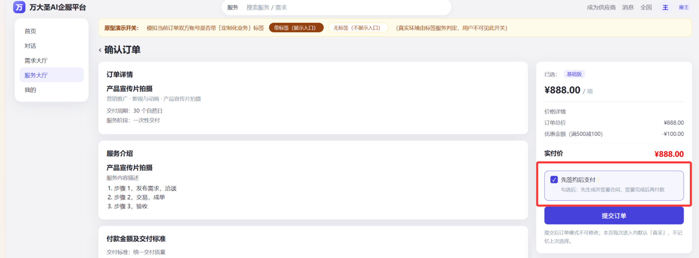

# REQ\-170 原直采模式支持雇主购买前选择购买模式\-PRD

> 需求编号：XVII REQ\-170
> 
> 版本：V1\.0
> 
> 状态：待评审
> 
> 输入：原直采模式支持雇主购买前选择购买模式 MRD、决策记录（D1–D11）、现有订单/合同/支付状态机（status\-flow\.md V1\.3）
> 
> 


---


## 1\. 项目信息

|项目|内容|
|---|---|
|需求名称|原直采模式支持雇主购买前选择购买模式|
|需求编号|XVII REQ\-170|
|云效ID|RZMP\-8989|
|产品经理|王宇轩|
|关联系统|雇主端 / 服务商端（Web \+ APP）、订单服务、合同服务、支付服务、标签服务、运营平台|
|目标上线|1022|


---


## 2\. 文档版本

|版本号|变更时间|变更内容|
|---|---|---|
|V1\.0|2026\-09\-15|首版，基于 MRD XVII REQ\-170 与决策记录 D1–D11 输出|


---


## 3\.  需求背景\&目标

### 3\.1 需求背景

平台目前同时支持两种交易顺序：

- **直采模式（先购买后签约）**：适用于标品业务，追求快速支付体验，订单类型记为“直采”；

- **反采模式（先签约后购买）**：适用于定制化业务，需要先明确合同再付款，订单类型记为“需求发布”。

但当前从服务大厅/对话中点击「立即购买」后，直接进入**固定流程**（直采），用户无法根据实际业务场景自主选择签约与支付的先后顺序，导致：

1. 定制化业务无法在直采入口下获得「先签约后支付」的资金与合规保障；

2. 用户被动接受固定顺序，体验与业务诉求不匹配。

    

### 3\.2 需求目标

|编号|目标|
|---|---|
|G1|在确认订单页增加「签约支付顺序」选择入口，让用户自主选择直采或反采|
|G2|入口仅对带「定制化业务」系统标签的账号展示，无标签账号无感知<br>**注：**「定制化业务」仅作初始化命名，后续业务可根据实际情况联系IT进行变更，本文档中都以「定制化业务」作为识别流程的系统标签|
|G3|选择后订单进入对应的既有流转路径，两种模式订单独立流转、互不干扰|
|G4|订单列表与详情展示订单所属模式（直采/反采）|
|G5|Web 端与 APP 端展示逻辑、流程执行保持一致|


---


## 4\. 名词解释

|名词|释义|
|---|---|
|直采模式|先支付后签约。流程：提交订单 → **支付 → 签署合同** → 履约 → 验收 → 完成|
|反采模式|先签约后支付。流程：提交订单 → **签署合同 → 支付** → 履约 → 验收 → 完成|
|定制化业务标签|运营后台维护的**系统标签**，打在服务商账号上；标签定义不支持运营修改、删除|
|模式选择入口|确认订单页的勾选项「先签约后支付（签完合同再付款）」|
|订单模式（purchase\_mode）|订单表已有字段，已有枚举值：直采 / 需求发布。<br>本次反采流程复用「需求发布」取值|
|标签校验服务|判定订单双方账号的服务商端是否带有「定制化业务」标签，id匹配|
|订单模式路由服务|根据订单模式决定订单初始状态与后续流转路径的服务能力|


---


## 5\. 需求概述

### 5\.1 需求范围

**本期功能列表**

|序号|功能模块|说明|
|---|---|---|
|F1|确认订单页模式选择入口|勾选项展示、默认态、交互与提交|
|F2|标签判定与入口展示控制|按订单双方账号标签决定入口是否展示|
|F3|订单模式路由|按模式决定订单创建后的初始状态与流转路径|
|F4|订单模式数据落库|订单记录 purchase\_mode|
|F5|订单列表/详情模式展示|雇主端、服务商端、运营后台|
|F6|Web \+ APP 同步|展示逻辑与流程执行一致|

F1\-1：有标签展示入口



F1\-2：无标签（不展示入口）


### 5\.2 需求影响

**影响业务范围**

|**业务场景**|**影响说明**|
|---|---|
|雇主在服务大厅直接购买服务产品|**确认订单页可能新增模式选择入口**|
|雇主在服务详情页点击联系卖家进到对话中，直接点击卡片购买服务产品|**同上，确认订单页可能新增模式选择入口**<br>|
|雇主发布需求 → 服务商报价 → 选服务|**不受影响**（该链路本身就是反采顺序）|
|雇主发布需求→通过需求匹配服务→ 选服务|**不受影响**（该链路本身就是反采顺序）|
|订单查看（雇主端/服务商端/运营后台）|列表与详情新增「订单模式」展示|

**影响系统范围**

|**系统/模块**|**影响说明**|
|---|---|
|用户端确认订单页<br>（雇主端 Web/APP、服务商端 Web/APP）|新增模式选择入口<br>|
|订单类型|按已有 purchase\_mode 取值路由；<br>沿用现有查询字段，不新增字段|
|合同服务|勾选后，走反采模式下合同生成时机前移至订单创建时|
|支付服务|勾选后，走反采模式下支付节点后移至双方签署完成之后|
|标签服务|新增标签判定调用（复用既有能力）|
|运营平台|订单列表/详情展示模式，支持按模式筛选|


---


## 6\. 需求详述


### 6\.1 应用架构\&业务流程

#### 6\.1\.1 功能结构图

```Plain Text
原直采模式支持雇主购买前选择购买模式
├── 一、入口层（确认订单页）
│   ├── 1. 标签判定 → 入口展示控制
│   ├── 2. 勾选项交互（默认不勾选、不记忆）
│   └── 3. 下单时根据勾选项传入 purchase_mode（复用已有参数）
├── 二、路由层（订单模式路由服务）
│   ├── 1. 标签二次校验
│   ├── 2. 直采路径路由：点击“提交订单”后，展示支付弹窗，支付后展示合同选择弹窗（模版、自用合同）
│   └── 3. 反采路径路由：点击“提交订单”后，展示合同选择弹窗（模版、自用合同），双方签合同后支付
├── 三、数据层
│   ├── 1. 复用已有 purchase_mode 字段
│   └── 2. 复用标签定义表、账号标签映射表（根据REQ-156定义结构适配）
└── 四、展示层
    ├── 1. 雇主端订单列表/详情
    ├── 2. 服务商端订单列表/详情
    ├── 3. 运营后台订单列表/详情
    └── 4. APP 端（与 Web 一致）
```


#### 6\.1\.2 主流程图

主流程图：


数据流转：


**说明**：

1. 其中识别“定制化业务”标签时，雇主/服务商有其中一端带有该标签则为“是”

说明：雇主账号在服务商侧绑定的其中一个认证主体带有“定制化业务”标签；或签约服务商带有“定制化业务”标签

2. 入口展示与提交校验共用同一套标签判定规则；后端在提交时做二次校验，防止前端伪造模式。


#### 6\.1\.3 直采模式状态流转图（复用现有标品链路）

```Plain Text
stateDiagram-v2
    [*] --> 待雇主支付 : 提交订单（purchase_mode=直采）
    待雇主支付 --> 待雇主签署合同 : 支付成功
    待雇主支付 --> 待服务商签署合同 : 支付成功
    待雇主支付 --> 订单关闭 : 24h 未支付 / 雇主取消

    待雇主签署合同 --> 待缴纳保证金 : 双方签署完成 且 要求保证金
    待服务商签署合同 --> 待缴纳保证金 : 双方签署完成 且 要求保证金
    待雇主签署合同 --> 履约中 : 双方签署完成 且 不要求保证金
    待服务商签署合同 --> 履约中 : 双方签署完成 且 不要求保证金
    待雇主签署合同 --> 订单关闭 : 7 自然日超时未签 / 取消
    待服务商签署合同 --> 订单关闭 : 7 自然日超时未签 / 关闭

    待缴纳保证金 --> 履约中 : 服务商缴纳成功
    待缴纳保证金 --> 订单关闭 : 24h 超时未缴 / 取消

    履约中 --> 订单完成 : 全部阶段验收通过
    履约中 --> 订单关闭 : 退款成功
    订单完成 --> [*]
    订单关闭 --> [*]
```


#### 6\.1\.4 反采模式状态流转图（复用现有定制化链路）

```Plain Text
stateDiagram-v2
    [*] --> 待雇主签署合同 : 提交订单（purchase_mode=需求发布）
    [*] --> 待服务商签署合同 : 提交订单（purchase_mode=需求发布）

    待雇主签署合同 --> 待雇主支付 : 双方签署完成
    待服务商签署合同 --> 待雇主支付 : 双方签署完成
    待雇主签署合同 --> 订单关闭 : 7 自然日超时未签 / 取消
    待服务商签署合同 --> 订单关闭 : 7 自然日超时未签 / 关闭

    待雇主支付 --> 待缴纳保证金 : 支付成功 且 要求保证金
    待雇主支付 --> 履约中 : 支付成功 且 不要求保证金
    待雇主支付 --> 订单关闭 : 24h 未支付 / 雇主取消

    待缴纳保证金 --> 履约中 : 服务商缴纳成功
    待缴纳保证金 --> 订单关闭 : 24h 超时未缴 / 取消

    履约中 --> 订单完成 : 全部阶段验收通过
    履约中 --> 订单关闭 : 退款成功
    订单完成 --> [*]
    订单关闭 --> [*]
```


**两条链路的唯一差异**

|**差异点**|**直采**|**反采**|
|---|---|---|
|订单创建后初始状态|待雇主支付<br>|待雇主签署合同 \+ 待服务商签署合同（并行）|
|合同生成时机|支付成功后|订单创建时|
|支付时机|签署前|双方签署完成后|
|保证金节点|签约后、履约前|支付后、履约前|
|其余节点|完全一致（履约 → 验收 → 完成/关闭）|同左|

> 说明：两条链路均为**现有已实现**的状态机，本次不新增任何订单状态，仅按 purchase\_mode 决定进入哪条链路。
> 
> 


### 6\.2 需求规则说明

#### 6\.2\.1 触发条件 / 前置条件

模式选择入口的展示需**同时满足**：

|编号|条件|说明|
|---|---|---|
|C1|订单来源为「直采下单入口」|服务大厅直接购买、对话中直接购买服务业|
|C2|订单的**雇主账号或服务商账号**至少一个带有「定制化业务」标签|标签目前只打在服务商账号上（D2）|

**判定公式**

```Plain Text
showModeSelector =
    isDirectPurchaseOrder
    AND ( hasLabel(employerAccountId, "定制化业务")
        OR hasLabel(providerAccountId, "定制化业务") )
```

**前置条件**

- 订单尚未提交（处于确认订单页），提交后无该选项

#### 6\.2\.2 业务规则

|编号|规则|说明|
|---|---|---|
|R1|入口默认态|勾选项默认**未勾选**，即默认直采|
|R2|不记忆选择|每次进入确认订单页均重置为默认态，不读取历史选择|
|R3|提交前可切换|用户在确认订单页可反复勾选/取消，提交后不可修改|
|R4|提交时二次校验|后端按下单请求中双方账号的标签状态做最终校验|
|R5|校验失败处理|传`purchase_mode=需求发布` 但无标签 → 拒绝下单，提示「当前账号不支持下单模式切换，请重新进入确认订单页」|
|R6|订单模式落库|订单创建时确定 purchase\_mode 取值（沿用已有字段）|
|R7|独立流转|两种模式订单按各自状态机流转，互不干扰|
|R8|多端一致|Web 端与 APP 端的展示逻辑、流程执行、文案保持一致（D11）|
|R9|标签不可改删|「定制化业务」标签为系统标签，不支持运营修改、删除标签定义（打标/取消打标除外，见 D1/D9）|
|R10|需求链路不受影响|「发布需求 → 报价 → 选标」链路保持原有反采顺序，不展示该入口|

#### 6\.2\.3 后置条件 / 输出

|场景|后置结果|
|---|---|
|不勾选并提交|创建 `purchase_mode=直采`订单，进入「待雇主支付」|
|勾选并提交|创建 `purchase_mode=需求发布`订单 \+ 生成合同，进入「待雇主签署合同 / 待服务商签署合同」|
|校验失败|不创建订单，返回错误提示|
|订单查询|返回 `purchase_mode`，列表/详情展示「直采 / 需求发布」|

#### 6\.2\.4 边界与数量规则

|项目|规则|
|---|---|
|模式选择入口数量|每张确认订单页最多 1 个|
|可选模式数量|2 种（直采、反采），通过 1 个勾选项表达|
|订单模式字段|单值枚举，不可为空，默认直采|

### 6\.3 功能清单

```Plain Text
F1 确认订单页模式选择入口
   F1.1 入口展示（按标签判定）
   F1.2 勾选项交互（默认不勾选、不记忆）
   F1.3 下单时按勾选传入 purchase_mode（复用已有参数）

F2 标签判定服务（复用既有能力）
   F2.1 确认订单页标签判定
   F2.2 下单提交时二次校验

F3 订单模式路由服务
   F3.1 直采路由（→ 待雇主支付）
   F3.2 反采路由（→ 待雇主/服务商签署合同 + 生成合同）

F4 订单模式展示
   F4.1 雇主端订单列表/详情
   F4.2 服务商端订单列表/详情
   F4.3 运营后台订单列表/详情 + 筛选

F5 多端同步
   F5.1 Web 端
   F5.2 APP 端
```

---


### 6\.4 功能说明（产品原型设计及说明）

#### F1 确认订单页模式选择入口

##### **F1\.1 交互展示**

web：


app：


|维度|说明|
|---|---|
|**信息**|勾选框 \+ 文案；勾选后高亮或补充提示「勾选后：先生成并签署合同，签署完成后再付款」|
|**交互**|点击勾选框切换选中状态；未勾选=直采，勾选=反采；|
|**数量**|单个二值控件|
|**状态**|未勾选（默认）/ 已勾选|
|**来源**|标签校验服务返回“标签识别状态”`canSelectPurchaseMode`；默认值由前端固定为「未勾选」|

##### **F1\.2 提交订单**

|维度|说明|
|---|---|
|**信息**|提交按钮；后端按下单请求的 purchase\_mode 取值路由|
|**交互**|点击提交后按钮进入 loading，防重复提交|
|**数量**|\-|
|**状态**|`purchaseMode = 直采` / `需求发布`|
|**来源**|由勾选状态映射|
|**异常**|① 二次校验失败 → 提示「当前账号不支持下单模式切换，请重新进入确认订单页」；② 网络异常 → 提示重试，不重复创建订单|

#### F2 标签判定服务：`canSelectPurchaseMode`

|维度|说明|
|---|---|
|**信息**|输入：雇主账号 ID、服务商账号 ID；输出：是否命中「定制化业务」标签|
|**交互**|无界面，服务调用|
|**数量**|单次判定返回布尔值|
|**状态**|命中 / 未命中|
|**来源**|标签服务（账号\-标签映射）|
|**异常**|服务不可用 → 确认订单页降级不展示入口；下单接口二次校验失败 → 拒绝反采下单|

#### ~~F4 订单列表：~~~~订单类型展示（新增）~~

~~web\(方案1\)：~~


~~web\(方案2\)：~~


~~app：~~


|~~维度~~|~~说明~~|
|---|---|
|**~~影响范围~~**|~~web端：雇主端订单列表、服务商订单列表~~<br>~~移动端：雇主端订单列表、服务商订单列表~~|
|**~~信息~~**|~~订单列表新增「订单类型」字段，展示为文本标签「直采」/「需求发布」~~|
|**~~数量~~**|~~每笔订单 1 个模式标签~~|
|**~~状态~~**|~~直采 / 反采~~|
|**~~来源~~**|~~订单 ~~~~`purchase_mode`~~~~ 字段，复用已有字段~~|

#### ~~F5 订单详情：订单类型展示（新增）~~

~~web\(方案1\)：~~


~~app：~~


|~~维度~~|~~说明~~|
|---|---|
|**~~影响范围~~**|~~web端：雇主端订单详情、服务商订单详情~~<br>~~移动端：雇主端订单详情、服务商订单详情~~|
|**~~信息~~**|~~订单详情「订单编号」下新增「订单类型」字段，展示为文本标签「直采」/「需求发布」~~|
|**~~数量~~**|~~每笔订单 1 个模式标签~~|
|**~~状态~~**|~~直采 / 反采~~|
|**~~来源~~**|~~订单 ~~~~`purchase_mode`~~~~ 字段，复用已有字段~~|


---


### 6\.5 数据定义

#### 6\.5\.1 核心实体说明

- **订单（order）**：交易主对象。purchase\_mode 为已有字段，本次仅新增「需求发布」取值的产生路径

- **标签定义（label）**：既有实体，本期复用（需求REQ\-156实现）；「定制化业务」为系统标签，`is_system=1`，不支持修改/删除。

- **账号标签映射（account\_label）**：既有实体，记录账号与标签的绑定关系。

    

#### 6\.5\.2 字段清单（字段现状说明）

|字段名|类型|长度|必填|说明|示例值|
|---|---|---|---|---|---|
|purchase\_mode|tinyint|1|是|订单模式：1=直采，2=反采；默认 1|2|
|（无其它新增字段）|\-|\-|\-|其余复用现有订单字段|\-|


#### 6\.5\.4 计算规则

**规则 1：入口展示判定**

```Plain Text
showModeSelector =
    isDirectPurchaseOrder == true
    AND (
        hasLabel(employerAccountId, LABEL_CUSTOMIZED_BUSINESS) == true
        OR hasLabel(providerAccountId, LABEL_CUSTOMIZED_BUSINESS) == true
    )
```

**示例 1**：雇主账号无标签、服务商账号有「定制化业务」标签 → 展示入口。

**示例 2**：雇主账号有标签、服务商账号无标签 → 展示入口。

**示例 3**：双方均无标签 → 不展示入口。

**示例 4**：非直采入口（发布需求链路）→ 不展示入口（不判定标签）。


**规则 2：提交校验**

```Plain Text
if (purchaseMode == 需求发布) {
    if (hasLabel(employerAccountId) OR hasLabel(providerAccountId)) {
        createOrder(purchaseMode = 需求发布);   // 反采路由
    } else {
        reject("当前账号不支持下单模式切换，请重新进入确认订单页");
    }
} else {
    createOrder(purchaseMode = 直采);        // 直采路由，无需标签
}
```


### 6\.6 数据处理

- **数据生成依赖**：订单 `purchase_mode` 来源于用户下单时的选择，经后端二次校验后落库。

- **数据关系**：一个订单对应一个 `purchase_mode`（1:1）；一个账号可绑定多个标签（1:N）。

    

---


### 6\.7 非功能需求（接口需求）

#### 6\.7\.1 接口清单

|序号|接口|方法|调用方|提供方|说明|
|---|---|---|---|---|---|
|I1|确认订单页信息（扩展）|GET|用户端|订单服务|**新增 1 个出参** `showPurchaseModeSelector`|
|I2|创建订单<br>|POST|用户端|订单服务|**不新增入参**；复用现有参数，取值 直采 / 需求发布|
|I3|订单列表|GET|用户端 / 运营后台|订单服务|沿用现有返回，不新增出参|
|I4|订单详情|GET|用户端 / 运营后台|订单服务|沿用现有返回，不新增出参|
|I5<br>|标签判定|GET/POST|订单服务|标签服务|输入账号 ID，返回是否命中标签（复用既有能力）|


#### 6\.7\.2 接口明细

**I1 确认订单页信息（扩展）**

```Plain Text
GET /api/v1/orders/confirm-info?serviceId={serviceId}

响应（新增 1 个出参）:
{
  "code": 200,
  "data": {
    ...,
    "showPurchaseModeSelector": true      // 是否展示「先签约后支付」入口
  }
}
```


**I2 创建订单（扩展）**

```Plain Text
POST /api/v1/orders
入参（不新增字段，仅取值变化）:
{
  "serviceId": "...",
  "purchase_mode": "需求发布",     // 取值：直采（默认）/ 需求发布
  ...
}
出参（沿用现有结构）:
{
  "code": 200,
  "data": { "orderId": "...", "purchase_mode": "需求发布", "orderStatus": "..." }
}
错误码:
  400x  当前账号不支持下单模式切换，请重新进入确认订单页
```


**I3/I4 订单查询（扩展）**

```Plain Text
GET /api/v1/orders?purchase_mode={直采|需求发布}&...
GET /api/v1/orders/{orderId}

沿用现有返回（取值示例）:
{
  "purchase_mode": "需求发布"
}
```


**I5 标签判定**

```Plain Text
输入: { "accountIds": ["emp_001", "prv_002"], "labelCode": "CUSTOMIZED_BUSINESS" }
输出: { "hit": true, "hitAccountIds": ["prv_002"] }
```


