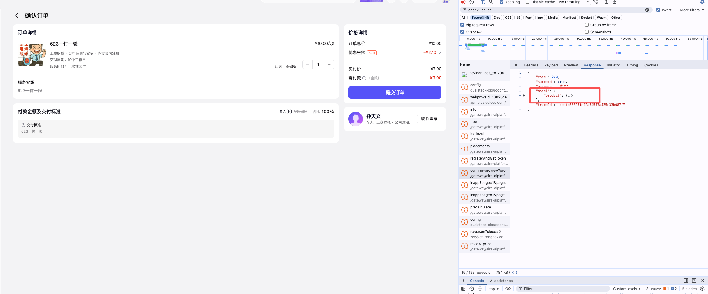

# REQ\-170 订单模式直采支持变成反采

# 需求

[REQ\-170 原直采模式支持雇主购买前选择购买模式\-PRD](https://wanlianyida.feishu.cn/wiki/UVaDwYXQViKS3AkhSgxcnRp2nMd)


# 技术方案

确认订单页，接口新增返回 canChangeOrderType : true/false, 为true时，展示选择框。用户选中后，在创建订单接口中orderType传2


# 改动点

## 确认订单页

接口： gateway/aira\-aiplatform\-esp\-api/v2/employer/orders/confirm\-preview

apifox:  https://app\.apifox\.com/link/project/8677491/apis/api\-497643478

改动点：新增order\.canChangeOrderType

```JSON
{
    "code": 200,
    "succeed": true,
    "message": "成功",
    "model": {
        "product": {},
        "order": {
            "canChangeOrderType": true
        }
    },
    "traceId": "deefb38025fef2a64557a535c33b087f"
}
```




## 注意点

**创建订单后，决定走签约or支付，需要前端看下现在的逻辑，是如果是以url中的orderType判断的话，这里需要修改**

