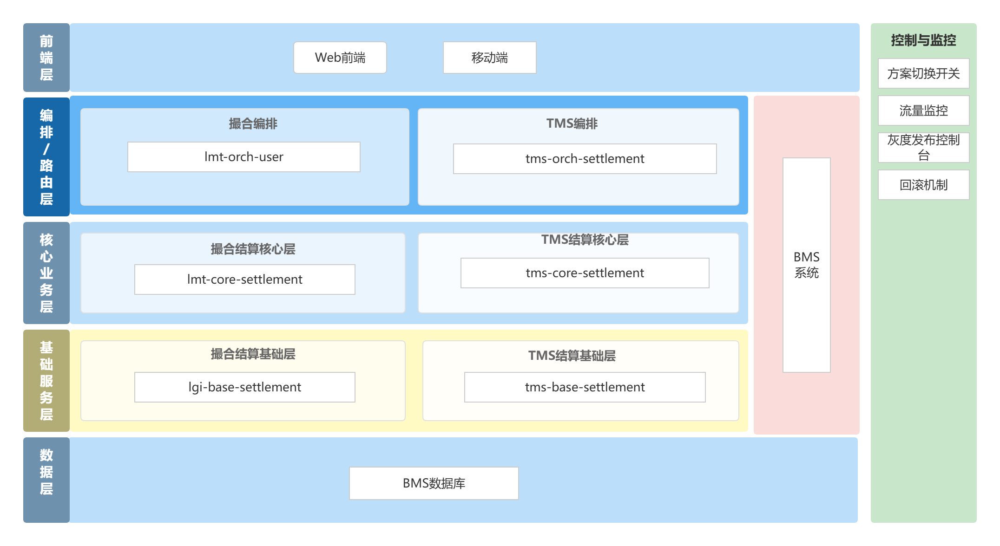

# TMS结算业务梳理和迁移方案

# 一、背景

TMS 业务预计在下半年进入全面扩量阶段，后续会围绕私户充值、区域返货车货匹配、多装多卸、拼车运输、运单批量导入导出、区域运营推广等方向持续建设。随着业务规模扩大，TMS 对系统性能、稳定性、功能迭代效率和运营支撑能力提出了更高要求。

目前 TMS 结算相关能力与撮合、网货业务耦合在同一套结算服务链路中，涉及 `lmt-orch-user`、`lmt-core-settlement`、`lgi-base-settlement`、`BMS` 等服务，底层共用 `BMS` 数据库。该模式随着 TMS 扩量发展，会带来以下问题：

- TMS与撮合网货业务边界不清晰，接口、服务、业务逻辑交叉复用，后续需求迭代和问题定位成本较高。

- 撮合与 TMS 共用结算链路，任一业务发布、故障或性能波动都可能互相影响，难以做到独立治理。

- TMS 后续会作为独立产品业务线运营，需要具备独立的接口体系、服务边界、发布节奏和扩展能力。

- 结算属于核心业务链路，涉及费用、收入、支出、对账、在途费用等关键数据，需要降低跨业务耦合带来的稳定性风险。

因此，本次设计计划将 TMS 结算相关模块从撮合结算服务中解耦，建设独立的 TMS 结算服务链路，为后续业务扩量和独立运营提供支撑。

# 二、目标

本次迁移目标是将 TMS 结算相关业务能力从撮合结算服务链路中拆出，形成独立、清晰、可持续演进的 TMS 结算服务体系。

# 三、业务梳理

## 3\.1 过往需求

TMS 1\.0

https://thoughts\.aliyun\.com/workspaces/688b4b40bf9b65001bf01a41/docs/69d8db603fb918000151ab72

TMS 2\.0

https://thoughts\.aliyun\.com/workspaces/688b4b40bf9b65001bf01a41/docs/69e9b6b974e40300017a7424\#69feff225fa45f4be62c4e1d

TMS 3\.0

https://thoughts\.aliyun\.com/workspaces/688b4b40bf9b65001bf01a41/docs/69fea09e51b144000192d480\#6a0db27073baca3856f7dd02

TMS 4\.0

https://thoughts\.aliyun\.com/workspaces/688b4b40bf9b65001bf01a41/docs/6a30e384a7c8ff0001e73608

【C113\.6】ETC费用管理及自动生成在途费用

https://thoughts\.aliyun\.com/workspaces/688b4b40bf9b65001bf01a41/docs/6a4b9c1cd31fed0001b8cdd5

## 3\.2 模块接口梳理

|模块|接口|描述|服务|表||||
|---|---|---|---|---|---|---|---|
|系统设置\- 费用项管理 |/bms/BmsCostManage/bmsCostManagePaging|费用项管理分页接口 |bms|bms\_cost bms\_cost\_manage||||
||/bms/BmsCostManage/bmsCostManageUpdateStatus|更新企业费用项启用状态|bms|bms\_cost\_manage ||||
||/lmt\-user/bms\-cost\-manage\-opt/update |费用项管理修改|lmt\-orch\-user lgi\-base\-settlement|bms\_cost bms\_cost\_manage||||
||/bms/BmsCostManage/exportData|费用项管理导出|bms |bms\_cost bms\_cost\_manage||||
|财务管理\-客户对账管理\- 客户汇总|/lmt\-user/lscWaybill/queryTotalAmount |查询对账总金额|lmt\-orch\-user lgi\-base\-settlement|lsc\_stmt\_waybill\_pool||||
||/lmt\-user/lscWaybill/page |分页查询运单池|lmt\-orch\-user lgi\-base\-settlement|lsc\_stmt\_waybill\_pool ||||
||/lmt\-user/customer\-statement/create\-v2 |创建对账单 |lmt\-orch\-user lgi\-base\-settlement |lsc\_stmt\_waybill\_pool lsc\_common\_stmt lsc\_stmt\_pay\_mtd lsc\_attachment||||
||com\.wanlianyida\.lmtcore\.settlement\.interfaces\.listener\.entrustfee\.CreateCustomerStatementMqListener\.WaybillStatementListener|监听消息，生成对账单明细|lmt\-core\-settlement lgi\-base\-settlement|lsc\_common\_stmt lsc\_stmt\_detl lsc\_stmt\_waybill\_pool||||
||com\.wanlianyida\.lmtcore\.settlement\.interfaces\.listener\.entrustfee\.WaybillStatementMqListener\.WaybillStatementListener |监听消息，已签收运单插入运单池表|lmt\-core\-settlement lgi\-base\-settlement |lsc\_stmt\_waybill\_pool |com\.wanlianyida\.lmtcore\.settlement\.infrastructure\.adapter\.waybill\.WaybillInqrySettInter\#singleQueryForSettlement com\.wanlianyida\.pricecalc\.api\.inter\.BasePccBillWaybillFeeDetlInter\#batchQueryByWaybill|||
||/customer\-statement/init|对账单初始化接口|应该是不用了|||||
|财务管理\-客户对账管理\- 客户对账单|/lmt\-user/lsc\-common\-statement/query/page |分页查询对账单 |lmt\-orch\-user lgi\-base\-settlement |lsc\_stmt\_pay\_mtd lsc\_common\_stmt lsc\_stmt\_detl lsc\_attachment||||
||/lsc\-common\-statement/status/audit\-pass |对账单审核通过|lmt\-orch\-user lgi\-base\-settlement |lsc\_common\_stmt lsc\_stmt\_detl lsc\_stmt\_pay\_mtd||||
||/lsc\-common\-statement/status/cancel\-pass |对账单取消审核|lmt\-orch\-user lgi\-base\-settlement|lsc\_common\_stmt||||
||/lsc\-common\-statement/status/audit\-reject|对账单审核驳回|lmt\-orch\-user lgi\-base\-settlement|lsc\_common\_stmt||||
||/lsc\-common\-statement/status/transfer\-settlement|对账单转结算|lmt\-orch\-user lgi\-base\-settlement|lsc\_common\_stmt||||
||/lsc\-common\-statement/status/cancel\-settlement|对账单取消结算|lmt\-orch\-user lgi\-base\-settlement|lsc\_common\_stmt||||
||/lsc\-common\-statement/status/delete\-by\-id |对账单删除对账单|lmt\-orch\-user lgi\-base\-settlement |lsc\_common\_stmt lsc\_stmt\_detl lsc\_stmt\_waybill\_pool lsc\_stmt\_pay\_mtd lsc\_stmt\_snap lsc\_attachment||||
||/lmt\-user/common\-statement/detail\-query |查询对账单详情|lmt\-orch\-user lmt\-core\-settlement lgi\-base\-settlement|lsc\_common\_stmt lsc\_attachment lsc\_stmt\_pay\_mtd ||||
||/lmt\-user/common\-statement/update|更新对账单|lmt\-orch\-user lmt\-core\-settlement lgi\-base\-settlement|lsc\_common\_stmt lsc\_attachment lsc\_stmt\_pay\_mtd||||
||/lmt\-user/stmt\-detail/page\-query|分页查询对账明细|lmt\-orch\-user lmt\-core\-settlement lgi\-base\-settlement|lsc\_stmt\_detl ||||
||/lmt\-user/stmt\-detail/batch\-delete |批量删除对账明细|lmt\-orch\-user lmt\-core\-settlement lgi\-base\-settlement|lsc\_common\_stmt lsc\_stmt\_detl lsc\_stmt\_waybill\_pool||||
||/lmt\-user/stmt\-detail/batch\-create |批量新增对账明细|lmt\-orch\-user lmt\-core\-settlement lgi\-base\-settlement|lsc\_common\_stmt lsc\_stmt\_detl lsc\_stmt\_waybill\_pool||||
|财务管理\-日常收支\- 日常收入 |/lmt\-user/income/costList |查询企业收入费用项 |lmt\-orch\-user lgi\-base\-settlement|bms\_cost bms\_cost\_manage||income\_costList||
||/lmt\-user/income/page |分页查询日常收入|lmt\-orch\-user lgi\-base\-settlement|bms\_incexp\_flow\_pay\_mtd bms\_incexp\_flow lsc\_attachment||||
||/lmt\-user/income/detail |收入流水详情|lmt\-orch\-user lgi\-base\-settlement |bms\_incexp\_flow\_detl bms\_incexp\_flow  lsc\_attachment bms\_incexp\_flow\_pay\_mtd||||
||/lmt\-user/income/attachList |收入附件列表|lmt\-orch\-user lgi\-base\-settlement|lsc\_attachment||||
||/lmt\-user/income/create|创建日常收入|lmt\-orch\-user lgi\-base\-settlement|||||
||/lmt\-user/income/update|修改日常收入|lmt\-orch\-user lgi\-base\-settlement|||||
||/lmt\-user/income/audit|审核日常收入|lmt\-orch\-user lgi\-base\-settlement|||||
||/lmt\-user/income/delete |删除日常收入|lmt\-orch\-user lgi\-base\-settlement|||||
|财务管理\-日常收支\- 日常支出 |/lmt\-user/expenditure/costList|查询企业收入费用项|lmt\-orch\-user lgi\-base\-settlement|||||
||/lmt\-user/expenditure/page |分页查询日常支出|lmt\-orch\-user lgi\-base\-settlement|||||
||/lmt\-user/expenditure/detail|支出流水详情 |lmt\-orch\-user lgi\-base\-settlement|||||
||/lmt\-user/expenditure/attachList |支出附件列表|lmt\-orch\-user lgi\-base\-settlement|||||
||/lmt\-user/expenditure/create|创建日常支出|lmt\-orch\-user lgi\-base\-settlement|||||
||/lmt\-user/expenditure/update|修改日常支出 |lmt\-orch\-user lgi\-base\-settlement|||||
||/lmt\-user/expenditure/audit |审核日常支出|lmt\-orch\-user lgi\-base\-settlement|||||
||/lmt\-user/expenditure/delete|删除日常支出|lmt\-orch\-user lgi\-base\-settlement|||||
|在途管理\-在途费用 |/lmt\-user/route\-cost\-query/cost\-apply\-list |分页查询费用记录 |lmt\-orch\-user lgi\-base\-settlement|bms\_cost\_rec |/lgi\-base\-enterprise/company\-org/get\-org\-info\-by\-org\-ids /lgi\-base\-wbinqry/waybill\-inqry/batch\-query\-transport|||
||/lmt\-user/route\-cost\-query/cost\-item\-list |获取企业可用的费用项|lmt\-orch\-user lgi\-base\-settlement|bms\_cost bms\_cost\_manage||||
||/lmt\-user/route\-cost\-query/cost\-apply\-detail |费用详情 |lmt\-orch\-user lgi\-base\-settlement|bms\_cost\_rec |/lgi\-base\-enterprise/company\-org/get\-org\-info\-by\-org\-ids /lgi\-base\-wbinqry/waybill\-inqry/batch\-query\-transport|||
||/lmt\-user/route\-cost\-query/find\-same\-cost\-apply |在途费用\-查同单费用列表（分页）|lmt\-orch\-user lgi\-base\-settlement|bms\_cost\_rec |/lgi\-base\-enterprise/company\-org/get\-org\-info\-by\-org\-ids /lgi\-base\-wbinqry/waybill\-inqry/batch\-query\-transport|||
||/lmt\-user/route\-cost/cost\-edit|在途费用\-编辑 |lmt\-orch\-user lmt\-core\-settlement lgi\-base\-settlement|bms\_cost\_rec ||||
||/lmt\-user/route\-cost/cost\-apply |在途费用\-上报|lmt\-orch\-user lmt\-core\-settlement lgi\-base\-settlement|bms\_cost bms\_cost\_rec||||
||/lmt\-user/route\-cost/cost\-delete|在途费用\-删除|lmt\-orch\-user lmt\-core\-settlement lgi\-base\-settlement|bms\_cost\_rec ||||
||/lmt\-user/route\-cost/cost\-audit|在途费用\-审核|lmt\-orch\-user lmt\-core\-settlement lgi\-base\-settlement|bms\_cost\_rec ||||
||/lmt\-user/route\-cost/cost\-revoke\-audit |在途费用\-撤销审核 |lmt\-orch\-user lmt\-core\-settlement lgi\-base\-settlement|bms\_cost\_rec|lgi\_base\_operation\_log\_topic|||
||/lmt\-user/route\-cost/cost\-revoke\-pay |在途费用\-取消支付 |lmt\-orch\-user lmt\-core\-settlement lgi\-base\-settlement|bms\_cost\_rec|lgi\_base\_operation\_log\_topic|||
||/lmt\-user/payment/batch\-transfer |在途费用批量发起支付（转账方式，不拉收银台） |lmt\-orch\-user lgi\-base\-settlement lgi\-base\-payment |bms\_cost\_rec bms\_cost\_manage |com\.wanlianyida\.payment\.api\.inter\.PaymentInter\#executeTransfer lgi\_base\_operation\_log\_topic|||
||/lmt\-user/payment/cancel\-transfer |在途费用取消支付\(待定位\)|lmt\-orch\-user lgi\-base\-settlement|bms\_cost\_rec||||

# 四、迁移范围

## 4\.1 本次迁移模块

本次纳入迁移范围的 TMS 结算模块包括：

- 财务管理 \- 客户对账管理 \- 客户汇总

- 财务管理 \- 客户对账管理 \- 客户对账单

- 财务管理 \- 日常收支 \- 日常收入

- 财务管理 \- 日常收支 \- 日常支出

- 在途管理 \- 在途费用

以上模块当前主要依赖撮合结算链路，本次需要迁移到新的 TMS 结算服务链路中。

## 4\.2 本次暂不迁移模块

系统设置 \- 费用项管理暂不纳入本次迁移范围。

原因如下：

- 费用项管理当前由网货、撮合、TMS 共用，前后端均存在共用逻辑。

- 费用项属于基础数据，数据量不大，业务变更频率相对较低。

- 改动范围：1、后端接口各拆分一套  2、前端页面拆分，调不同接口  3、企业纬度的费用项数据不再共用，拆分数据，撮合、网货、TMS各一套。

- 德哥建议费用项管理模块单独一个服务处理。

# 五、迁移架构变更

迁移前 TMS 结算相关功能与撮合结算链路耦合：

- TMS 的客户汇总、客户对账单、日常收入、日常支出、在途费用等模块，实际复用撮合结算服务链路。

- 费用项管理由撮合、网货、TMS 共用，主要由 `BMS` 服务提供能力。

- 撮合结算服务和 `BMS` 服务共用 `BMS` 数据库。

- TMS 没有独立的结算服务边界，无法按 TMS 业务独立发布、扩容、监控和治理。

迁移后TMS 结算相关模块通过新的 TMS 结算服务承接，独立的编排层、核心层和基础层。费用项管理仍保持现状，继续走 `BMS` 服务及既有共用能力。

# 六、迁移方案

## 6\.1 服务拆分方案

本次按照既有撮合结算链路的分层方式，新增 TMS 独立结算链路：

- `ltms-orch-settlement`：TMS 结算编排层。ltms\-orch\-settlement  

- `ltms-core-settlement`：TMS 结算核心服务层。ltms\-core\-settlement 

- `ltms-base-settlement`：TMS 结算基础服务层。ltms\-base\-settlement 

- `BMS` 服务继续承接费用项管理等共用基础能力。

## 6\.2 接口迁移方案

对纳入迁移范围的模块，新建 TMS 结算接口，接口路径按 TMS 业务语义重新规划：

- `/tms-settlement`

迁移期间新老接口并行保留。前端根据迁移开关结果选择调用新接口或老接口，避免一次性全量切换。

## 6\.3 开关分流方案

迁移期间增加前端开关能力，用于控制 TMS 结算模块是否走新服务。开关为接口纬度。

分流规则如下：

- 开关关闭：继续调用撮合结算接口。

- 开关开启：调用新 TMS 结算接口和新域名。

- 开关接口异常：默认走撮合结算接口

- 新服务异常：关闭开关，前端切回老链路。

迁移开关流程如下：

## 6\.4 网关处理方案

网关层新增 TMS 结算独立域名和路由规则。

## 6\.5 数据方案

本次迁移暂不拆分数据库，仍共用 `BMS` 数据库。新 `ltms-base-settlement` 直接访问现有结算相关表。

# 七、迁移步骤

1. 梳理现有撮合结算接口，确认客户汇总、客户对账单、日常收入、日常支出、在途费用涉及的接口、服务方法和数据表。

2. 新建 `ltms-orch-settlement`、`ltms-core-settlement`、`ltms-base-settlement` 服务模块或应用。

3. 按模块迁移接口和业务逻辑，采用原代码整体迁移，避免迁移前后不一致。

4. 网关新增 TMS 结算域名和接口路由。

5. 前端接入迁移开关，根据模块开关选择新老接口。

6. 新链路稳定后逐步扩大开关范围。

7. 全量切换稳定运行后，再评估老链路中 TMS 相关逻辑下线计划。

# 八、总结

本次 TMS 结算迁移整体方案：服务解耦优先、数据库暂不拆分、新老链路并行、前端开关灰度。

通过新增 `ltms-orch-settlement`、`ltms-core-settlement`、`ltms-base-settlement`，将 TMS 客户对账、日常收支、在途费用等结算能力从撮合结算链路中拆出，形成独立服务边界。费用项管理作为撮合、网货、TMS 共用基础数据能力，短期继续保留在现有 `BMS` 服务中，降低迁移范围和上线风险。

该方案可以在控制风险的前提下，逐步完成 TMS 结算能力独立化，为后续 TMS 扩量、独立发布、独立监控和产品化运营提供基础支撑。

# 九、排期

|后端|新建项目部署到dev|2026\.7\.29\-2026\.8\.3|王同威|
|---|---|---|---|
|||||
|||||

