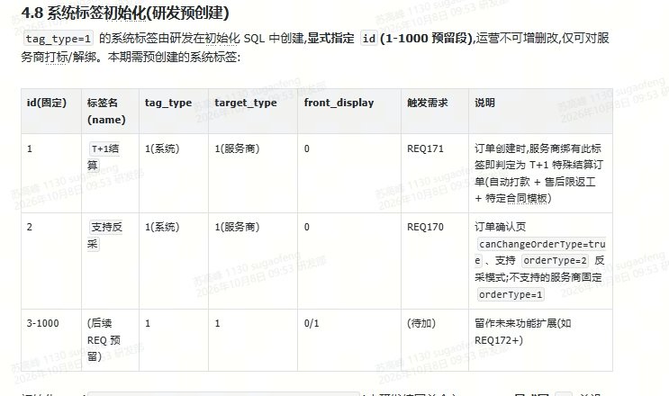

# REQ171\-指定标签服务商支持服务商T\+1日收到款项\-技术方案

## 一、核心设计：订单增加结算模式 `settlement_mode`

订单增加一个“结算模式”属性：

|settlement\_mode|含义|
|---|---|
|STANDARD|标准结算|
|T1|T\+1 特殊结算|

### 1\. settlement\_mode 代表什么

`settlement_mode` 表示：

> **这张订单从创建开始，最终采用哪一套结算业务规则。**
> 
> 

它是**订单自身的业务属性**，不是服务商当前状态。

---

### 2\. settlement\_mode 是怎么确定的

只在**订单创建时判断一次**。

```Plain Text
务商标签
                     │
                     │ 只在订单创建时读取
                     ▼
                订单创建时判定
                     │
           ┌─────────┴─────────┐
           ▼                   ▼
      命中 T1 标签            未命中
           │                   │
           ▼                   ▼
   settlement_mode=T1   settlement_mode=STANDARD
           │                   │
           └─────────┬─────────┘
                     ▼
                  订单落库
                     │
                     │ 从此不再根据当前标签重算
                     ▼
       ┌─────────────┼─────────────┐
       ▼             ▼             ▼
      结算           合同           售后
       │             │             │
       └─────────────┴─────────────┘
                     │
                     ▼
           全部使用 settlement_mode
```

**一旦订单创建完成，****`settlement_mode`**** 就固定下来，不再随着服务商标签变化而变化。**

---

### 3\. settlement\_mode 确定后续业务


**标签只负责在下单时决定 settlement\_mode；订单创建以后，所有业务都只看 settlement\_mode，不再根据当前标签重新判断。**

梳理下来主要是 **8 类业务**：

|业务|`settlement_mode` 的作用|PRD规则（【REQ\-171】指定标签服务商支持服务商T\+1日收到款项）|
|---|---|---|
|**1\. 订单结算类型锁定**<br>|创建订单时确定 `STANDARD / T1`，<br>创建后不再随服务商标签变化|订单创建时根据当前标签判定，后续标签变更不影响已创建订单；<br>非标签服务商保持原流程|
|**2\. 结算规则**<br>|决定走“验收后标准结算”<br>还是“免验收 T\+1 自动结算”|T1订单支付成功、进入履约后，跳过验收，<br>支付次自然日自动结算至服务商账户|
|**3\. 验收规则**|T1订单的验收结果不能控制资金结算|PRD明确“T\+1特殊结算订单，验收结果不影响结算”|
|**4\. 售后规则**|决定订单可以走哪些售后类型<br>|T1订单仅支持返工，不支持退款/部分退款，且后端也要校验拦截|
|**5\. 合同规则**|决定订单使用普通合同还是 T1 特定合同|打标期间产生的订单使用特定合同模板，打标前订单使用普通模板|
|**6\. 页面展示/订单标识**|决定是否展示“T\+1特殊结算”提示、支付和到账信息|确认订单页提示特殊规则；订单详情展示支付、预计/实际到账；<br>后台列表展示 T1 类型标识|
|**7\. 钱包流水/财务对账**|决定这笔结算是否作为  T\+1  分账记录展示和查询|T1打款在钱包中标识为分账流水；<br>打款流水进入订单流水并支持财务对账|
|**8\. 打款异常/风控**|只有 T1自动结算订单会进入这套自动打款异常处理|打款失败记录原因并重试、通知运营；<br>账户异常冻结打款并通知服务商更新账户|

### 可以把它理解成一条主线

`settlement_mode` 首先在**订单创建**时产生：

```Plain Text
服务商标签
   ↓
订单创建时判断一次
   ↓
settlement_mode
   ├─ STANDARD
   └─ T1
```

订单创建完成后，`settlement_mode` 就成为后续业务的统一判断依据：

```Plain Text
settlement_mode
   │
   ├─ 结算：走标准结算还是 T+1
   ├─ 验收：是否影响结算
   ├─ 售后：普通售后还是仅返工
   ├─ 合同：普通模板还是特殊模板
   ├─ 展示：是否显示 T+1 标识和提示
   ├─ 钱包：是否展示 T+1 分账流水
   ├─ 对账：是否按 T+1 打款记录处理
   └─ 异常：是否进入自动打款异常处理
```

> **`settlement_mode`**** 是订单创建时确定并固化的结算业务类型，用于统一决定订单后续的结算、验收、售后、合同、展示、流水及异常处理规则；服务商标签仅用于订单创建时确定该模式，后续标签变化不改变已创建订单的 ****`settlement_mode`****。**
> 
> 

---

# 二、业务设计

## 1\. 订单结算类型锁定

订单创建时，根据服务商当前是否命中 T\+1 指定标签，确定本订单的结算模式。



**规则如下：**

- 服务商命中 T\+1 指定标签，且订单属于 T\+1 适用范围，则订单 `settlement_mode = T1`；

- 其他订单 `settlement_mode = STANDARD`；

- `settlement_mode` 只在订单创建时确定一次；

- 订单创建完成后，服务商新增、取消或变更标签，都不再影响已经创建订单的 `settlement_mode`；

- 打标前已经创建的订单继续按照 STANDARD 规则执行；

- 打标期间创建的 T1 订单，即使后续服务商取消标签，仍按照 T1 规则执行；

- 取消标签以后新创建的订单恢复 STANDARD。

因此：

> 标签决定“新订单创建时属于哪一种结算模式”，`settlement_mode` 决定“订单创建以后按照什么规则继续执行”。
> 
> 

### T1 适用订单范围

REQ\-171 本期仅对普通订单中的直采、反采（定制）订单生效：

```Plain Text
order_type = 1  DIRECT  直采订单
order_type = 2  CUSTOM  反采/定制订单
```

总分包相关订单不属于本期 T1 适用范围：

```Plain Text
order_type = 3  GENERAL_CONTRACT
order_type = 4  AGENCY_OPERATION
```

因此，即使总分包相关订单对应的服务商命中 T1 指定标签，也**不参与 ****`settlement_mode = T1`**** 的业务判定**，继续保持现有总分包业务及结算规则，不受 REQ\-171 影响。

该边界与现有订单标签快照范围保持一致：当前标签快照仅对 `order_type = 1/2` 的普通订单生效，总分包订单不进入普通服务商标签快照链路。

需要特别说明：

> 数据库字段默认值为 `STANDARD` 仅用于兼容历史数据及非 T1 订单，不代表总分包订单需要改走普通订单的 STANDARD 自动结算任务；总分包仍保持自身原有结算链路。
> 
> 

---

**数据库变更**

```SQL
ALTER TABLE `esp_order`
ADD COLUMN `settlement_mode` TINYINT NOT NULL DEFAULT 1
COMMENT '结算模式：1-标准结算，2-T+1特殊结算';
```

```Plain Text
1 = STANDARD  标准结算
2 = T1        T+1特殊结算
```

字段使用 `DEFAULT 1`，保证历史订单以及未命中 T1 规则的新订单默认保持原有结算语义；历史订单不根据服务商当前标签做批量重算或回填为 T1。

## 2\. 结算规则

订单根据 `settlement_mode` 分为两套结算规则：

|settlement\_mode|结算规则|
|---|---|
|STANDARD|保持现有验收后结算逻辑|
|T1|支付成功次自然日，满足履约条件后免验收自动结算|

两种模式只改变**什么时候具备结算资格**。真正进入结算以后，金额计算、服务费计算、服务商结算金额、分账、支付结果、到账结果等结算业务保持一致。

---

### 2\.1 STANDARD 现有结算规则

`settlement_mode = STANDARD` 的订单保持当前结算流程不变。

当前普通订单的结算是**阶段维度结算**，核心流程为：

```Plain Text
阶段支付成功
      ↓
服务商履约
      ↓
提交验收
      ↓
雇主验收通过
      ↓
记录 accepted_at
      ↓
按照阶段结算账期计算 settlement_due_at
      ↓
达到结算时间
      ↓
STANDARD 定时任务扫描到该阶段
      ↓
发起分账
      ↓
结算完成
```

当前系统的结算起点是**验收通过时间**，不是支付成功时间。

阶段验收通过后，根据该阶段约定的 `split_days / split_days_unit` 计算结算到期时间；当前阶段结算设计即以 `accepted_at + 结算等待期` 计算 `settlement_due_at`，涉及工作日时遇周末、节假日顺延。现有设计中普通阶段按 T\+3 工作日结算，并在到期后进入实际分账窗口。

因此 STANDARD 的核心业务规则可以概括为：

> **先验收，再计算结算账期，账期到期后由现有自动结算任务发起分账。**
> 
> 


---

### 2\.2 STANDARD 定时任务

保留现有 STANDARD 自动结算任务。

> **STANDARD 定时任务全天按配置周期持续扫描，当前周期为 1 小时；09:50（UTC\+8）是当日最早允许实际发起分账的时间门槛，不是任务从 09:50 才开始运行。09:50 之后任一轮扫描中，仅当阶段已达到结算到期时间并满足实际分账条件时，才会发起分账，否则本轮跳过，等待下一次扫描。**
> 
> 

现有实际分账时间判断还包括：

```Plain Text
当前时间 >= settlement_due_at + 15分钟
AND
当前时间 >= 当日09:50（UTC+8）
```

因此 STANDARD 的“任务扫描时间”和“真正允许发起分账的时间”需要区分：任务可以全天运行，但未进入可分账时间时不会调用支付中台执行分账。

任务只负责处理：

```Plain Text
settlement_mode = STANDARD
```

候选条件为：

```Plain Text
STANDARD订单
+
阶段已验收通过
+
accepted_at 已产生
+
达到原结算账期 settlement_due_at
+
达到实际分账时间窗口
+
当前尚未结算
```

扫描到候选以后：

```Plain Text
STANDARD定时任务
      ↓
查询符合标准结算条件的阶段
      ↓
发起阶段结算
      ↓
分账
      ↓
成功：更新结算状态
失败：进入现有异常处理
```

---

### 2\.3 T1 结算规则

`settlement_mode = T1` 的订单，不再使用“验收完成时间”作为结算起点，而是以**每一笔款项的支付成功时间**作为 T\+1 结算的时间基准。

PRD要求，T\+1 特殊结算订单需要满足“雇主支付成功、订单进入履约状态”，并且雇主支付的每一笔款项均跳过验收，于支付成功后的次自然日自动结算。

#### 1\. T\+1 时间定义

T\+1 按**自然日**计算：

```Plain Text
支付成功所在自然日 = T
支付成功后的下一自然日 = T+1
```

例如：

```Plain Text
支付成功时间：2026-10-08 10:30

T   = 2026-10-08
T+1 = 2026-10-09
```

这里的 T\+1 是“下一自然日”，不是“支付成功后满 24 小时”。

例如支付成功时间为：

```Plain Text
2026-10-08 23:59:59
```

对应的 T\+1 仍然是：

```Plain Text
2026-10-09
```

但进入 T\+1 日期后，**不代表跨过 0 点即可立即分账**。

支付中台存在分账时间限制：

> **当日支付成功的款项，次日 09:40 前不允许发起分账。**
> 
> 


因此对于 T1 订单，**次日 09:40 是支付中台允许发起分账的最早时间**。

这里需要区分两个概念：

- **T\+1**：REQ\-171 的业务规则，表示支付成功后的下一自然日；

- **09:40**：支付中台现有分账能力约束，表示当日支付款项在次日 09:40 前不允许发起分账，并不是 PRD 对 T\+1 的定义。

为避免“当前日期”和“当天 09:40”拆开判断产生边界歧义，统一定义一个绝对时间点：

```Plain Text
t1_ready_at = 支付成功后的下一自然日 09:40:00
```

例如：

```Plain Text
支付成功：2026-10-08 23:59:59
t1_ready_at：2026-10-09 09:40:00
```

后续无论订单是在 T\+1 当天还是更晚才进入履约，都统一判断：

```Plain Text
当前时间 >= t1_ready_at
```

而不是每天重新判断一次“今天是否已经到 09:40”。

---

#### 2\. T1 实际结算条件

一笔 T1 款项需要同时满足以下条件，才具备分账资格：

```Plain Text
settlement_mode = T1
+
该阶段已经支付成功
+
当前时间 >= t1_ready_at
+
订单已经进入履约状态
+
当前阶段尚未完成结算
```

全部满足后，由 T1 定时任务在下一次扫描时发起分账。

因此：

> **支付成功日决定 T\+1，****`t1_ready_at`**** 决定支付中台最早允许分账的绝对时间点，履约状态决定当前订单是否已经具备实际分账条件。**
> 
> 

支付成功时间应以支付域确认的**支付成功状态及对应成功时间**为准，业务设计不依赖“某个本地时间字段非空”来替代支付成功事实。

T1 结算**不判断**：

```Plain Text
是否提交验收
是否验收通过
accepted_at
STANDARD 的 split_days / split_days_unit
```

这是 T1 与 STANDARD 最核心的区别：

> **STANDARD 以验收通过时间作为结算起点；T1 以支付成功时间确定 T\+1，并且不受验收结果影响。**
> 
> 

---

### 2\.4 T1 结算案例

#### 1\. 常规案例

假设：

```Plain Text
支付成功：10月8日 15:00
订单进入履约：10月8日 18:00
```

则：

```Plain Text
T   = 10月8日
T+1 = 10月9日
```

10月9日：

```Plain Text
00:00 ～ 09:39:59
→ 已经进入T+1
→ 但支付中台不允许分账

09:40以后
→ 已进入T+1
→ 已满足中台分账时间
→ 订单已进入履约
→ 具备T1结算资格
```

之后由 T1 定时任务下一轮扫描并发起分账。

流程为：

```Plain Text
10月8日 15:00 支付成功
        ↓
10月8日 18:00 进入履约
        ↓
10月9日 T+1
        ↓
10月9日 09:40以后
        ↓
T1任务扫描
        ↓
发起分账
```

---

#### 2\. 极端案例一：当天接近 24 点支付

假设：

```Plain Text
支付成功：10月8日 23:59:59
订单已进入履约
```

虽然 1 秒以后就进入：

```Plain Text
10月9日 00:00
```

并且从日期上已经属于 T\+1，但此时仍然**不能分账**。

正确规则：

```Plain Text
10月9日 00:00
→ 已进入T+1
→ 但早于09:40
→ 不允许分账

10月9日 09:40以后
→ 满足中台时间要求
→ 可以进入T1分账
```

因此不会出现：

```Plain Text
23:59:59支付
00:00马上分账
```

这种支付后只有几秒就完成结算的情况。

---

#### 3\. 极端案例二：到了 T\+1，但订单还没有进入履约

假设直采订单：

```Plain Text
10月8日 20:00 支付成功
```

到了：

```Plain Text
10月9日 09:40
```

虽然已经同时满足：

```Plain Text
T+1
+
中台允许分账时间
```

但订单因为合同尚未签完，还没有进入履约状态，则：

```Plain Text
→ 暂不分账
```

如果：

```Plain Text
10月9日 14:00
双方签约完成
订单进入履约
```

此时：

```Plain Text
当前已经是T+1
+
已经超过09:40
+
订单已经进入履约
```

因此立即具备 T1 结算资格，由 T1 定时任务下一轮扫描处理。

这里**不会重新从 10 月9日开始再等待一个 T\+1**。

即：

```Plain Text
错误：
10月9日进入履约
→ 等到10月10日再结算

正确：
10月9日进入履约时已经满足T+1
→ 下一轮任务即可结算
```

---

#### 4\. 极端案例三：T\+1 当天始终未进入履约

假设：

```Plain Text
10月8日 支付成功
10月9日 为T+1
```

但 10 月9日全天订单都没有进入履约：

```Plain Text
→ 10月9日不结算
```

如果直到：

```Plain Text
10月10日 11:00
订单才进入履约
```

此时由于：

```Plain Text
当前日期 > T+1
+
当前时间 > 09:40
+
订单已进入履约
```

则订单在进入履约后即可具备结算资格。

也就是说，T1 不是“只能在 T\+1 当天结算”，而是从 `t1_ready_at` 开始持续具备时间资格。

例如：

```Plain Text
10月8日支付成功
t1_ready_at = 10月9日09:40

如果直到10月10日08:00才进入履约：
→ 当前时间已经晚于10月9日09:40
→ 不需要再等10月10日09:40
→ 进入履约后即可由下一轮T1任务处理
```

统一判断始终是：

```Plain Text
当前时间 >= t1_ready_at
```

而不是：

```Plain Text
每天都要求“当前时钟时间 >= 09:40”
```

---

#### 5\. 多阶段 / 多笔支付说明

PRD明确“雇主支付的每一笔款项均跳过验收环节”。

因此对于分阶段付款订单，每一阶段应按照**该阶段自身的支付成功时间**独立计算 T\+1。

例如：

```Plain Text
阶段1支付成功：10月8日
→ 最早10月9日09:40后具备结算时间条件

阶段2支付成功：10月10日
→ 最早10月11日09:40后具备结算时间条件
```

不能用订单第一笔付款时间统一计算所有阶段的 T\+1。

最终可以把 T1 结算规则总结成一句：

> **T1 订单的每笔已支付款项，以该笔支付成功日作为 T，最早在 T\+1 自然日 09:40 后进入结算；同时要求订单已进入履约状态，验收状态及 STANDARD 结算账期不参与 T1 结算资格判断。**
> 
> 

---

### 2\.5 直采订单 T1 触发时机

直采现有业务顺序是：

```Plain Text
创建订单
   ↓
雇主支付
   ↓
雇主签约
   ↓
服务商签约
   ↓
进入履约
```

因此直采存在一个特点：

> **支付成功发生在进入履约之前。**
> 
> 

例如：

```Plain Text
10月8日 10:00
雇主支付成功
→ T = 10月8日

10月8日 15:00
雇主完成签约

10月8日 17:00
服务商完成签约
→ 订单进入履约

10月9日
→ T+1
→ 09:40达到 t1_ready_at
→ 订单已进入履约
→ 具备T1结算资格
```

这是最正常的情况。

#### 如果签约在 T\+1 当天才完成

例如：

```Plain Text
10月8日 10:00
支付成功

10月9日
已经是 T+1

10月9日 10:20
服务商完成签约
→ 此时订单才进入履约
```

此时不能因为“进入履约发生在 10 月9日”，重新变成：

```Plain Text
10月10日才能结算
```

正确逻辑应该是：

```Plain Text
当前时间已经 >= t1_ready_at
+
现在又满足了履约条件
→ 立即具备T1结算资格
```

由 T1 定时任务下一轮扫描处理。

#### 如果 T\+1 当天始终没有进入履约

例如：

```Plain Text
8日支付
9日是T+1
但9日仍未签完合同
```

则 9 日不能结算。

以后什么时候进入履约：

```Plain Text
进入履约
+
当前时间已经 >= 原支付对应的 t1_ready_at
→ 即可进入结算
```

仍然不重新额外等待一天，也不会按“进入履约日”重新计算新的 T\+1。

---

### 2\.6 反采订单 T1 触发时机

反采现有业务顺序与直采不同：

```Plain Text
创建订单
   ↓
雇主签约
   ↓
服务商签约
   ↓
雇主支付
   ↓
进入履约
```

也就是说反采是：

> **先完成签约，再支付；支付成功后直接进入履约。**
> 
> 

因此反采的 T1 规则更简单。

例如：

```Plain Text
10月8日 09:00
双方签约完成

10月8日 15:00
雇主支付成功
→ 订单进入履约
→ T = 10月8日

10月9日
→ T+1
→ 09:40达到 t1_ready_at
→ 可以进入T1结算
```

所以反采订单：

> **支付成功后，反采订单通常已经完成除 T\+1 时间条件之外的其他业务前置条件。**
> 
> 

但仍然统一按照同一套候选规则判断：

```Plain Text
支付成功
+
当前时间 >= t1_ready_at
+
订单已进入履约
```

而不是为了反采单独定义另一套 T1 日期算法。

---

### 2\.7 直采、反采 T1 规则汇总

|**类型**|**当前业务顺序**|**T 如何确定**|**进入履约时机**|**最早具备分账资格**|
|---|---|---|---|---|
|直采|支付 → 签约 → 履约|支付成功日|双方签约完成后|`当前时间 >= t1_ready_at`，且已经进入履约|
|反采|签约 → 支付 → 履约|支付成功日|支付成功后|`当前时间 >= t1_ready_at`|

所以两种订单的统一规则仍然是：

```Plain Text
T = 支付成功自然日
t1_ready_at = T+1自然日 09:40

可结算 =
当前时间 >= t1_ready_at
AND
订单已经进入履约
AND
当前阶段尚未完成结算
```

其中 `09:40` 来源于支付中台现有分账限制；若中台规则后续调整，应以支付中台正式确认的可分账时间为准，不改变“T=支付成功日”的业务定义。

差异只在于：

```Plain Text
直采：
支付后可能还要等签约，才能进入履约

反采：
支付发生在签约以后，支付成功后即可进入履约
```

---

### 2\.8 新增 T1 定时任务

T1 不复用 STANDARD 的候选查询。

原因是 STANDARD 的核心条件是：

```Plain Text
accepted_at + 原结算账期
```

而 T1 明确要求：

```Plain Text
不依赖 accepted_at
```

所以新增独立的 **T1 自动结算定时任务**。

任务只扫描：

```Plain Text
settlement_mode = T1
```

核心候选条件：

```Plain Text
1. settlement_mode = T1

2. 阶段已经支付成功

3. 当前时间 >= t1_ready_at
   （t1_ready_at = 该阶段支付成功后的下一自然日09:40）

4. 订单已经进入履约

5. 当前阶段尚未完成结算
```

其中“阶段已经支付成功”应以支付域的权威支付成功状态为准；如果本地存在支付时间字段，仅作为成功时间载体使用，不能用“字段非空”替代支付成功状态判断。

候选中**不要求验收通过**。

---

### 2\.9 T1 定时任务执行时间设计

T1 使用独立的自动结算候选任务，任务采用周期扫描机制，避免只在每天固定时间扫描一次而导致直采订单因晚进入履约被无意义拖到 T\+2。

支付中台当前限制：

```Plain Text
T+1 当日 09:40 前不允许发起分账
```

因此：

- `09:40` 是支付中台允许分账的最早时间，不是 T1 任务必须执行的固定时刻；

- T1 任务可以全天按配置周期运行，但只有 `当前时间 >= t1_ready_at` 的阶段才允许真正进入分账；

- 为与现有资金执行时段保持一致，当前建议首个有效处理时点放在 09:50 及之后，并按固定周期继续扫描；

- 当前建议轮询周期为 1 小时，最终以部署配置及财务/支付团队确认结果为准。

例如：

```Plain Text
09:40
→ 中台开始允许该批T+1资金分账

09:50
→ T1任务本轮扫描
→ 满足 t1_ready_at + 已进入履约
→ 发起分账

10:20
→ 某直采订单此时才完成签约并进入履约

10:50
→ 下一轮扫描
→ 该订单已满足全部条件
→ 当天继续发起分账
```

因此 T1 任务的原则是：

> **周期扫描、按 ****`t1_ready_at`**** 控制最早可分账时间；本轮未满足履约条件的数据不处理，后续轮次继续扫描。**
> 
> 

---

### 2\.10 两个结算定时任务最终设计

最终形成两套候选任务：

|任务|STANDARD 自动结算任务|T1 自动结算任务|
|---|---|---|
|处理范围|`settlement_mode = STANDARD` 的普通订单|`settlement_mode = T1` 的普通订单|
|是否依赖支付成功|是（现有业务流程自然满足）|**是，按支付域权威成功状态判断**|
|是否依赖进入履约|现有流程自然已满足|**是**|
|是否依赖验收|**是**|**否**|
|结算时间基准|`accepted_at`|**该阶段支付成功时间**|
|等待时间|原 `split_days / split_days_unit`|`t1_ready_at = T+1自然日09:40`|
|实际最早执行限制|到期后至少15分钟，且当日09:50后|当前时间达到 `t1_ready_at`；建议09:50起进入有效扫描|
|任务模式|保持现有周期扫描|新增独立周期扫描|
|进入结算后|复用现有分账执行链路|复用现有分账执行链路|

整个关系：

```Plain Text
settlement_mode
                       /          \
                      /            \
              STANDARD              T1
                 │                   │
                 │                   │
             验收通过              支付成功
                 │                   │
          原结算账期到期            T+1
                 │                   │
                 │               已进入履约
                 │                   │
                 ▼                   ▼
         STANDARD定时任务       T1定时任务
                 │                   │
                 └─────────┬─────────┘
                           ▼
                      统一结算流程
                           ↓
                         分账
                           ↓
                      结算成功/失败
```

这里最重要的边界就是：

> **两个任务只负责使用不同规则判断“什么时候把一笔阶段资金送进结算”。**
> 
> 

阶段进入结算以后，金额计算、服务费计算、服务商结算金额、支付中台分账调用、异步回调、必要的主动查单以及结算状态更新等底层执行链路继续复用现有能力。

但以下业务信息仍然需要保留 `settlement_mode` 区分：

```Plain Text
页面T1标识
钱包/订单流水来源
财务对账分类
T1异常运营识别
```

因此“复用现有结算流程”不等于后续业务完全忽略 `settlement_mode`。

这样既不会改变现有 STANDARD 结算，又能保证 T1 真正实现“免验收、支付次自然日自动结算”。

---

## 3\. 验收规则

`settlement_mode` 不改变订单原有的履约和验收流程，只改变“验收是否是资金结算的前置条件”。

### STANDARD

继续按照原有逻辑：

> 验收结果会影响后续结算。
> 
> 

### T1

T1 订单仍然正常进行履约和验收，但：

> **验收结果不影响资金结算。**
> 
> 

具体规则：

- T1 订单未验收，不影响 T\+1 自动结算；

- T1 订单验收通过，不再触发一次新的资金结算；

- T1 订单验收不通过，也不撤销已经发生的 T\+1 结算；

- T1 已完成资金结算后，订单仍然继续正常履约、验收。

因此需要明确区分：

> **资金已结算 ≠ 订单履约已完成。**
> 
> 

T1 打款成功只代表资金结算完成，不代表订单履约流程结束。

### 结算状态与订单履约状态

PRD 中存在“打款成功后，订单状态更新为已结算”的描述。为避免与“资金已结算 ≠ 订单履约已完成”产生歧义，本设计按以下原则理解：

> **“已结算”表示资金/阶段结算状态已经完成，不直接代表订单履约主状态完成。**
> 
> 

T1 资金结算成功后，订单仍应继续原有履约、交付、验收流程。当前设计口径为：PRD 中“已结算”指资金/阶段结算状态，不代表订单履约主状态完成。即使订单下所有阶段均已完成资金结算，也不会仅因为资金全部结算而直接将 `order_status` 更新为 `COMPLETED`；订单主状态仍按照原有履约、交付、验收及售后完成条件推进。

---

## 4\. 售后规则

售后业务根据订单的 `settlement_mode` 判断可以使用哪些售后能力。

### STANDARD

继续按照现有售后规则执行。

### T1

`settlement_mode = T1` 的订单：

> **仅支持返工，不支持退款及部分退款。**
> 
> 

具体规则：

- 可以继续使用原有返工流程；

- 返工是否允许，仍然按照订单当前履约、验收状态判断；

- 不提供全额退款；

- 不提供部分退款；

- 所有会导致款项退回雇主的售后方案均不允许；

- 前端隐藏退款类售后入口；

- 后端业务规则同样必须限制，不能只依赖页面隐藏。

同时，T1 订单可能在申请返工前已经完成资金结算，因此：

> 返工只处理履约问题，不重新处理已经完成的资金结算。
> 
> 

返工完成、重新验收后，不再次产生结算。

### 售后时效

T1 订单的售后时效**不以资金是否已经分账/结算为判断依据**，继续按照订单原有售后时效规则执行。

也就是说：

```Plain Text
T1已经完成资金结算
≠
售后时效立即结束
```

资金结算仅改变款项处理时机，不改变订单原有售后有效期。

### 售后阶段范围

“仅支持返工”表示在**原业务允许发起售后的阶段和时效范围内**，T1 订单只允许选择返工，并不表示 T1 订单在所有状态下都可以发起返工。

按照 PRD 当前规则：

|阶段状态|T1 订单可售后类型|
|---|---|
|履约中|无|
|待验收|无|
|验收通过|仅返工|
|验收不通过|无|

多阶段、多次支付或多次验收场景，仍按照现有“当前阶段可售后范围”判断，不因为资金已经 T\+1 结算而扩大可售后阶段范围。

---

## 5\. 合同规则

合同业务根据订单自身的 `settlement_mode` 确定合同规则。

### STANDARD

继续使用普通订单合同规则。

### T1

`settlement_mode = T1`：

> 使用 T1 特殊结算订单对应的合同模板和合同规则。
> 
> 

合同模式同样遵循“订单创建时固化”的原则：

- 打标前创建的 STANDARD 订单继续使用普通合同；

- 打标期间创建的 T1 订单使用 T1 特定合同；

- T1 订单创建后，即使服务商后续取消标签，该订单仍然继续按照 T1 合同规则执行；

- 取消标签后新创建的 STANDARD 订单恢复普通合同规则；

- 如果业务允许雇主自主上传合同，则继续按照原有自主上传合同规则执行。

### 合同模板配置与版本

T1 特定合同模板继续由合同中台统一配置管理，并支持模板内容编辑及版本管理。

本需求只负责根据订单自身的 `settlement_mode` 选择“普通合同规则”或“T1 特定合同规则”，具体合同模板版本生成、保存和历史版本管理继续沿用合同中台现有能力，不在订单侧重新实现一套模板版本机制。

因此合同业务判断的是：

> **这张订单是不是 T1 订单。**
> 
> 

而不是：

> **这个服务商现在还有没有 T1 标签。**
> 
> 

---

## 6\. 页面展示 / 订单标识

所有涉及订单规则展示的页面，根据订单的 `settlement_mode` 决定展示内容。

### STANDARD

保持现有页面展示不变。

### T1

T1 订单需要统一展示“T\+1 特殊结算订单”标识，并根据页面场景展示相应提示。

主要包括：

**确认订单页**

在雇主付款前明确提示：

> 该订单适用 T\+1 特殊结算规则，款项将在支付成功次日自动结算给服务商，无需等待验收后结算。
> 
> 

**文案边界说明：**

实际资金结算仍要求订单已经进入履约状态，因此页面文案需要避免被理解为“只要支付成功，无论是否完成签约/进入履约，次日都会无条件到账”。

最终产品提示建议同时表达两个信息：

```Plain Text
支付成功日用于计算T+1
+
订单进入履约后才实际执行结算
```

具体对外文案由产品最终确认，但不能改变上述业务条件。

**订单详情页**

需要展示：

- T\+1 特殊结算标识；

- 雇主支付记录；

- 预计结算/到账信息；

- 实际结算/到账信息；

- 结算金额；

- 特殊结算规则说明。

**运营后台列表**

订单列表、售后列表、合同列表需要能够识别 T1 订单，并展示相应订单类型标识。

同时需要区分两个筛选维度：

- 按 `settlement_mode` 筛选：查“哪些订单是 T1 订单”；

- 按服务商标签筛选：继续满足 PRD 对订单、售后、合同列表的标签筛选要求。

二者不能混为一个条件。

需要注意：`settlement_mode` 是订单创建时固化的业务类型，而后台“服务商标签筛选”已确认按照**服务商当前标签**查询，不能直接使用 `settlement_mode` 替代服务商当前标签筛选。

例如：

```Plain Text
订单创建时服务商存在T1标签
→ settlement_mode = T1

订单创建后服务商取消T1标签
→ 历史订单 settlement_mode 仍然 = T1
→ 但按“服务商当前T1标签”筛选时，该服务商不再命中
```

因此：

> `settlement_mode` 回答“这张订单按照什么结算规则执行”；服务商标签筛选回答“这个服务商当前具有什么标签”。
> 
> 

---

## 7\. 钱包流水 / 财务对账

本需求**不调整现有分账流水、钱包流水及财务流水结构**。

T1 与 STANDARD 的差异只体现在**进入分账的时机不同**，真正发起分账后仍然复用现有支付中台分账能力。

### 7\.1 钱包流水

T1 自动结算成功后，仍按照现有规则生成服务商分账流水：

- 流水类型保持现有分账流水类型；

- 流水字段和展示方式保持现有逻辑；

- 不新增 T1 专用钱包流水；

- 不要求支付中台钱包页面增加 `settlement_mode` 或 T1 展示字段。

因此在支付中台钱包页面中：

> **STANDARD 和 T1 对支付中台来说仍然都是普通分账流水。**
> 
> 


如果业务需要判断某一笔分账流水是否属于 T1，不能直接依赖钱包流水本身判断，需要根据流水关联的订单信息进行二次查询。

例如：

```Plain Text
分账流水
   ↓
获取关联 order_id
   ↓
查询订单信息
   ↓
读取 settlement_mode
   ├─ STANDARD
   └─ T1
```

如需进一步定位具体阶段，可结合：

```Plain Text
order_id
stage_id
settlement_id
split_no
```

进行关联查询。

---

### 7\.2 订单结算信息

订单域继续按照现有规则保存分账关联信息，包括：

```Plain Text
order_id
stage_id
settlement_status
settlement_id
split_no
provider_settle_amount
platform_commission_amount
settled_at
```

本需求不单独新增一套“T1资金流水”。

T1 分账完成后，只是在原有订单阶段结算信息基础上，通过订单自身：

```Plain Text
settlement_mode = T1
```

识别该笔结算属于 T1 特殊结算。

因此查询关系为：

```Plain Text
订单
  ↓
settlement_mode
  ↓
判断 STANDARD / T1

订单阶段
  ↓
settlement_id / split_no / settled_at
  ↓
查询具体分账结果
```

---

### 7\.3 财务对账

现有支付中台分账及财务对账逻辑保持不变。

支付中台负责提供真实资金分账信息，例如：

```Plain Text
分账单号
订单号
分账金额
分账状态
分账成功时间
```

ESP 订单域负责提供订单业务属性，例如：

```Plain Text
order_id
stage_id
settlement_mode
order_type
provider_id
```

当财务需要区分：

```Plain Text
STANDARD 结算
T1 自动结算
```

时，根据支付流水中的 `order_id` 二次查询订单信息，再读取该订单固化的 `settlement_mode`。

即：

```Plain Text
支付中台分账记录
        ↓
      order_id
        ↓
    查询ESP订单
        ↓
  settlement_mode
      /       \
 STANDARD     T1
```

因此：

> **`settlement_mode`**** 不需要同步到支付中台作为新的资金流水字段，而是在需要进行业务分类、运营查询或财务核对时，根据订单 ID 二次查询获得。**
> 
> 


---

### 7\.4 分账时间与到账时间

分账执行仍完全复用现有支付中台能力，本需求不改变支付中台的时间字段和流水定义。

系统侧需要关注：

```Plain Text
发起分账时间
分账成功时间
```

当前设计对 REQ\-171 的“T\+1到账”采用以下验收口径：

> **支付中台在 T\+1 自然日内返回分账成功，即认为满足本需求的 T\+1 到账要求。**
> 
> 

因此不能只根据 T1 定时任务是否已经发起分账判断业务目标达成，而需要根据支付中台返回的分账结果确认。

如果需要判断该笔成功分账属于 STANDARD 还是 T1，则继续通过：

```Plain Text
支付分账记录.order_id
        ↓
查询订单
        ↓
settlement_mode
```

完成二次识别。

---

## 8\. 打款异常 / 风控

T1 是自动结算，因此需要针对自动打款结果处理异常。

### 打款失败

如果 T1 自动结算失败：

- 本次结算记录为失败；

- 记录具体失败原因；

- 根据失败类型进入重试；

- 重试仍失败或达到重试条件上限时，通知运营人工处理。

订单的 `settlement_mode` 仍然保持 T1，不因为一次打款失败变回 STANDARD。

### 收款账户异常

如果失败原因属于服务商收款账户异常：

- 暂停该笔自动打款；

- 不进行无意义的持续重试；

- 标记当前存在收款账户异常；

- 通知运营处理；

- 通知服务商更新有效收款账户；

- 收款账户恢复后，继续完成该笔 T1 结算。

### 风控原则

T1 订单由于资金可能早于验收完成，因此风险控制主要通过：

- 仅指定标签服务商才能产生 T1 新订单；

- 订单创建后固化 `settlement_mode`；

- T1 仅支持返工，不支持退款；

- 自动结算失败需要有明确异常状态和人工处理能力；

- T1 分账继续使用现有资金流水和对账体系；需要识别 T1 业务属性时，可根据分账关联的订单 ID 二次查询订单 `settlement_mode`，保证资金记录与订单业务类型可关联、可查询、可追溯。

### 关键操作日志

按照 PRD 数据与风控要求，关键操作需要保留操作日志，至少覆盖：

```Plain Text
标签配置变更
订单结算类型相关变更/人工处理
人工干预打款
售后异常处理
```

日志应能够记录：

```Plain Text
操作人
操作时间
操作内容
操作前状态
操作后状态
```

自动任务本身的分账执行结果仍通过订单流水、结算流水及任务日志追踪；人工干预必须能够单独审计。

---

## 9\. 测试补充清单

除常规 T1 订单、直采/反采、跨日、晚进入履约、多阶段/多笔支付等场景外，补充以下边界测试。

### 9\.1 0 元直采订单

0 元直采订单仍然遵循同一套 T1 规则，不单独定义结算算法。

测试重点：

```Plain Text
创建0元直采订单
    ↓
系统形成支付成功事实
    ↓
取得对应支付成功时间
    ↓
以支付成功所在自然日确定 T
    ↓
T+1 日计算 t1_ready_at
    ↓
双方完成签约，订单进入履约
    ↓
当前时间 >= t1_ready_at
    ↓
T1任务发起分账
```

需要验证：

- 0 元订单能够正确形成“支付成功”事实；

- T/T\+1 仍然以支付成功时间为基准计算；

- 不因为订单金额为 0 而跳过“进入履约”条件；

- 不因为系统自动形成支付成功事实而在创建订单后立即结算；

- 仍然需要满足 `当前时间 >= t1_ready_at`；

- 后续验收、返工、订单主状态推进仍按照 T1 统一规则执行。

> **0 元订单只是支付成功事实产生方式不同，不改变 T1 的结算业务规则。**
> 
> 

---

## 三、业务设计总结

这 8 类业务实际上都围绕同一个原则：

> **服务商标签只负责在订单创建时决定 ****`settlement_mode`****；订单创建完成以后，结算、验收、售后、合同、页面展示、钱包流水、财务对账和打款异常处理，全部以订单自身的 ****`settlement_mode`**** 为准。**
> 
> 

同时，本期 REQ\-171 的适用边界限定为 `order_type = 1/2` 的直采、反采（定制）普通订单；总分包相关订单 `order_type = 3/4` 不参与 T1 结算模式判定，继续保持原业务链路。

当前设计同时统一采用以下口径：

```Plain Text
T+1到账验收：
支付中台在T+1日内返回分账成功

支付中台限制：
T+1日09:40前不可分账

T1首个有效任务处理时间：
当前建议09:50

“已结算”含义：
资金/阶段 settlement_status 已结算
不代表 order_status = COMPLETED

后台服务商标签筛选：
按照服务商当前标签查询
```

业务关系可以简化为：

```Plain Text
服务商标签
    ↓
订单创建
    ↓
settlement_mode
    ├── STANDARD
    │     ├─ 标准结算
    │     ├─ 原验收规则
    │     ├─ 原售后规则
    │     └─ 普通合同
    │
    └── T1
          ├─ T+1免验收结算
          ├─ 验收不影响结算
          ├─ 售后仅支持返工
          ├─ 使用特殊合同
          ├─ 页面展示T1标识
          ├─ 产生T1分账/对账记录
          └─ 使用T1自动打款异常处理
```


