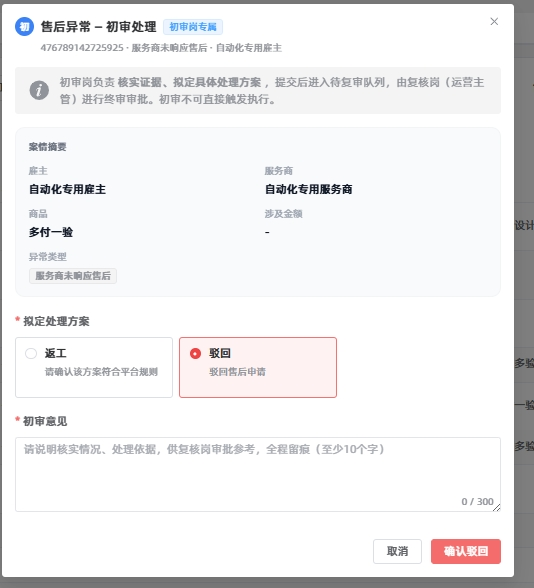
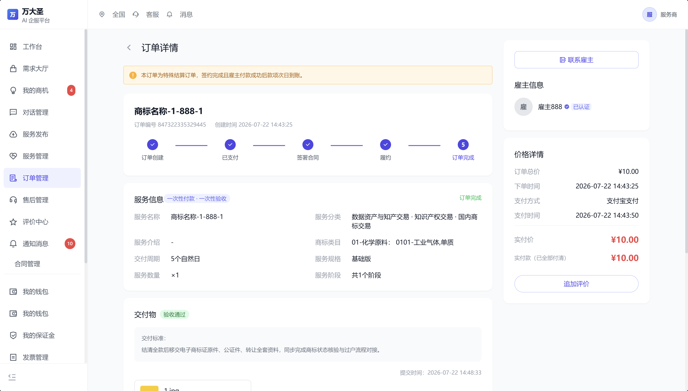

# 【REQ\-171】指定标签服务商支持服务商T\+1日收到款项

**核心结论：**对带有特定系统标签的高信用服务商启用"免验收·T\+1自动打款"机制，订单履约后款项跳过验收环节，于雇主支付成功次日自动结算打款至服务商账户。此类订单售后仅支持返工，不支持退款及部分退款，并使用特定合同模板。

**范围边界：**仅对打标服务商生效，非标签服务商按原有流程执行；打标前已产生的订单按原合同执行，打标后新产生订单按特定合同执行。

**验收方向：**结算时效T\+1到账、售后选项正确屏蔽、合同模板自动匹配、后台订单类型标识与筛选可用。

# 项目信息

|**项目名称**|指定标签服务商支持服务商T\+1日收到款项|
|---|---|
|**需求编号**|REQ\-171|
|**云效ID**|RZMP\-8904|
|**产品经理**|丁建文|
|**所属平台**|万大圣\&企服运管平台|

# 文档版本

|版本号|变更时间|变更内容|修订人|
|---|---|---|---|
|V1\.0|2026\.09\.16|新建文档，基于MRD完成PRD初稿|丁建文|
|V1\.1|待补充|业务评审后更新|待补充|
|V1\.2|待补充|研发评审后补充|待补充|

# 需求背景\&目标

## 需求背景

当前平台订单款项均需经过验收环节后方可结算，资金到账周期较长。部分销售核算业绩以到账金额为准，结算周期长导致销售业绩核算滞后，影响业务运营效率。

为提升结算效率，拟对高信用服务商（通过特定系统标签标识）启用"免验收·T\+1自动打款"机制：订单履约后款项无需验收，于雇主支付成功次日自动打款至服务商账户。同时通过"仅支持返工、不支持退款"的售后规则控制风险，保障雇主基本权益。

## 需求目标

1. 缩短优质服务商结算周期至T\+1到账，使销售核算与资金回笼同步。

2. 通过差异化结算规则激励优质服务商，提升供给侧粘性。

3. 以"仅支持返工、不支持退款"的售后规则控制风险，保障雇主基本权益。

4. 完善后台标签管理、订单标识、合同模板及财务对账能力，支撑业务落地。

# 名词解释

|名词|释义|
|---|---|
|T\+1结算|雇主支付成功后的次日（自然日），系统自动将款项结算并打款至服务商绑定的收款账户|
|特定标签服务商|由运营后台配置、带有特定系统标签的高信用服务商，享受免验收T\+1结算等差异化规则|
|跳过验收环节|T\+1结算的服务商分账不受验收状态的影响|
|返工|售后类型之一，服务商重新提供服务以满足雇主要求，不涉及款项退回|

# 需求概述

## 需求范围

**本期功能列表：**

红色：新增页面/功能   红色下划线：删除页面/功能   蓝色：修改页面/功能

|项目|模块|功能点|描述|备注|
|---|---|---|---|---|
|运营后台|服务商标签管理|特定标签配置|配置生效的特定系统标签范围|新增|
||订单管理\-订单详情|订单类型标识与筛选 |T\+1订单单独标记订单类型，支持按类型筛选查询|修改|
||售后列表/合同列表|订单类型标识与筛选|售后、合同列表同步展示订单类型标识，支持筛选|修改|
|雇主端|确认订单页|结算规则说明 |展示款项结算规则说明，明确告知款项将于次日直接结算给服务商|修改|
||订单详情页|支付与到账记录展示|展示雇主支付记录和服务商到账记录，提示该订单适用特殊结算规则|修改|
||售后申请页|售后选项屏蔽|不展示退款、部分退款选项，仅展示返工选项|修改|
|服务商端|钱包流水页面|分账流水显示|T\+1打款记录在钱包流水中做相应分账流水显示|修改|
|后端服务|订单结算分账服务|T\+1自动结算打款|跳过验收环节，支付成功次日自动结算打款|新增|
||售后服务|售后类型限制|T\+1订单仅支持返工，不支持退款及部分退款|修改|
||合同模板服务|特定合同模板匹配|打标服务商关联订单使用特定通用合同模板|修改|

## 需求影响

**影响业务范围：**

- 服务商结算流程：特定标签服务商由"验收后结算"变更为"T\+1自动结算"

- 售后服务流程：特定标签服务商订单售后类型受限，仅支持返工

- 合同签署流程：特定标签服务商订单使用特定合同模板

- 销售业绩核算：到账金额确认时效提升，核算周期缩短

- 财务对账：新增T\+1打款流水类型，支持财务对账查询

**影响系统范围：**

- 订单系统：订单类型字段、结算状态流转

- 结算分账系统：T\+1自动打款任务、免验收逻辑

- 售后系统：售后类型校验与选项展示

- 合同系统：合同模板匹配规则

- 运营后台：标签管理、列表筛选与标识

- 钱包系统：分账流水记录与展示

# 需求详述

## 应用架构\&业务流程

### 整体方案说明

本需求通过"服务商标签"作为差异化规则的触发标识，在订单创建时判定服务商是否带有特定标签，从而决定该订单适用常规结算流程还是T\+1特殊结算流程。T\+1订单在雇主支付成功后，跳过验收环节（雇主正常验收，不影响分账），由定时任务于次日自动执行结算打款。售后和合同模板同步根据订单类型执行差异化规则。

### 业务流程图

### 功能结构图

## 需求规则说明

### 适用对象规则

|规则项|规则说明|
|---|---|
|触发条件|服务商关联T\+1结算的系统标签，标签名称待业务老师确认|
|判定时机|订单创建时根据服务商当前绑定标签判定订单类型，订单创建后服务商标签变更不影响已创建订单（不含总分包相关订单）|
|非标签服务商|按原有验收结算及售后流程执行，不受本需求影响|
|标签变更影响|- 打标前已产生的订单：按原合同、原结算流程执行 - 打标后新产生的订单：按特定合同、T\+1结算流程执行 - 取消标签后新产生的订单：恢复常规流程|

### 结算流程规则

|规则项|规则说明|
|---|---|
|前置条件|订单为T\+1特殊结算订单，雇主支付成功，订单进入履约状态|
|核心规则|- 雇主支付的每一笔款项均跳过验收环节 - 款项在雇主支付成功的次日（自然日T\+1），由系统自动结算并打款至服务商绑定的收款账户|
|打款时间|次日固定时间窗口执行（具体时间由研发与财务确认，建议每日凌晨批量处理）|
|打款账户|服务商在平台绑定的有效收款账户|
|异常处理|- 打款失败：记录失败原因，进入重试机制，同时通知运营人工介入 - 账户异常：冻结打款，通知服务商更新收款账户|
|后置条件|打款成功后，订单流水记录打款信息，服务商钱包生成对应分账流水，订单状态更新为已结算|

### 前端展示规则

|页面|展示规则|
|---|---|
|确认订单页（雇主端）|- 展示款项结算规则说明，明确告知雇主"该服务商适用特殊结算规则，款项将于支付次日直接结算给服务商" - 规则说明需醒目展示，建议使用提示框样式|
|订单详情页（雇主端/服务商端） |- 雇主端展示雇主支付记录（支付时间、支付金额、支付方式） - 服务商端展示服务商到账记录（预计到账时间、实际到账时间、到账金额） - 雇主端页面显著位置提示"该订单适用特殊结算规则，款项T\+1自动结算"（页面具体提示信息见6\.4\.6） |
|钱包流水页面（服务商端） |- T\+1打款记录在流水中单独标识，显示"分账流水"类型（与现状保持一致） - 流水详情展示关联订单号、打款时间、打款金额、结算规则说明|
|||

### 验收规则

|规则项|规则说明|
|---|---|
|适用范围|T\+1特殊结算订单|
|验收|验收结果不影响结算|

### 售后规则

|规则项|规则说明|
|---|---|
|适用范围|T\+1特殊结算订单|
|支持的售后类型|仅支持返工|
|不支持的售后类型|- 退款 - 部分退款|
|前端展示|售后申请页不展示退款、部分退款选项，仅展示返工选项；如用户通过其他渠道申请退款，系统拦截并提示"该订单不支持退款，仅支持返工"|
|后端校验|售后创建接口增加订单类型校验，T\+1订单创建退款/部分退款售后时返回错误码及提示|
|异常处理|售后异常审核时只有返工和驳回|

### 后台列表与订单类型规则

|规则项|规则说明|
|---|---|
|订单类型标识|- T\+1订单在后台订单列表、售后列表、合同列表中通过标签区分 - 列表中展示订单类型标识（标签），与常规订单区分|
|筛选查询|三个列表均支持按服务商标签筛选查询|

### 合同模板规则

|规则项|规则说明|
|---|---|
|模板匹配|特定系统标签服务商关联订单使用特定通用合同模板，模板内容与常规订单模板区分，或者由雇主自主上传合同。|
|生效时机|- 打标前的服务商：使用普通模板 - 打标后的服务商：使用特定模板 - 在被打标的时间内产生的订单：按特定合同执行 - 自主上传合同则在审核通过时生效|
|模板配置|特定合同模板由中台配置管理，支持模板内容的编辑和版本管理|

### 数据与风控规则

|规则项|规则说明|
|---|---|
|打款记录|每笔T\+1打款记录计入订单流水，支持后台财务对账查询，流水包含订单号、打款金额、打款时间、服务商账户信息等|
|标签管控|特定标签及结算、售后、合同规则由系统控制，运营后台可配置生效标签范围|
|操作日志|关键操作记录操作日志，包括：标签配置变更、订单类型变更、人工干预打款、售后异常处理等，日志包含操作人、操作时间、操作内容、操作前后状态（保持现状）|

## 功能清单

|模块|功能点|优先级|说明|
|---|---|---|---|
|运营后台|特定标签配置管理|P0|配置生效标签范围|
||订单列表类型标识与筛选|P0|T\+1订单标识展示，支持按类型筛选|
||售后列表类型标识与筛选|P0|售后订单类型标识展示，支持筛选|
||合同列表类型标识与筛选|P0|合同订单类型标识展示，支持筛选|
|雇主端|确认订单页结算规则说明|P0|展示T\+1结算规则提示|
||订单详情页支付与到账记录|P0|展示支付记录、到账记录及特殊规则提示|
||售后申请页选项屏蔽|P0|仅展示返工选项，屏蔽退款/部分退款|
|服务商端|钱包流水分账流水显示|P0|T\+1打款记录标识为分账流水|
|后端服务|T\+1自动结算打款|P0|跳过验收，次日自动打款|
||售后类型限制校验|P0|T\+1订单仅允许返工售后|
||特定合同模板匹配|P0|打标服务商订单使用特定合同模板|

## 功能说明（产品原型设计及说明）

运营后台的T\+1结算的订单、合同、售后结算均通过服务商标签查询实现。

### 雇主端\-确认订单页

|**信息**|- 在确认订单页面顶部展示提示 - 提示文案：该订单服务商适用特殊结算规则，款项将于双方完成签约且雇主完成支付的次日直接结算给服务商。~~无需验收环节，售后仅支持返工，不支持退款。~~ - 提示框使用醒目样式（建议浅黄色背景\+信息图标）|
|---|---|
|**交互**|- 提示框常驻展示，不可关闭 - 仅当订单为T\+1特殊结算订单时展示|
|**触发条件**|订单创建时判定服务商带有特定标签|

~~支付弹窗展示提示：~~~~该服务商适用特殊结算规则，款项将于双方完成签约且雇主完成支付的次日直接结算给服务商。~~

~~支付页面为中台页面，需协调中台，可能不随本次需求上线。~~

### 雇主端\-订单详情页

|**信息**|- 在订单详情页顶部 - 提示：该订单服务商适用特殊结算规则，款项将于双方完成签约且雇主完成支付的次日直接结算给服务商。|
|---|---|
|**交互**|- 提示框常驻展示，不可关闭 - 仅当订单为T\+1特殊结算订单时展示|

### 雇主端\-售后申请页

|**信息**|- 售后类型选项仅展示"返工" - 不展示"退款""部分退款"选项|
|---|---|
|**交互**|- 提示框常驻展示，不可关闭 - 仅当订单为T\+1特殊结算订单时展示 - 选择返工后，展示返工原因填写、返工说明、上传凭证等字段 - 提交后进入返工售后流程|
|**异常**|如通过API或其他入口尝试创建退款售后，后端返回错误码，提示"该订单不支持退款"|

可选择的售后范围

|**场景**|**T\+1结算订单逻辑**|普通订单逻辑|
|---|---|---|
|一次支付一次验收|T\+1结算，不与验收结果挂钩，仅支持当前阶段售后|验收通过，平台按规定时间分账，支持当前阶段售后 |
|一次支付多次验收|T\+1结算，不与验收结果挂钩，仅支持当前阶段售后,不支持当前及剩余阶段售后|每个阶段验收通过，平台按规定时间分账，支持当前阶段售后，支持当前及剩余阶段售后 |
|多次支付一次验收|T\+1结算，不与验收结果挂钩，仅支持当前阶段售后|验收通过，平台按规定时间分账，支持当前阶段售后|
|多次支付多次验收|T\+1结算，不与验收结果挂钩，仅支持当前阶段售后,不支持当前及剩余阶段售后|每个阶段验收通过，平台按规定时间分账，支持当前阶段售后，支持当前及剩余阶段售后|

当前阶段状态显示可售后类型

|**阶段状态**|**T\+1结算订单逻辑**|**普通订单逻辑**|
|---|---|---|
|履约中|售后类型：空|售后类型：仅退款|
|待验收|售后类型：空|售后类型：仅退款|
|验收通过|售后类型：仅返工|售后类型：仅退款/仅返工|
|验收不通过|售后类型：空|售后类型：仅退款|

### 服务商端\-订单详情

|**信息**|- T\+1结算订单展示提醒信息：本订单为特殊结算订单，签约完成且雇主付款成功后款项次日到账。~~本订单为特殊结算订单，签约完成且雇主付款成功后次日自动清分到账，验收结果不影响本次资金结算。交付争议请配合平台售后处理。~~|
|---|---|
|**交互**|- 提示框常驻展示，不可关闭 - 仅当订单为T\+1特殊结算订单时展示|

### ~~运营后台\-订单详情（已删除）~~

|**信息** |- ~~T\+1结算订单~~ - ~~顶部提示信息：该订单服务商适用特殊结算规则，款项将于双方完成签约且雇主完成支付的次日直接结算给服务商，无需验收环节，售后仅支持返工，不支持退款。~~|
|---|---|
|**交互**|- ~~提示框常驻展示，不可关闭~~ - ~~仅当订单为T\+1特殊结算订单时展示~~|

### 提示信息汇总

|区分端|页面|提示信息|
|---|---|---|
|雇主端|确认订单页|该订单服务商适用特殊结算规则，款项将于双方完成签约且雇主完成支付的次日直接结算给服务商。|
||订单详情页|该订单服务商适用特殊结算规则，款项将于双方完成签约且雇主完成支付的次日直接结算给服务商。|
|服务商端|订单详情页 |本订单为特殊结算订单，签约完成且雇主付款成功后款项次日到账。|

## 数据定义

### 核心实体说明

本需求涉及的核心实体包括：服务商标签、订单、结算流水、售后单、合同。服务商标签是触发差异化规则的核心标识，订单创建时关联标签状态生成订单类型，后续结算、售后、合同均基于订单类型执行对应规则。

## 非功能需求

### 依赖与风险

|类型|内容|负责方|应对措施|
|---|---|---|---|
|外部依赖|支付渠道打款接口稳定性，支持批量打款和异步回调|支付团队|提前对接支付渠道，确认批量打款能力和限流策略|
|外部依赖|财务对账系统需支持T\+1分账流水的对账规则|财务团队|提前与财务确认对账口径，联调验证|
|技术依赖|定时任务调度系统支持每日固定时间触发大规模批量任务|研发团队|评估调度系统能力，必要时做分片处理优化|
|技术依赖|服务商标签体系已存在，可扩展特定标签配置|研发团队|确认现有标签系统能力，不足部分需同步开发|
|已知风险|**资金风险：**免验收模式下，若服务商履约不合格，款项已打款，追回难度大|业务/风控|- 严格控制标签准入，仅对高信用服务商开放 - 建立服务商保证金或信用扣减机制|
|已知风险|**打款失败风险：**服务商账户异常、渠道故障等导致打款失败|研发/运营|- 异常订单处理|
|已知风险|**雇主投诉风险：**雇主不理解免验收规则，对资金安全产生疑虑|产品/运营 |- 确认订单页和订单详情页显著提示结算规则 - 客服话术同步更新，做好解释准备 - 仅支持返工的售后规则保障雇主基本权益|

# 验收标准

1. **订单类型：**打标服务商创建的订单自动标记为T\+1结算订单，后台三个列表均展示类型标识并支持筛选。

2. **结算打款：**T\+1订单支付成功后跳过验收，次日自动打款至服务商账户，打款记录可查询。

3. 前端展示：确认订单页展示结算规则说明，订单详情页展示支付与到账记录，服务商钱包流水分账流水显示正确。

4. **售后限制：**T\+1订单售后申请仅展示返工选项，退款/部分退款选项屏蔽，后端接口校验拦截。

5. **合同模板：**打标服务商订单自动匹配特定合同模板，打标前订单仍使用原模板。

6. **数据对账：**T\+1打款流水计入订单流水，支持财务对账查询，关键操作有日志记录。

7. **异常处理：**打款失败进入异常订单处理。

# 内审记录

|评审人|评审时间|建议修改内容|结论|
|---|---|---|---|
|胡佳旭、王宇轩、傅杰彬|2026\-09\-23 13:00|增加提示信息汇总|修改后通过|

> （注：部分内容可能由 AI 生成）
